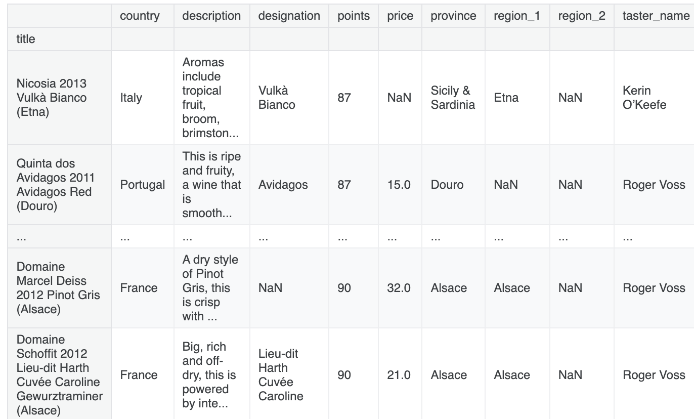
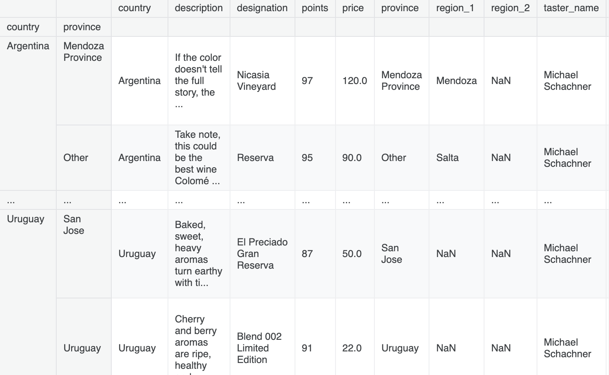

### source - https://www.kaggle.com/learn/pandas
## 1 - Creating, Reading and Writing

### Getting started
To use pandas, you'll typically start with the following line of code.

```python
import pandas as pd
```

### Creating data
There are two core objects in pandas:

1 - DataFrame

2 - Series

#### 1 - DataFrame
* A DataFrame is a table. It contains an array of individual entries, each of which has a certain value. 

* Each entry corresponds to a row (or record) and a column.

* We are using the pd.DataFrame() constructor to generate these DataFrame objects. The syntax for declaring a new one is a dictionary whose keys are the column names (Bob and Sue in below example), and whose values are a list of entries. This is the standard way of constructing a new DataFrame, and the one you are most likely to encounter.

For example, consider the following simple DataFrame:

```python
pd.DataFrame({'Yes': [50, 21], 'No': [131, 2]})

'''
Output - 
	Yes	No
0	50	131
1	21	2
'''
```

* DataFrame entries are not limited to integers. For instance, here's a DataFrame whose values are strings:

```python
pd.DataFrame({'Bob': ['I liked it.', 'It was awful.'], 'Sue': ['Pretty good.', 'Bland.']})

'''
Output - 

	Bob	            Sue
0	I liked it.	    Pretty good.
1	It was awful.	Bland.
'''

```

* The dictionary-list constructor assigns values to the column labels, but just uses an ascending count from 0 (0, 1, 2, 3, ...) for the row labels. Sometimes this is OK, but oftentimes we will want to assign these labels ourselves.

* The list of row labels used in a DataFrame is known as an Index. We can assign values to it by using an index parameter in our constructor:

```python
pd.DataFrame({'Bob': ['I liked it.', 'It was awful.'], 
              'Sue': ['Pretty good.', 'Bland.']},
             index=['Product A', 'Product B'])

'''
Output - 
	        Bob	            Sue
Product A	I liked it.	    Pretty good.
Product B	It was awful.	Bland.
'''
```

#### 2 - Series

* A Series, by contrast, is a sequence of data values. If a DataFrame is a table, a Series is a list. And in fact you can create one with nothing more than a list:

```python
pd.Series([1, 2, 3, 4, 5])

'''
Output - 
0    1
1    2
2    3
3    4
4    5
dtype: int64
'''
```


* A Series is, in essence, a single column of a DataFrame. So you can assign row labels to the Series the same way as before, using an index parameter. However, a Series does not have a column name, it only has one overall name:

```python
pd.Series([30, 35, 40], index=['2015 Sales', '2016 Sales', '2017 Sales'], name='Product A')

'''
Output-  
2015 Sales    30
2016 Sales    35
2017 Sales    40
Name: Product A, dtype: int64
'''
```

* The Series and the DataFrame are intimately related. It's helpful to think of a DataFrame as actually being just a bunch of Series "glued together".

### Reading data files

* We'll use the pd.read_csv() function to read the data into a DataFrame.

```python
wine_reviews = pd.read_csv("../input/wine-reviews/winemag-data-130k-v2.csv")
```

* We can use the shape attribute to check how large the resulting DataFrame is:

```python
wine_reviews.shape

'''
Output - 
(129971, 14)

130,000 records split across 14 different columns

'''
```

* We can examine the contents of the resultant DataFrame using the head() command, which grabs the first five rows:

```python
wine_reviews.head()
```
| Unnamed: 0 | Country  | Description                                       |
| ---------- | -------- | ------------------------------------------------- |
| 0          | Italy    | Aromas include tropical fruit, broom, brimston... |
| 1          | Portugal | This is ripe and fruity, a wine that is smooth... |
| 2          | US       | Tart and snappy, the flavors of lime flesh and... |
| 3          | US       | Pineapple rind, lemon pith and orange blossom ... |
| 4          | US       | Much like the regular bottling from 2012, this... |


* The pd.read_csv() function is well-endowed, with over 30 optional parameters you can specify. For example, you can see in this dataset that the CSV file has a built-in index, which pandas did not pick up on automatically. To make pandas use that column for the index (instead of creating a new one from scratch), we can specify an index_col.

```python
wine_reviews = pd.read_csv("../input/wine-reviews/winemag-data-130k-v2.csv", index_col=0)
wine_reviews.head()
```
| Country  | Description                                       | Designation                        |
| -------- | ------------------------------------------------- | ---------------------------------- |
| Italy    | Aromas include tropical fruit, broom, brimston... | Vulkà Bianco                       |
| Portugal | This is ripe and fruity, a wine that is smooth... | Avidagos                           |
| US       | Tart and snappy, the flavors of lime flesh and... | NaN                                |
| US       | Pineapple rind, lemon pith and orange blossom ... | Reserve Late Harvest               |
| US       | Much like the regular bottling from 2012, this... | Vintner's Reserve Wild Child Block |

### Writing data files

* DataFrame to a CSV file is very straightforward using df.to_csv()

```python
import pandas as pd

# Sample DataFrame
data = {
    'Name': ['Alice', 'Bob', 'Charlie'],
    'Age': [25, 30, 22],
    'City': ['New York', 'Los Angeles', 'Chicago']
}

df = pd.DataFrame(data)

# Write to CSV
df.to_csv('output.csv', index=False)  # index=False avoids writing row numbers


'''
Output - 
This will create a file called output.csv in the current working directory.
'''
```

* Advanced Options

```python
# Include index
df.to_csv('output_with_index.csv', index=True)

# Specify separator (e.g., tab-separated)
df.to_csv('output.tsv', sep='\t', index=False)

# Handle missing values
df.to_csv('output_na.csv', index=False, na_rep='N/A')

# Write only specific columns
df.to_csv('output_columns.csv', columns=['Name', 'City'], index=False)
```

## 2 - Indexing, Selecting & Assigning

* Consider dataframe - reviews

* In Python, we can access the property of an object by accessing it as an attribute. A book object, for example, might have a title property, which we can access by calling book.title. Columns in a pandas DataFrame work in much the same way.

* Hence to access the country property of reviews we can use:

```python
reviews.country
'''
Output -

0           Italy
1           Portugal
            ...   
129969      France
129970      France
Name: country, Length: 129971, dtype: object
'''
```

* If we have a Python dictionary, we can access its values using the indexing ([]) operator. We can do the same with columns in a DataFrame:

```python
reviews['country']
'''
Output -

0           Italy
1           Portugal
            ...   
129969      France
129970      France
Name: country, Length: 129971, dtype: object
'''
```

* Note - 

* 1 - reviews.country and reviews['country'] are almost same when column name is clean. But it won't work when there are spaces in column name.

* 2 - indexing operator [] does have the advantage that it can handle column names with reserved characters in them (e.g. if we had a country providence column, reviews.country providence wouldn't work).

```python
# Dot notation fails for 'reviews count'
print(reviews.reviews count)  # ❌ SyntaxError
print(reviews['reviews count'])  # ✅ Works
```

* ✅ Rule of Thumb

 1 - Safe for any column: use reviews['column_name']

 2 - Shortcut for simple, clean column names: reviews.column_name


* Doesn't a pandas Series look kind of like a fancy dictionary? It pretty much is, so it's no surprise that, to drill down to a single specific value, we need only use the indexing operator [] once more:

```python
reviews['country'][0] # Output - 'Italy'
```

#### Indexing in pandas

* Apart from indexing operator from python, Pandas has its own accessor operators, loc and iloc

* index-based selection - iloc

```python
# To select the first row of data in a DataFrame
reviews.iloc[0]

# To get all column with iloc
reviews.iloc[:, 0]

# To select the country column from just the first, second, and third row
reviews.iloc[:3, 0]

# To select just the second and third entries
reviews.iloc[1:3, 0]

# It's also possible to pass a list
reviews.iloc[[0, 1, 2], 0] # return 1st column of 0,1,2 records

# Negative numbers can be used in selection. last five elements of the dataset
reviews.iloc[-5:]
```

* Label-based selection - loc

```python
# to get the first country in reviews
reviews.loc[0, 'country'] # this will return series

# To get all entries of specific columns
reviews.loc[:, ['taster_name', 'taster_twitter_handle', 'points']] # this will return dataframe
```

* Difference between iloc and loc - 

```
df.iloc[0:1000] will return 1000 entries. End index exclusive.
df.loc[0:1000] return 1001 of them. End index inclusive.

To get 1000 elements using loc, you will need to go one lower and ask for df.loc[0:999].
```

#### Manipulating the index

* The set_index() method can be used to do the job. Here is what happens when we set_index to the title field:

```python
reviews.set_index("title")
```



#### Conditional selection

* checking if each wine is Italian or not:

```python
reviews.country == 'Italy'

0         True
1         False
          ...  
129969    False
129970    False
Name: country, Length: 129971, dtype: bool

'''
This operation produced a Series of True/False booleans based on the country of each record. This result can then be used inside of loc to select the relevant data:
'''

reviews.loc[reviews.country == 'Italy']
```

| Country | Description                                       | Designation  | Points |
| ------- | ------------------------------------------------- | ------------ | ------ |
| Italy   | Aromas include tropical fruit, broom, brimston... | Vulkà Bianco | 87     |
| Italy   | Here's a bright, informal red that opens with ... | Belsito      | 87     |
| ...     | ...                                               | ...          | ...    |
| Italy   | Intense aromas of wild cherry, baking spice, t... | NaN          | 90     |


* We also wanted to know which ones are better than average. Wines are reviewed on a 80-to-100 point scale, so this could mean wines that accrued at least 90 points.

```python
reviews.loc[(reviews.country == 'Italy') & (reviews.points >= 90)]
```

| Country | Description                                       | Designation               | Points |
| ------- | ------------------------------------------------- | ------------------------- | ------ |
| Italy   | Slightly backward, particularly given the vint... | Bricco Rocche Prapó       | 92     |
| Italy   | At the first it was quite muted and subdued, b... | Bricco Rocche Brunate     | 91     |
| ...     | ...                                               | ...                       | ...    |
| Italy   | Intense aromas of wild cherry, baking spice, t... | NaN                       | 90     |
| Italy   | Blackberry, cassis, grilled herb and toasted a... | Sàgana Tenuta San Giacomo | 90     |


* Suppose we'll buy any wine that's made in Italy or which is rated above average. 

```python
reviews.loc[(reviews.country == 'Italy') | (reviews.points >= 90)]

# Note - Every condition should be wrapped in () seperately
```

| Country | Description                                       | Designation  | Points |
| ------- | ------------------------------------------------- | ------------ | ------ |
| Italy   | Aromas include tropical fruit, broom, brimston... | Vulkà Bianco | 87     |
| Italy   | Here's a bright, informal red that opens with ... | Belsito      | 87     |
| ...     | ...                                               | ...          | ...    |
| France  | A dry style of Pinot Gris, this is crisp with ... | NaN          | 90     |


* isin is lets you select data whose value "is in" a list of values. For example, here's how we can use it to select wines only from Italy or France:

```python
reviews.loc[reviews.country.isin(['Italy', 'France'])]
```

| Country | Description                                       | Designation                   | Points |
| ------- | ------------------------------------------------- | ----------------------------- | ------ |
| Italy   | Aromas include tropical fruit, broom, brimston... | Vulkà Bianco                  | 87     |
| Italy   | Here's a bright, informal red that opens with ... | Belsito                       | 87     |
| ...     | ...                                               | ...                           | ...    |
| France  | A dry style of Pinot Gris, this is crisp with ... | NaN                           | 90     |
| France  | Big, rich and off-dry, this is powered by inte... | Lieu-dit Harth Cuvée Caroline | 90     |

* isnull (and its companion notnull). These methods let you highlight values which are (or are not) empty (NaN). For example, to filter out wines lacking a price tag in the dataset, here's what we would do

```python
reviews.loc[reviews.price.notnull()]
```

| Country  | Description                                       | Designation | Points | Price |
| -------- | ------------------------------------------------- | ----------- | ------ | ----- |
| Portugal | This is ripe and fruity, a wine that is smooth... | Avidagos    | 87     | 15.0  |
| US       | Tart and snappy, the flavors of lime flesh and... | NaN         | 87     | 14.0  |
| ...      | ...                                               | ...         | ...    | ...   |
| France   | A dry style of Pinot Gris, this is crisp with ... | NaN         | 90     | 32.0  |

#### Assigning data

* You can assign either a constant value:

```python
reviews['critic'] = 'everyone'
reviews['critic']

'''
Output - 
0         everyone
1         everyone
            ...   
129969    everyone
129970    everyone
Name: critic, Length: 129971, dtype: object
'''
```

* Or with an iterable of values:

```python

reviews['index_backwards'] = range(len(reviews), 0, -1)
reviews['index_backwards']

'''
Output - 
0         129971
1         129970
           ...  
129969         2
129970         1
Name: index_backwards, Length: 129971, dtype: int64
'''
```

## 3 - Summary Functions and Maps

### Summary functions
* Pandas provides many simple "summary functions" (not an official name) which restructure the data in some useful way.

* For example, consider the describe() method:

```python
reviews.points.describe()

'''
count        129971.000000
mean         88.447138
             ...      
75%          91.000000
max          100.000000
Name: points, Length: 8, dtype: float64
'''
```

* This method generates a high-level summary of the attributes of the given column. It is type-aware, meaning that its output changes based on the data type of the input. The output above only makes sense for numerical data

* For string data here's what we get:

```python
reviews.taster_name.describe()

'''
count         103727
unique            19
top       Roger Voss
freq           25514
Name: taster_name, dtype: object
'''
```

* If you want to get some particular simple summary statistic about a column in a DataFrame or a Series, there is usually a helpful pandas function that makes it happen.

* For example, to see the mean of the points allotted (e.g. how well an averagely rated wine does), we can use the mean() function:

```python
reviews.points.mean()

'''
88.44713820775404
'''
```
* To see a list of unique values we can use the unique() function:

```python
reviews.taster_name.unique()

'''
array(['Kerin O’Keefe', 'Roger Voss', 'Paul Gregutt',
       'Alexander Peartree', 'Michael Schachner', 'Anna Lee C. Iijima',
       'Virginie Boone', 'Matt Kettmann', nan, 'Sean P. Sullivan',
       'Jim Gordon', 'Joe Czerwinski', 'Anne Krebiehl\xa0MW',
       'Lauren Buzzeo', 'Mike DeSimone', 'Jeff Jenssen',
       'Susan Kostrzewa', 'Carrie Dykes', 'Fiona Adams',
       'Christina Pickard'], dtype=object)
'''
```

* To see a list of unique values and how often they occur in the dataset, we can use the value_counts() method:

```python
reviews.taster_name.value_counts()

'''
Roger Voss           25514
Michael Schachner    15134
                     ...  
Fiona Adams             27
Christina Pickard        6
Name: taster_name, Length: 19, dtype: int64
'''
```

### Maps

* A map is a term, borrowed from mathematics, for a function that takes one set of values and "maps" them to another set of values. In data science we often have a need for creating new representations from existing data, or for transforming data from the format it is in now to the format that we want it to be in later. Maps are what handle this work, making them extremely important for getting your work done!

* There are two mapping methods that you will use often.

* 1 - map() is the first, and slightly simpler one. For example, suppose that we wanted to remean the scores the wines received to 0. We can do this as follows:

```python
review_points_mean = reviews.points.mean()
reviews.points.map(lambda p: p - review_points_mean)

'''
0        -1.447138
1        -1.447138
            ...   
129969    1.552862
129970    1.552862
Name: points, Length: 129971, dtype: float64
'''
```

* The function you pass to map() should expect a single value from the Series (a point value, in the above example), and return a transformed version of that value. map() returns a new Series where all the values have been transformed by your function.

* 2 - apply() is the equivalent method if we want to transform a whole DataFrame by calling a custom method on each row.

```python
# 1️⃣ Define the mean first
review_points_mean = reviews.points.mean()

# 2️⃣ Define the function
def remean_points(row):
    row.points = row.points - review_points_mean
    return row

# 3️⃣ Apply the function
reviews = reviews.apply(remean_points, axis='columns')
```

| Country  | Description                                       | Designation  | Points    |
| -------- | ------------------------------------------------- | ------------ | --------- |
| Italy    | Aromas include tropical fruit, broom, brimston... | Vulkà Bianco | -1.447138 |
| Portugal | This is ripe and fruity, a wine that is smooth... | Avidagos     | -1.447138 |
| ...      | ...                                               | ...          | ...       |
| France   | A dry style of Pinot Gris, this is crisp with ... | NaN          | 1.552862  |


* If we had called reviews.apply() with axis='index', then instead of passing a function to transform each row, we would need to give a function to transform each column.

```python
import pandas as pd

# Sample DataFrame
reviews = pd.DataFrame({
    'country': ['Italy', 'Portugal', 'US'],
    'points': [87, 87, 87],
    'price': [None, 15, 14]
})

print("Original DataFrame:")
print(reviews)

# Function to summarize a column
def summarize_column(col):
    if col.dtype == 'object':
        return col.unique()  # return unique values for text columns
    else:
        return col.mean()    # return mean for numeric columns

# Apply function to each column (axis='index' or axis=0)
summary = reviews.apply(summarize_column, axis='index')
print("\nSummary for each column:")
print(summary)

'''
Original DataFrame:
    country  points  price
0     Italy      87   None
1  Portugal      87   15.0
2        US      87   14.0

Summary for each column:
country    [Italy, Portugal, US]
points                     87.0
price                     14.5
dtype: object

✅ Explanation:

- axis='index' → the function sees each column as a Series.
- Numeric columns (points, price) can be aggregated (mean in this case).
- Text columns (country) can be processed differently (unique values here).
'''
```

### Summary code

```python
import pandas as pd

# Sample DataFrame
reviews = pd.DataFrame({
    'country': ['Italy', 'Portugal', 'US'],
    'points': [87, 87, 87],
    'price': [None, 15, 14]
})

print("Original DataFrame:")
print(reviews)

# --- Row-wise transformation (axis=1) ---
# Example: combine country and points for each row
def row_summary(row):
    return f"{row['country']} has {row['points']} points"

row_results = reviews.apply(row_summary, axis=1)
print("\nRow-wise apply (axis=1):")
print(row_results)

# --- Column-wise transformation (axis=0 / axis='index') ---
# Example: summarize each column
def column_summary(col):
    if col.dtype == 'object':
        return col.unique()  # unique values for text columns
    else:
        return col.mean()    # mean for numeric columns

column_results = reviews.apply(column_summary, axis=0)
print("\nColumn-wise apply (axis=0):")
print(column_results)

'''
Original DataFrame:
    country     points  price
0     Italy      87     None
1     Portugal   87     15.0
2     US         87     14.0

Row-wise apply (axis=1):
0         Italy has 87 points
1    Portugal has 87 points
2            US has 87 points
dtype: object

Column-wise apply (axis=0):
country    [Italy, Portugal, US]
points                     87.0
price                     14.5
dtype: object

✅ Key differences:

Row-wise (axis=1) → Function gets each row (Series) → used to combine or transform row data.

Column-wise (axis=0) → Function gets each column (Series) → used to aggregate, summarize, or transform column data.

'''

```

* Note that map() and apply() return new, transformed Series and DataFrames, respectively. They don't modify the original data they're called on.

* Pandas provides many common mapping operations as built-ins. For example, here's a faster way of remeaning our points column:

```python
review_points_mean = reviews.points.mean()
reviews.points - review_points_mean

'''
0        -1.447138
1        -1.447138
            ...   
129969    1.552862
129970    1.552862
Name: points, Length: 129971, dtype: float64
'''
```

* In this code we are performing an operation between a lot of values on the left-hand side (everything in the Series) and a single value on the right-hand side (the mean value). Pandas looks at this expression and figures out that we must mean to subtract that mean value from every value in the dataset.

* Pandas will also understand what to do if we perform these operations between Series of equal length. For example, an easy way of combining country and region information in the dataset would be to do the following:

```python
reviews.country + " - " + reviews.region_1

'''
0            Italy - Etna
1                     NaN
               ...       
129969    France - Alsace
129970    France - Alsace
Length: 129971, dtype: object
'''
```

* These operators are faster than map() or apply() because they use speed ups built into pandas. All of the standard Python operators (>, <, ==, and so on) work in this manner.

* However, they are not as flexible as map() or apply(), which can do more advanced things, like applying conditional logic, which cannot be done with addition and subtraction alone.

#### Imp exercise

* I'm an economical wine buyer. Which wine is the "best bargain"? Create a variable bargain_wine with the title of the wine with the highest points-to-price ratio in the dataset. (Q5 from https://www.kaggle.com/code/dipikasureshpatil/exercise-summary-functions-and-maps/edit)

```python
bargain_index = (reviews.points / reviews.price).idxmax()
bargain_wine = reviews.loc[bargain_index, 'title']
'''
🧠 Explanation

- reviews.points / reviews.price computes the points‑to‑price ratio for each wine. 

- .idxmax() finds the index label where this ratio is largest. 
criskrus.github.io

- reviews.loc[...] retrieves the title at that index. 
criskrus.github.io

So bargain_wine ends up as a string — the name of the most cost‑effective wine in the dataset.
'''
```

* There are only so many words you can use when describing a bottle of wine. Is a wine more likely to be "tropical" or "fruity"? Create a Series descriptor_counts counting how many times each of these two words appears in the description column in the dataset. (For simplicity, let's ignore the capitalized versions of these words.) (Q6 from https://www.kaggle.com/code/dipikasureshpatil/exercise-summary-functions-and-maps/edit)

```python
n_tropical = reviews.description.map(lambda d : "tropical" in d).sum()
n_fruity = reviews.description.map(lambda d : "fruity" in d).sum()

descriptor_counts = pd.Series([n_tropical, n_fruity], index=["tropical","fruity"])

print(descriptor_counts)

'''
tropical    3607
fruity      9090
dtype: int64
'''
```

```python
n_tropical = reviews.description.str.contains("tropical").sum()
n_fruity   = reviews.description.str.contains("fruity").sum()

descriptor_counts = pd.Series([n_tropical, n_fruity], index=["tropical","fruity"])

print(descriptor_counts)

'''
Note - 
.contains() exists only on string Series (like reviews.description.str.contains("tropical"))

tropical    3607
fruity      9090
dtype: int64
'''
```

* We'd like to host these wine reviews on our website, but a rating system ranging from 80 to 100 points is too hard to understand - we'd like to translate them into simple star ratings. A score of 95 or higher counts as 3 stars, a score of at least 85 but less than 95 is 2 stars. Any other score is 1 star.
Also, the Canadian Vintners Association bought a lot of ads on the site, so any wines from Canada should automatically get 3 stars, regardless of points.
Create a series star_ratings with the number of stars corresponding to each review in the dataset.

```python
def set_ratings(row):
    if (row.country == "Canada") or (row.points >= 95):
        return 3
    elif (row.points >= 85) and (row.points < 95):
        return 2
    else:
        return 1

star_ratings = reviews.apply(set_ratings, axis = 1)

'''
0         2
1         2
         ..
129969    2
129970    2
Length: 129971, dtype: int64
'''
```

## 4 - Grouping and Sorting

### Groupwise analysis
* One function we've been using heavily thus far is the value_counts() function. We can replicate what value_counts() does by doing the following:

```python
reviews.groupby('points').points.count()

'''
points
80     397
81     692
      ... 
99      33
100     19
Name: points, Length: 21, dtype: int64
'''
```

* groupby() created a group of reviews which allotted the same point values to the given wines. Then, for each of these groups, we grabbed the points() column and counted how many times it appeared. value_counts() is just a shortcut to this groupby() operation.

* We can use any of the summary functions we've used before with this data. For example, to get the cheapest wine in each point value category, we can do the following:

```python
reviews.groupby('points').price.min()

'''
points
80      5.0
81      5.0
       ... 
99     44.0
100    80.0
Name: price, Length: 21, dtype: float64
'''
```

* You can think of each group we generate as being a slice of our DataFrame containing only data with values that match. This DataFrame is accessible to us directly using the apply() method, and we can then manipulate the data in any way we see fit.

* For example, here's one way of selecting the name of the first wine reviewed from each winery in the dataset:

```python
reviews.groupby('winery').apply(lambda df: df.title.iloc[0])

'''
winery
1+1=3                          1+1=3 NV Rosé Sparkling (Cava)
10 Knots                 10 Knots 2010 Viognier (Paso Robles)
                                  ...                        
àMaurice    àMaurice 2013 Fred Estate Syrah (Walla Walla V...
Štoka                         Štoka 2009 Izbrani Teran (Kras)
Length: 16757, dtype: object
'''
```

* For even more fine-grained control, you can also group by more than one column.

* For an example, here's how we would pick out the best wine by country and province:

```python
reviews.groupby(['country', 'province']).apply(lambda df: df.loc[df.points.idxmax()])
```



