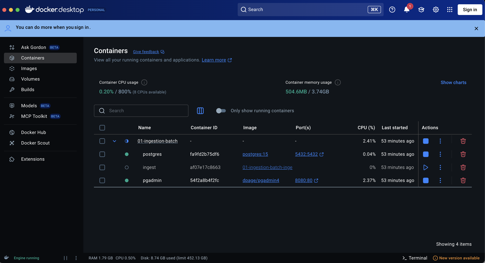
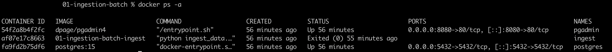
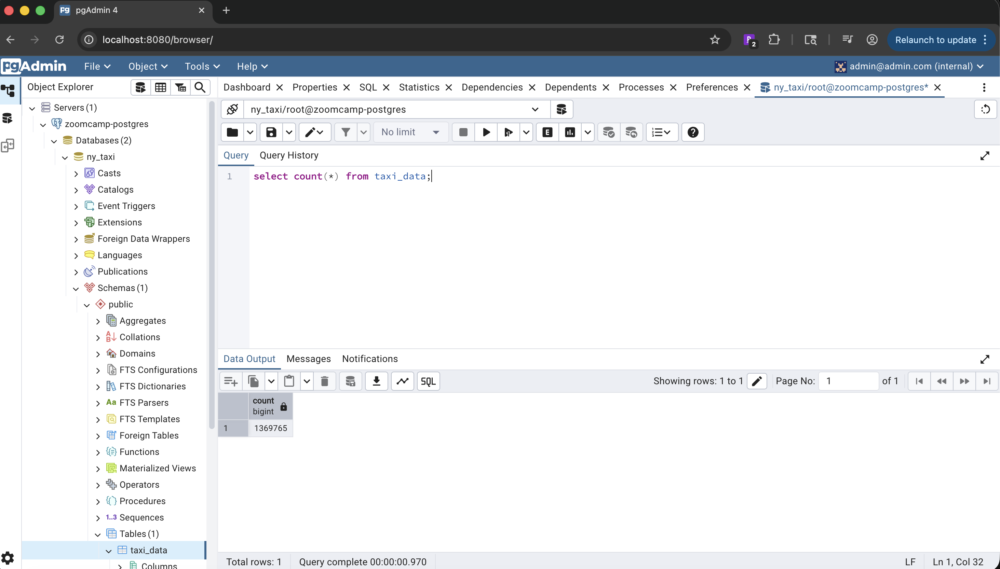
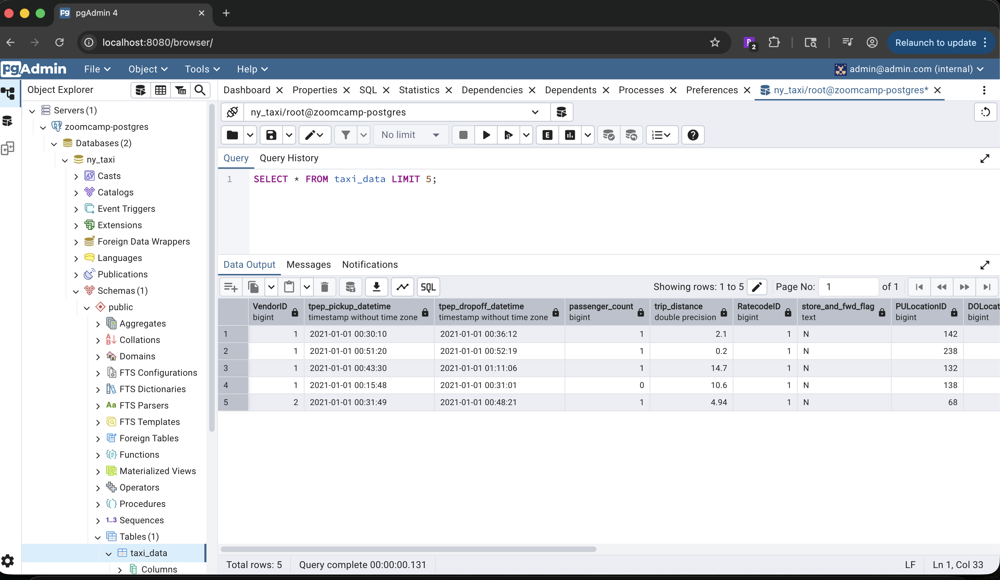

# 01 - Docker + Postgres (docker-sql pipeline)

# 📦 Batch Data Ingestion with Docker & PostgreSQL

This project demonstrates a batch data ingestion pipeline using Docker, Python, Pandas, and PostgreSQL.
It ingests NYC Taxi trip data in chunks and loads it into a Postgres database.

## 🏗️ Project Structure

```sql
01-ingestion-batch/
├── docker-compose.yml
├── docker/
│   └── Dockerfile
├── scripts/
│   └── ingest_data.py
├── sql/
│   └── (optional SQL queries)
├── images/
│   └── (screenshots for README)
├── requirements.txt
└── README.md
```

## 🚀 Technologies Used

- Python 3.10
- Pandas
- SQLAlchemy
- PostgreSQL 15
- Docker & Docker Compose
- pgAdmin
- tqdm (progress tracking)

## 📊 Dataset

NYC Yellow Taxi Trip Data (January 2021):

```bash
https://github.com/DataTalksClub/nyc-tlc-data/releases/download/yellow/yellow_tripdata_2021-01.csv.gz
```

## ⚙️ How It Works (Runtime Flow)

## ⚙️ How It Works (Runtime Flow)

- `docker-compose up --build`
  - Builds the ingestion Docker image
  - Starts all required containers

- **PostgreSQL container**
  - Starts first
  - Initializes the database
  - Uses a persistent volume to store data

- **pgAdmin container (optional)**
  - Starts as a web-based UI
  - Used to inspect tables and run SQL queries

- **Ingestion container**
  - Downloads the CSV dataset
  - Reads the data in chunks
  - Explicitly parses datetime columns
  - Loads data into PostgreSQL
    - First chunk replaces the table
    - Remaining chunks append data

- **Completion**
  - Ingestion container exits after successful execution
  - PostgreSQL continues running with persisted data


```text
CSV Dataset
    │
    ▼
Ingestion Container (Python + Pandas)
    │
    ▼
PostgreSQL (Persistent Volume)
    │
    ▼
pgAdmin / SQL Queries
```

## ▶️ How to Run

From the 01-ingestion-batch directory:

```bash
docker-compose up --build
```

## 🧾 Sample Logs (Successful Run)

```text
docker-compose up --build
[+] Running 1/1
 ✔ postgres Pulled                                                                                                                                                                                         1.2s
[+] Building 1.1s (12/12) FINISHED
 => [internal] load local bake definitions                                                                                                                                                                 0.0s
 => => reading from stdin 469B                                                                                                                                                                             0.0s
 => [internal] load build definition from Dockerfile                                                                                                                                                       0.0s
 => => transferring dockerfile: 411B                                                                                                                                                                       0.0s
 => [internal] load metadata for docker.io/library/python:3.10-slim                                                                                                                                        0.7s
 => [internal] load .dockerignore                                                                                                                                                                          0.0s
 => => transferring context: 2B                                                                                                                                                                            0.0s
 => [1/5] FROM docker.io/library/python:3.10-slim@sha256:f5d029fe39146b08200bcc73595795ac19b85997ad0e5001a02c7c32e8769efa                                                                                  0.0s
 => => resolve docker.io/library/python:3.10-slim@sha256:f5d029fe39146b08200bcc73595795ac19b85997ad0e5001a02c7c32e8769efa                                                                                  0.0s
 => [internal] load build context                                                                                                                                                                          0.0s
 => => transferring context: 1.92kB                                                                                                                                                                        0.0s
 => CACHED [2/5] WORKDIR /app                                                                                                                                                                              0.0s
 => CACHED [3/5] COPY requirements.txt .                                                                                                                                                                   0.0s
 => CACHED [4/5] RUN pip install --no-cache-dir -r requirements.txt                                                                                                                                        0.0s
 => [5/5] COPY scripts/ingest_data.py .                                                                                                                                                                    0.0s
 => exporting to image                                                                                                                                                                                     0.1s
 => => exporting layers                                                                                                                                                                                    0.0s
 => => exporting manifest sha256:25d2fe566d964bb89761843323dc37a442b2dd9be7218569e049a6a6948ce8c6                                                                                                          0.0s
 => => exporting config sha256:4b38039f4619c61dd3893d77213fc49a38d2414b9b5c006cabcac9a71d3dc354                                                                                                            0.0s
 => => exporting attestation manifest sha256:04ff8d0e50f312bb54af47bfd0d5d0e33ed045dbb5b071a1b1a3eea0b194bbf4                                                                                              0.0s
 => => exporting manifest list sha256:bb47c9a3fce138fd50e083fdbb569eeb725ace0fae63464a68d3b76458589346                                                                                                     0.0s
 => => naming to docker.io/library/01-ingestion-batch-ingest:latest                                                                                                                                        0.0s
 => => unpacking to docker.io/library/01-ingestion-batch-ingest:latest                                                                                                                                     0.0s
 => resolving provenance for metadata file                                                                                                                                                                 0.0s
[+] Running 5/5
 ✔ ingest                              Built                                                                                                                                                               0.0s
 ✔ Network 01-ingestion-batch_default  Created                                                                                                                                                             0.0s
 ✔ Container postgres                  Created                                                                                                                                                             0.0s
 ✔ Container pgadmin                   Created                                                                                                                                                             0.1s
 ✔ Container ingest                    Created                                                                                                                                                             0.1s
Attaching to ingest, pgadmin, postgres
postgres  |
postgres  | PostgreSQL Database directory appears to contain a database; Skipping initialization
postgres  |
pgadmin   | email config is {'CHECK_EMAIL_DELIVERABILITY': False, 'ALLOW_SPECIAL_EMAIL_DOMAINS': [], 'GLOBALLY_DELIVERABLE': True}
postgres  | 2026-01-21 23:36:59.946 UTC [1] LOG:  starting PostgreSQL 15.15 (Debian 15.15-1.pgdg13+1) on aarch64-unknown-linux-gnu, compiled by gcc (Debian 14.2.0-19) 14.2.0, 64-bit
postgres  | 2026-01-21 23:36:59.946 UTC [1] LOG:  listening on IPv4 address "0.0.0.0", port 5432
postgres  | 2026-01-21 23:36:59.946 UTC [1] LOG:  listening on IPv6 address "::", port 5432
postgres  | 2026-01-21 23:36:59.951 UTC [1] LOG:  listening on Unix socket "/var/run/postgresql/.s.PGSQL.5432"
postgres  | 2026-01-21 23:36:59.955 UTC [28] LOG:  database system was shut down at 2026-01-21 23:30:07 UTC
postgres  | 2026-01-21 23:36:59.966 UTC [1] LOG:  database system is ready to accept connections
ingest    | Starting ingestion process...
ingest    | Downloading data from: https://github.com/DataTalksClub/nyc-tlc-data/releases/download/yellow/yellow_tripdata_2021-01.csv.gz
pgadmin   | /venv/lib/python3.12/site-packages/passlib/pwd.py:16: UserWarning: pkg_resources is deprecated as an API. See https://setuptools.pypa.io/en/latest/pkg_resources.html. The pkg_resources package is slated for removal as early as 2025-11-30. Refrain from using this package or pin to Setuptools<81.
pgadmin   |   import pkg_resources
pgadmin   | NOTE: Configuring authentication for SERVER mode.
pgadmin   |
pgadmin   | pgAdmin 4 - Application Initialisation
pgadmin   | ======================================
pgadmin   |
pgadmin   | postfix/postlog: starting the Postfix mail system
pgadmin   | /venv/lib/python3.12/site-packages/passlib/pwd.py:16: UserWarning: pkg_resources is deprecated as an API. See https://setuptools.pypa.io/en/latest/pkg_resources.html. The pkg_resources package is slated for removal as early as 2025-11-30. Refrain from using this package or pin to Setuptools<81.
pgadmin   |   import pkg_resources
pgadmin   | /venv/lib/python3.12/site-packages/passlib/pwd.py:16: UserWarning: pkg_resources is deprecated as an API. See https://setuptools.pypa.io/en/latest/pkg_resources.html. The pkg_resources package is slated for removal as early as 2025-11-30. Refrain from using this package or pin to Setuptools<81.
pgadmin   |   import pkg_resources
pgadmin   | [2026-01-21 23:37:12 +0000] [1] [INFO] Starting gunicorn 23.0.0
pgadmin   | [2026-01-21 23:37:12 +0000] [1] [INFO] Listening at: http://[::]:80 (1)
pgadmin   | [2026-01-21 23:37:12 +0000] [1] [INFO] Using worker: gthread
pgadmin   | [2026-01-21 23:37:12 +0000] [118] [INFO] Booting worker with pid: 118
Ingesting CSV chunks: 12it [00:48,  3.99s/it]/usr/local/lib/python3.10/site-packages/tqdm/std.py:1181: DtypeWarning: Columns (6) have mixed types. Specify dtype option on import or set low_memory=False.
ingest    |   for obj in iterable:
Ingesting CSV chunks: 14it [00:55,  3.93s/it]
ingest    | Table 'taxi_data' created (chunk 1)
ingest    | Ingestion completed successfully.
ingest exited with code 0
postgres  | 2026-01-21 23:41:59.366 UTC [26] LOG:  checkpoint starting: time
postgres  | 2026-01-21 23:46:29.060 UTC [26] LOG:  checkpoint complete: wrote 12578 buffers (76.8%); 0 WAL file(s) added, 0 removed, 16 recycled; write=269.642 s, sync=0.009 s, total=269.693 s; sync files=34, longest=0.002 s, average=0.001 s; distance=267229 kB, estimate=267229 kB
```

### ℹ️ Note:
tqdm progress bars may not render smoothly in docker-compose logs due to Docker’s log buffering.
The ingestion process still runs correctly and completes successfully.

## 🗄️ Database Verification (pgAdmin)

- pgAdmin runs at: http://localhost:8080
- Login using credentials from docker-compose.yml
- Connect to Postgres using:
    - Host: postgres
    - Port: 5432
    - Database: ny_taxi

### 📸 Screenshots

#### Docker Containers Running





There are three containers:

- postgres
- pgadmin
- ingest (will exit after ingestion)

#### pgAdmin – Taxi Data Table

```sql
-- Total rows
SELECT COUNT(*) FROM taxi_data;
```



```sql
-- First 5 rows
SELECT * FROM taxi_data LIMIT 5;
```



#### Sample SQL Query Result


## 📌 Notes & Learnings

- Docker build context must include all required files (requirements.txt, scripts)
- Ingestion containers are expected to exit after completion
- Explicit datetime parsing avoids schema issues in Postgres
- Chunked ingestion prevents memory overload
- pgAdmin is useful for validation but not required for ingestion

## ✅ Status

✔ Dockerized ingestion pipeline

✔ Chunked CSV ingestion

✔ PostgreSQL persistence

✔ pgAdmin verification

✔ Zoomcamp-aligned implementation

## 🔮 Next Steps

- Add SQL analytical queries
- Add Makefile for common commands
- Extend pipeline with orchestration (Prefect / Airflow)
- Convert batch ingestion to scheduled runs


## 🧠 Overview

In this module, I set up a local **data ingestion pipeline** that uses **Docker** to run a PostgreSQL database and a Python ingestion script.  
The goal is to create a reproducible environment where raw CSV data can be imported into Postgres using containerized tools.

This serves as a foundation for more advanced data engineering workflows such as orchestration (Airflow), transformations, and analytics.

---

## 🛠 Tools & Technologies

| Category | Tool / Library |
|----------|----------------|
| Containerization | Docker, Docker Compose |
| Database | PostgreSQL |
| Language | Python |
| Data Processing | Pandas |
| Database Drivers | psycopg2, SQLAlchemy |
| Version Control | Git & GitHub |

---

## 📦 Architecture & Data Flow

Below is a simplified diagram showing how the ingestion pipeline works:

```text
CSV Dataset (NYC)
        │
        ▼
Python Ingestion Script
(Pandas + SQLAlchemy)
        │
        ▼
PostgreSQL (Docker Container)
```


**Data Flow Steps:**
1. Dataset is downloaded (from a public URL or local source).
2. Python script reads the CSV using Pandas.
3. Data is written into the Postgres database in chunks.
4. The Postgres database persists the data inside Docker.

---

## 📁 Components

### Docker
- `Dockerfile`: Builds the Python ingestion environment.
- PostgreSQL Docker image: Runs Postgres with environment variables for credentials and database.

### Python Script
- `ingest_data.py`: Reads a CSV file in chunks and writes to the Postgres database.
- Uses `Pandas` for data reading/processing.
- Uses `SQLAlchemy` and `psycopg2` for database connections.
- The ingestion script replaces the table if it exists on the first chunk and appends remaining chunks. This ensures the pipeline is idempotent and can be rerun without errors.”

### Docker Compose
- Combines multiple services (Python + Postgres).
- Ensures both services can communicate internally.
- Provides a single command to orchestrate the environment.

---

## 📌 How to Run 

> ⚠️ These are *starter steps*.  
> You can refine them once you’ve executed the pipeline yourself.

1️⃣ Start Docker containers
```bash
docker-compose up --build
```
Launch PostgreSQL and Python ingestion containers.

#### Expected Output / Screenshot:

```arduino
<Add terminal logs here or attach screenshot>
```

2️⃣ Check running containers
```bash
docker ps
```
Ensure both Postgres and Python containers are running.

#### Expected Output / Screenshot:

```css
<Container IDs, status, ports, etc.>
```

3️⃣ Connect to Postgres
```bash
psql -h localhost -U root -d ny_taxi
```
Or connect using pgAdmin/DBeaver with host localhost and port 5432.

#### Expected Output / Screenshot:

```sql
<Example psql prompt or pgAdmin table view>
```

4️⃣ Run Python ingestion script
```
docker exec -it <python-container-id> python ingest_data.py
```
Load CSV dataset into Postgres using Pandas + SQLAlchemy.

#### Expected Output / Screenshot:

```php-template
<Logs showing chunk processing or success message>
```

5️⃣ Verify data
```sql
SELECT COUNT(*) FROM taxi_data;
```
Confirm the data is loaded successfully.

#### Expected Output / Screenshot:

```sql
<Row count, sample rows, or pgAdmin screenshot>

```

6️⃣ Stop containers
```bash
docker compose down
```
Clean up all running containers.

#### Expected Output / Screenshot:
```php-template
<Docker stopped containers logs>
```

### Key Files

- `Dockerfile` – Builds Python container with dependencies for ingestion
- `docker-compose.yml` – Runs Postgres + Python containers, sets env variables
- `ingest_data.py` – Reads CSV in chunks using Pandas, writes to Postgres
- `requirements.txt` – Python libraries: pandas, sqlalchemy, psycopg2

🧠 Learnings / Notes

* Docker allows containerized, reproducible environments for Python and Postgres.

* Pandas chunked ingestion enables loading large datasets efficiently.

* SQLAlchemy + psycopg2 provide reliable DB connectivity inside containers.

* This setup forms a solid foundation for scheduling pipelines and data warehouse integration.

### Enhancements

- **Progress Monitoring with `tqdm`**  
  The ingestion script uses `tqdm` to display a progress bar for chunked CSV ingestion.  
  This provides visual feedback during long-running data loads, making the pipeline more user-friendly and professional.

### Optional: pgAdmin (PostgreSQL UI)

1 - pgAdmin is included as an optional service for inspecting the PostgreSQL database.
It can be used to verify table creation, schema, and ingested records.

Access: http://localhost:8080  
Default credentials:
- Email: admin@admin.com
- Password: admin

Postgres connection inside Docker:
- Host: postgres
- Port: 5432

2 - pgcli - to inspect the database from the terminal:

```bash
pgcli -h localhost -p 5432 -U root -d ny_taxi
```
 

🖼 Runtime Flow Diagram (Text-Based / ASCII for Markdown)

```text

docker-compose up --build
        │
        ▼
+---------------------------+
| Build ingest image        |
| (Dockerfile)              |
+---------------------------+
        │
        ▼
+---------------------------+
| Start Postgres container  |
| - Initializes DB          |
| - Listens on port 5432    |
+---------------------------+
        │
        ▼
+---------------------------+
| Start pgAdmin container   |
| - Web UI on port 8080     |
| - Connects to Postgres    |
| - Optional inspection     |
+---------------------------+
        │
        ▼
+---------------------------+
| Start Ingest container    |
| - Runs ingest_data.py     |
| - Reads CSV in chunks     |
| - Parses datetimes        |
| - Creates / appends table |
| - Progress bar via tqdm   |
+---------------------------+
        │
        ▼
+---------------------------+
| Ingest container exits    |
| - Data persisted in volume|
| - Postgres remains active |
+---------------------------+

```

### 🔹 Runtime Flow — Step-by-Step Explanation

#### 1. `docker-compose up --build`
- Triggers both **building and starting containers**.
- Ensures your **ingestion container is built from the Dockerfile** before running.

#### 2. Build ingest image (Dockerfile)
- Dockerfile creates a **Python environment** with:
  - Required libraries: `pandas`, `SQLAlchemy`, `tqdm`, `psycopg2`
  - Script: `ingest_data.py` copied inside
- Produces a **container image ready to run your ingestion**.

#### 3. Start Postgres container
- Initializes the database using environment variables:
  - `POSTGRES_USER`, `POSTGRES_PASSWORD`, `POSTGRES_DB`
- Creates a **persistent volume** (`pgdata`) for data storage.
- Listens on **port 5432** for connections.

#### 4. Start pgAdmin container (optional)
- Web-based GUI for inspecting Postgres.
- Connects to Postgres using **container name `postgres`** as host.
- Accessible at: [http://localhost:8080](http://localhost:8080)
- Useful for **schema verification and manual queries**.

#### 5. Start ingestion container
- Runs the script: `python ingest_data.py`.
- Execution flow inside the script:
  1. Reads environment variables (DB credentials, host)
  2. Downloads CSV dataset in **chunks**
  3. Parses **datetime columns explicitly**
  4. Loads the **first chunk** using `if_exists="replace"`
  5. Appends **remaining chunks** using `if_exists="append"`
  6. Displays progress with `tqdm`

#### 6. Ingestion container exits
- After all chunks are loaded, the container **stops automatically**.
- **Postgres continues running** with persisted data.
- Results can be inspected via **pgAdmin** or SQL queries.

### Common Issues

- HTTP 404 when reading CSV  
  This occurs if the NYC Taxi dataset URL is outdated.
  Solution: use datasets from the DataTalksClub NYC TLC release page.
  CSV_URL = "https://github.com/DataTalksClub/nyc-tlc-data/releases/download/yellow/yellow_tripdata_2021-01.csv.gz"

  Note:
  Data source: NYC TLC Yellow Taxi Trip Records (January 2021)
  Downloaded directly from official DataTalksClub GitHub releases.

- Note: tqdm progress bars may not render smoothly when running via
`docker-compose up` due to Docker log buffering. The ingestion
process still runs correctly and completes successfully. 


