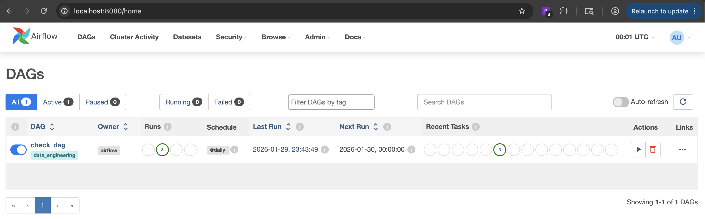
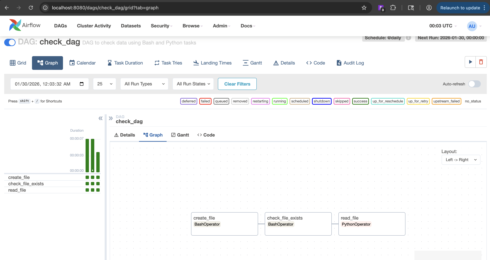
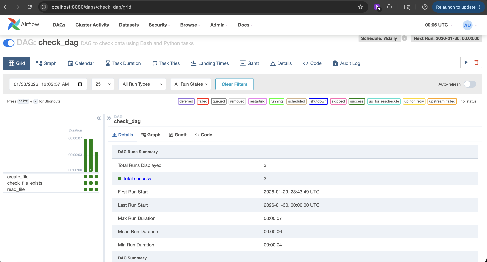
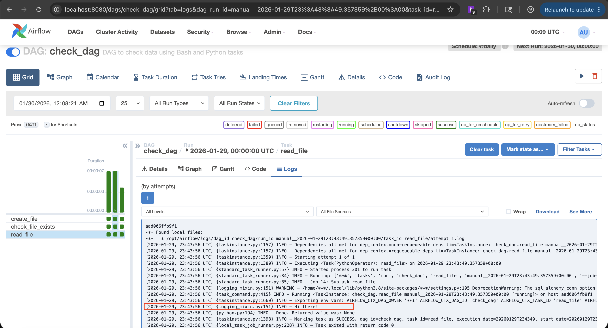

# Airflow Practice (Workflow Orchestration)

This folder contains a **practice Airflow setup** used to learn and validate
workflow orchestration concepts as part of the Data Engineering Zoomcamp.

## What this demonstrates
- Creating DAGs using the TaskFlow API
- Bash and Python tasks
- Task dependencies
- Scheduling and manual triggering
- Inspecting task logs via Airflow UI

## DAGs
- `check_dag`
  - Creates a file using Bash
  - Checks file existence
  - Reads file content using Python

## How to run

### 1. Go to docker folder
```bash
cd 02-workflow-orchestration/airflow_practice/docker
```

### 2. Initialize Airflow metadata DB
"Create and prepare the metadata database that Airflow needs to run."

This step:

- Creates all required tables
- Applies schema migrations
- Makes the database usable by the scheduler & webserver

Without this step, Airflow has nowhere to store state.

##### What happens during initialization (step-by-step)
Airflow will:

     1. Connect to the DB defined in: env AIRFLOW__CORE__SQL_ALCHEMY_CONN

     2. Create all tables (via SQLAlchemy)

     3. Set schema version using Alembic

     4 . Mark the DB as ready for Airflow services

After this:

- Scheduler can write task states
- Web UI can read DAG info
- Users & connections can be created

##### db init vs db upgrade

Command	When to use

`airflow db init`	First-time setup

`airflow db upgrade`	After Airflow version upgrade

In Docker-based workflows:

`db init` → one-time setup

`db upgrade` → future migrations


```bash
docker-compose run --rm airflow-webserver airflow db init
```

Docker:

- Creates a temporary container
- Loads .env
- Connects to Postgres
- Initializes metadata DB
- Deletes the container

Postgres data persists because it’s in a volume.

### 3. Create Airflow admin user
"Creating a login account for the Airflow web UI"

Airflow uses role-based access control (RBAC), so:

- Users must exist in the metadata database
- Each user has a role (Admin, User, Viewer, etc.)

Without a user → you cannot log in to the UI.

The user is stored in the Airflow metadata database (Postgres).

- Table: ab_user
- Roles: ab_role
- Permissions: ab_permission, ab_permission_view

So when you create a user, you are literally inserting rows into these tables.

```bash
docker-compose run --rm airflow-webserver airflow users create \
  --username admin \
  --firstname Admin \
  --lastname User \
  --role Admin \
  --email admin@example.com
```

This command:

- Connects to the metadata DB
- Inserts a user record
- Hashes the password you enter (never stored in plain text)
- Assigns the Admin role
- Grants full UI access

### 4. Start Airflow
```bash
docker-compose up
```

This will launch:

- airflow-webserver → UI at http://localhost:8080
- airflow-scheduler → runs DAGs
- postgres → metadata DB

### 5. Open Airflow UI

URL: http://localhost:8080

Username: admin

Password: (the one you set)

Trigger check_dag manually and inspect task logs.

### Notes

This setup is fully isolated from the actual Zoomcamp project DAGs

Used only for practice and experimentation

### Common Questions - 

#### What is .env?

 - .env file is to manage environment-specific configuration for Airflow when running in Docker. Docker Compose injects these variables into the container, and Airflow maps them to config settings using the AIRFLOW__SECTION__KEY convention. This keeps configuration clean, reproducible, and separate from code.

 #### What is AIRFLOW__CORE__FERNET_KEY key?

 - AIRFLOW__CORE__FERNET_KEY is the encryption key Airflow uses to protect sensitive data stored in its metadata database.
    - In Docker: Containers are recreated often. Without a fixed Fernet key, Airflow may auto-generate one. Auto-generated keys = lost secrets on restart. By setting in .env, you ensure that secrets remain readable across restarts and metadata DB stays consistent

#### Whay is use of docker-compose run --rm airflow-webserver ?

 - `docker-compose run --rm airflow-webserver` starts a temporary container using the Airflow webserver image to run CLI commands like database initialization or user creation, then removes the container to avoid clutter.

 ## Troubleshooting

    1. Error while executing `docker-compose run --rm airflow-webserver airflow db init` ValueError: Fernet key must be 32 url-safe base64-encoded bytes.

Airflow tried to read: AIRFLOW__CORE__FERNET_KEY

and the value is either:
- empty
- invalid
- copied incorrectly
- wrapped in quotes
- line-broken
Without a valid Fernet key, Airflow cannot encrypt/decrypt connections, so DB init fails.

✅ The fix (step by step)

Generate Fernet key using Docker (no installs)
From the same folder where your docker-compose.yml lives:

```bash
docker-compose run --rm airflow-webserver \
  python -c "from cryptography.fernet import Fernet; print(Fernet.generate_key().decode())"
```

This will output something like:

```logs
docker-compose run --rm airflow-webserver \
  python -c "from cryptography.fernet import Fernet; print(Fernet.generate_key().decode())"

WARN[0000] /Users/niteshmishra/data-engineering-zoomcamp-portfolio/02-workflow-orchestration/airflow_practice/docker/docker-compose.yml: the attribute `version` is obsolete, it will be ignored, please remove it to avoid potential confusion
[+] Creating 3/3
 ✔ Network docker_default               Created                                                                                                                                                            0.0s
 ✔ Volume "docker_postgres-db-volume"   Created                                                                                                                                                            0.0s
 ✔ Container airflow_practice_postgres  Created                                                                                                                                                            0.1s
[+] Running 1/1
 ✔ Container airflow_practice_postgres  Started                                                                                                                                                            0.2s

8JQ9qr6B1fAEJf73jwb1as3PqLzZut09EN2IID9TB_Y=
```

👉 Copy `8JQ9qr6B1fAEJf73jwb1as3PqLzZut09EN2IID9TB_Y=` and paste it in your .env file

```env
AIRFLOW__CORE__FERNET_KEY=8JQ9qr6B1fAEJf73jwb1as3PqLzZut09EN2IID9TB_Y=
```

Reset and retry
```bash
docker-compose down -v
docker-compose run --rm airflow-webserver airflow db init
```

    2 Dag import error on UI


✅ The fix (step by step)
Issue is with one of the Import statement in check_dag.py
Fixed file with correct import statement and now rerunning from UI

Using the Airflow UI

- Open your webserver (usually at http://localhost:8080).
- Go to DAGs → check_dag → Trigger DAG.
- Or select a previous run, click Clear on tasks you want to rerun.

OR 

Using command if UI option is not visible - 

#### Remove Python cache inside the container

Docker keeps __pycache__ folders which Airflow may still use:

```bash
docker-compose exec airflow-practice-scheduler bash
cd /opt/airflow/dags
rm -rf __pycache__
exit
```

#### Restart webserver and scheduler

To detect new DAGs, restart both services:

```bash
docker-compose restart airflow-webserver
docker-compose restart airflow-scheduler
```

```
logs - 

docker-compose restart airflow-webserver
[+] Restarting 1/1
 ✔ Container airflow_practice_webserver  Started

 docker-compose restart airflow-scheduler
[+] Restarting 1/1
 ✔ Container airflow_practice_scheduler  Started

 ```

If your containers are running (scheduler + webserver), you can trigger a run like this:
```bash
docker-compose exec airflow-webserver airflow dags trigger check_dag
```

Check logs
```
docker-compose logs airflow-webserver
docker-compose logs airflow-scheduler
```
```
INFO - DAG check_dag has been imported
```


## Important logs:

### 1. Initialize Airflow metadata DB

docker-compose run --rm airflow-webserver airflow db init

```logs

docker-compose run --rm airflow-webserver airflow db init
[+] Creating 3/3
 ✔ Network docker_default               Created                                                                                                                                                            0.0s
 ✔ Volume "docker_postgres-db-volume"   Created                                                                                                                                                            0.0s
 ✔ Container airflow_practice_postgres  Created                                                                                                                                                            0.1s
[+] Running 1/1
 ✔ Container airflow_practice_postgres  Started                                                                                                                                                            0.1s
...

[2026-01-29T01:22:30.845+0000] {migration.py:213} INFO - Context impl PostgresqlImpl.
[2026-01-29T01:22:30.845+0000] {migration.py:216} INFO - Will assume transactional DDL.
INFO  [alembic.runtime.migration] Context impl PostgresqlImpl.
INFO  [alembic.runtime.migration] Will assume transactional DDL.
INFO  [alembic.runtime.migration] Running stamp_revision  -> 405de8318b3a
Initialization done
```

This line is the money shot:

`Initialization done`

It means:

✅ Airflow successfully connected to Postgres

✅ Metadata tables were created

✅ Fernet key is valid

✅ SQLAlchemy + Alembic migrations ran

✅ Your Airflow environment is now ready to run DAGs

Note - 
Alembic is a database migration tool used by Airflow through SQLAlchemy to manage and version changes to the metadata database schema as Airflow evolves.

```
SQLAlchemy defines the tables
Alembic updates the tables
Airflow depends on the tables
```

### 2. Create Airflow admin user

docker-compose run --rm airflow-webserver airflow users create \
  --username admin \
  --firstname Admin \
  --lastname User \
  --role Admin \
  --email admin@example.com

 ```logs
 [+] Creating 1/1
 ✔ Container airflow_practice_postgres  Running                                                                                                                                                            0.0s


[2026-01-29T01:28:08.776+0000] {manager.py:239} INFO - Inserted Role: %s
[2026-01-29T01:28:08.780+0000] {manager.py:239} INFO - Inserted Role: %s
[2026-01-29T01:28:08.782+0000] {manager.py:666} WARNING - No user yet created, use flask fab command to do it.
[2026-01-29T01:28:08.803+0000] {manager.py:499} INFO - Created Permission View: %s
[2026-01-29T01:28:08.806+0000] {manager.py:558} INFO - Added Permission %s to role %s

...

[2026-01-29T01:28:08.944+0000] {manager.py:499} INFO - Created Permission View: %s
[2026-01-29T01:28:08.945+0000] {manager.py:558} INFO - Added Permission %s to role %s
Password:
Repeat for confirmation:
[2026-01-29T01:28:30.641+0000] {manager.py:211} INFO - Added user %s
User "admin" created with role "Admin"
 ```

 This means:

✅ Airflow connected to the metadata DB

✅ Inserted a new user in the ab_user table

✅ Assigned the Admin role

✅ Encrypted the password using your Fernet key

✅ Ready to log in to the Airflow UI

### 3. Start Airflow

docker-compose up

```logs
[+] Running 3/3
 ✔ Container airflow_practice_postgres   Running                                                                                                                                                           0.0s
 ✔ Container airflow_practice_webserver  Created                                                                                                                                                           0.1s
 ✔ Container airflow_practice_scheduler  Created                                                                                                                                                           0.1s
Attaching to airflow_practice_postgres, airflow_practice_scheduler, airflow_practice_webserver
```

## ✅ Successfully done

### 1️⃣ DAG is discovered correctly

Airflow parsed your DAG

No “Broken DAG”

Scheduler picked it up

### 2️⃣ BashOperator works

echo "Hi there!" > /tmp/dummy

File created inside the worker container

### 3️⃣ Task dependencies work

create_file → check_file_exists → read_file

Each task waited for the previous one

### 4️⃣ PythonOperator works

Python read the file

Output showed up in task logs

### 5️⃣ UI + manual trigger works

Triggered DAG from UI

Inspected logs

Validated output

## Check /tmp/dummy file at container level

```bash
docker ps
```
## Running Docker Containers (Airflow Setup)

| Container ID | Image                 | Created          | Status        | Ports                                   | Name                          |
|--------------|-----------------------|------------------|---------------|------------------------------------------|-------------------------------|
| aad006ffb9f1 | apache/airflow:2.7.1  | 26 minutes ago   | Up 26 minutes | 8080/tcp                                | airflow_practice_scheduler    |
| f94987d3d6b8 | apache/airflow:2.7.1  | 26 minutes ago   | Up 26 minutes | 0.0.0.0:8080→8080/tcp, [::]:8080→8080/tcp | airflow_practice_webserver    |
| bb048baa2a64 | postgres:15           | 38 minutes ago   | Up 38 minutes | 5432/tcp                                | airflow_practice_postgres     |

```bash
docker exec -it airflow_practice_scheduler bash
ls -l /tmp
cat /tmp/dummy
```

```
Output - 

Hi there!
```

## Airflow UI Screenshots

### DAGs List View (Home)


### DAG Graph View


### DAG Grid View (Task History)


### Task Log View


