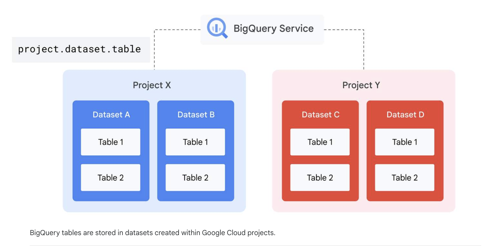

#### Key differences between data definition models of Oracle and BigQuery:
- Oracle uses schemas to store tables in a database within an instance.
- BigQuery tables are stored in a dataset created within a Google Cloud project.


### Big Query Data Types

#### 📦 Scalar (Primitive) Types

🔢 Numeric

| Type         | Description                               | Example   |
| ------------ | ----------------------------------------- | --------- |
| `INT64`      | Integer (signed)                          | `42`      |
| `FLOAT64`    | Floating-point                            | `3.14159` |
| `NUMERIC`    | Fixed-point, 38 digits (9 decimal places) | `123.45`  |
| `BIGNUMERIC` | Higher precision numeric                  | `1e-38`   |
| `BOOL`       | Boolean                                   | `TRUE`    |


🧵 String & Bytes

| Type     | Description     | Example       |
| -------- | --------------- | ------------- |
| `STRING` | UTF-8 text      | `"hello"`     |
| `BYTES`  | Raw binary data | `b'\x01\x02'` |

🕒 Date & Time

| Type        | Description                  | Example                  |
| ----------- | ---------------------------- | ------------------------ |
| `DATE`      | Calendar date                | `2026-02-04`             |
| `TIME`      | Time of day                  | `14:30:00`               |
| `DATETIME`  | Date + time (no timezone)    | `2026-02-04 14:30:00`    |
| `TIMESTAMP` | Absolute point in time (UTC) | `2026-02-04 14:30:00+00` |


🧱 Complex Types
📚 ARRAY

Ordered list of elements (same type)

```sql
ARRAY<INT64>
ARRAY<STRUCT<name STRING, age INT64>>
```

Example
```sql
[1, 2, 3]
```

🧩 STRUCT (aka RECORD)

Nested fields (like a JSON object)

```sql
STRUCT<
  id INT64,
  name STRING,
  created_at TIMESTAMP
>
```

Example

```sql
STRUCT(1 AS id, "Alice" AS name)
```

🗺️ Geography

| Type        | Description                   |
| ----------- | ----------------------------- |
| `GEOGRAPHY` | Points, lines, polygons (GIS) |


```sql
ST_GEOGPOINT(-122.084, 37.422)
```

🧪 JSON

| Type   | Description               |
| ------ | ------------------------- |
| `JSON` | Semi-structured JSON data |


Example

```sql
JSON '{"a": 1, "b": ["x", "y"]}'
```

🔄 Common Type Patterns
Nullable fields (default)

```sql
name STRING
```

Arrays of structs
```sql
ARRAY<STRUCT<product_id STRING, price NUMERIC>>
```

Timestamps best practice

👉 Use TIMESTAMP for events in time, not DATETIME

⚠️ Gotchas

- BigQuery has no VARCHAR, INT, or DOUBLE → use STRING, INT64, FLOAT64
- TIMESTAMP is always stored in UTC
- Arrays cannot contain NULL elements, but the array itself can be NULL
- NUMERIC > FLOAT64 for money 💸

## Organizing BigQuery resources

- Datasets are top-level containers that are used to organize and control access to your tables and views in BigQuery. A dataset is contained within a specific project. A table or view must belong to a dataset, so you need to create at least one dataset before loading data into BigQuery. 

- Access control to run a query is through Identity and Access Management (IAM); different access policies can be set at the Project, Dataset, Table, View, Column or Row levels. To query data in a table or view, you need at least read permissions on the Table or View. 

- In Google Cloud, users run jobs to query BigQuery data. In order to run a query in a specific project, you need IAM permission to submit a job in that project.





## Create Dataset

Datasets are top-level containers used for organizing and controlling access to your data. 

- Resource Naming Format

``` project_id:dataset_id.table_id ```

BigQuery datasets can be regional or multi-regional. You specify a location for storing your BigQuery data when you create a dataset.

- A region is a specific geographic place, such as London.

- A multi-region is a large geographic area, such as the United States, that contains two or more geographic places.

### You can create BigQuery datasets in the following ways:

- Using the Google Cloud console.
```
Navigate to the Explorer pane -> click the three dots next to your project -> select Create dataset.
```
- Using a SQL query.
```sql
CREATE SCHEMA `my-project.analytics`
OPTIONS (
  location = "US",
  description = "Analytics dataset",
  default_table_expiration_days = 30
);
```
- Using the bq mk command in the bq command-line tool.
```bash
bq mk \
  --dataset \
  --location=US \
  my-project:analytics
  ```
- Calling the datasets.insert API method. Send a POST request to the BigQuery API endpoint to programmatically define and create a dataset.
```http
POST https://bigquery.googleapis.com/bigquery/v2/projects/{projectId}/datasets
```

Request Body

```json
{
  "datasetReference": {
    "datasetId": "analytics"
  },
  "location": "US"
}
```

- Using the client libraries.
- Copying an existing dataset.


To create a dataset, you need the IAM permission named `bigquery.datasets.create,` which is in many predefined IAM roles for BigQuery, including `roles/bigquery.user` and `roles/bigquery.dataEditor`. 

### BigQuery datasets are subject to certain limitations:

- You can set the **geographic location** only at dataset creation time.  
  Once a dataset is created, its location is **immutable** and cannot be changed.

- All tables referenced in a **single query** must be stored in datasets that are in the **same location**.

- To **copy a table**, both the **source** and **destination** datasets must reside in the **same location**.

- **Dataset names** must be **unique within each project**.


## Table Management

### Ways to Create Tables

1. Using the **BigQuery UI**
```
Console → BigQuery → Create table

Typical inputs:

Source: Empty table / Upload / Google Cloud Storage
Destination: project.dataset.table
Schema: define columns or enable auto-detect

✅ Best for quick/manual setups
❌ Not reproducible
```
2. Programmatically by calling the **`tables.insert` API** method

REST request
```http
POST https://bigquery.googleapis.com/bigquery/v2/projects/my-project/datasets/analytics/tables
```

Body
```json
{
  "tableReference": {
    "tableId": "users"
  },
  "schema": {
    "fields": [
      { "name": "user_id", "type": "INT64", "mode": "REQUIRED" },
      { "name": "email", "type": "STRING" },
      { "name": "created_at", "type": "TIMESTAMP" }
    ]
  }
}
```
✅ Infrastructure as code
❌ More verbose

3. By using the **client libraries**
```python
from google.cloud import bigquery

client = bigquery.Client()

schema = [
    bigquery.SchemaField("user_id", "INT64", mode="REQUIRED"),
    bigquery.SchemaField("email", "STRING"),
    bigquery.SchemaField("created_at", "TIMESTAMP"),
]

table = bigquery.Table("my-project.analytics.users", schema=schema)
client.create_table(table)
```
4. From **query results**
```sql
CREATE TABLE analytics.top_users AS
SELECT
  user_id,
  COUNT(*) AS event_count
FROM analytics.events
GROUP BY user_id;
```
or overwrite
```sql
CREATE OR REPLACE TABLE analytics.top_users AS
SELECT * FROM analytics.users;
```
5. By defining a table that references an **external data source**

Example: GCS CSV
```sql
CREATE EXTERNAL TABLE analytics.external_users
OPTIONS (
  format = 'CSV',
  uris = ['gs://my-bucket/users/*.csv'],
  skip_leading_rows = 1,
  autodetect = TRUE
);
```

Example: Parquet

```sql
CREATE EXTERNAL TABLE analytics.external_events
OPTIONS (
  format = 'PARQUET',
  uris = ['gs://my-bucket/events/*.parquet']
);
```

6. When you **load data**

CLI (bq load)
```bash
bq load \
  --source_format=CSV \
  analytics.users \
  gs://my-bucket/users.csv \
  user_id:INT64,email:STRING,created_at:TIMESTAMP
```

7. By using a **CREATE TABLE** data definition language (DDL) statement

Basic Table

```sql
CREATE TABLE analytics.users (
  user_id INT64 NOT NULL,
  email STRING,
  created_at TIMESTAMP
);
```

Partitioned Table

```sql
CREATE TABLE analytics.events (
  event_id STRING,
  event_time TIMESTAMP
)
PARTITION BY DATE(event_time);
```

Clustered Table

```sql
CREATE TABLE analytics.events (
  user_id INT64,
  event_type STRING,
  event_time TIMESTAMP
)
PARTITION BY DATE(event_time)
CLUSTER BY user_id, event_type;
```

Temporary Table

```sql
CREATE TEMP TABLE temp_users AS
SELECT * FROM analytics.users;
```

To create a table within a BigQuery dataset, you need the following specific IAM permissions: `bigquery.tables.create`,`bigquery.tables.updateData` and`bigquery.jobs.create`. 

These permissions are included in many predefined IAM roles for BigQuery, including `roles/bigquery.user` and `roles/bigquery.dataEditor`.

## Managing tables

After creating a table in a BigQuery dataset, you can manage the table in several ways including 
- copying the table to duplicate or move it
- renaming the table 
- setting table properties
- deleting the table
- restoring a deleted table

### copying the table

- Google Cloud console

```
#### Steps to Copy a Table in BigQuery (UI)

1. Go to **BigQuery** in the **Google Cloud Console**
2. Select the **source table**
3. Click **⋮ (More options)** → **Copy**
4. Choose the following:
   - **Destination project**
   - **Destination dataset**
   - **New table name**
5. Select the **write option**:
   - Append
   - Overwrite
   - Error if exists
6. Click **Copy**

### Notes

- ✅ Best for **ad-hoc copies**
- ❌ **Not automatable**
```

- `bq cp` command

Basic Copy

```bash
bq cp \
  my-project:analytics.users \
  my-project:backup.users_copy
```

Overwrite Destination

```bash
bq cp -f \
  analytics.users \
  backup.users_copy
```

Append to Existing Table

```bash
bq cp -a \
  analytics.users \
  analytics.users_history
```


- data definition language (DDL) `CREATE TABLE COPY`

Basic Copy

```sql
CREATE TABLE analytics.users_copy
COPY analytics.users;
```

Copy Across Datasets

```sql
CREATE TABLE backup.users_copy
COPY analytics.users;
```

Copy Across Projects

```sql
CREATE TABLE `target-project.backup.users_copy`
COPY `source-project.analytics.users`;
```

Overwrite Destination

```sql
CREATE OR REPLACE TABLE analytics.users_copy
COPY analytics.users;
```

Copy with Expiration

“Copy with expiration” means you create a copied table that automatically deletes itself at a specified time.

It’s basically a temporary / disposable copy of a table.

```sql
CREATE TABLE analytics.users_copy
OPTIONS (
  expiration_timestamp = TIMESTAMP_ADD(CURRENT_TIMESTAMP(), INTERVAL 7 DAY)
)
COPY analytics.users;
```

Set expiration on an existing table

```sql
ALTER TABLE analytics.users_copy
SET OPTIONS (
  expiration_timestamp = TIMESTAMP_ADD(CURRENT_TIMESTAMP(), INTERVAL 3 DAY)
);
```

⚠️ Important Gotchas

❌ Expiration cannot be undone once the table is deleted
✅ You can extend the expiration before it expires
❌ Expiration does not cascade (views depending on it will break)
❌ Table expiration ≠ partition expiration

💡 Pro Tip

If the table is large and short-lived, consider:

```sql
CREATE TABLE analytics.users_clone
CLONE analytics.users
OPTIONS (
  expiration_timestamp = TIMESTAMP_ADD(CURRENT_TIMESTAMP(), INTERVAL 7 DAY)
);
```

➡️ Same behavior, way cheaper 💸

- COPY = physical duplicate (more storage, slower)
- CLONE = metadata snapshot (fast, cheap)

COPY

```sql
CREATE TABLE dataset.table_copy
COPY dataset.table;
```

- BigQuery physically copies the data
- Storage is duplicated
- Takes time proportional to table size
- Source table can be deleted without affecting copy

CLONE

```sql
CREATE TABLE dataset.table_clone
CLONE dataset.table;
```

- BigQuery creates a snapshot of metadata
- Data blocks are shared initially
- Uses copy-on-write
- Almost instantaneous

CLONE limitations

- ❌ Cannot clone external tables
- ❌ Cannot clone views
- ❌ Must be in the same location
- ❌ Source table must exist at creation time


### BigQuery tables are subject to certain limitations:

- Table names must be **unique within a dataset**.

- The **Google Cloud Console** supports copying **only one table at a time**.

- The Google Cloud Console can display up to **50,000 tables per dataset**.

- When copying tables, the **destination dataset must be in the same location** as the source dataset.  
  For example, you **cannot copy** a table from an **EU-based** dataset to a **US-based** dataset.

- When copying **multiple source tables** into a single destination table using the **`bq` CLI**, **API**, or **client libraries**, all source tables must have **identical schemas**.

- When exporting table data, the **only supported destination is Cloud Storage**.  
  However, the Google Cloud Console allows downloading **query results** to a **local file**, **Google Sheets**, or **Google Drive**.


## IAM

What is IAM?

- In Google Cloud, IAM is a tool and framework for fine-grained access control and visibility for centrally managing cloud resources. 

- IAM enables you to grant granular access to specific Google Cloud resources and to prevent unauthorized access to other resources as needed.

- IAM follows a model of access management composed of three main parts: Principal, Role, and Policy. 

### IAM Principal
An **IAM principal** is an identity that can access resources.  
Examples include:
- A **user**
- A **group**
- A **service account**
- A **Google account**

Principals are the **who** in IAM.

---

### IAM Role
An **IAM role** is a collection of permissions.  
Roles define **what actions are allowed** on resources.

Types of roles:
- **Primitive roles**: Owner, Editor, Viewer
- **Predefined roles**: Service-specific (e.g., `roles/bigquery.dataViewer`)
- **Custom roles**: User-defined sets of permissions

Roles are the **what** in IAM.

---

### IAM Policy
An **IAM policy** binds **principals** to **roles** on a resource.

A policy answers:
> *Who* can do *what* on *which resource*

Policies are made up of **bindings**, where each binding includes:
- One or more principals
- A role

Policies are the **how** in IAM.

```
In IAM, permission to access a resource is not granted directly to the end user. Instead, permissions are grouped into roles, and roles are granted to authenticated principals.
```

```
An allow policy, also known as an IAM policy, defines and enforces what roles are granted to which principals. Each allow policy is attached to a Google Cloud resource such as a BigQuery dataset. When an authenticated principal attempts to access a resource, IAM checks the resource's allow policy to determine whether the action is permitted.
```

## How does data encryption work on Google Cloud?

### Encryption at Rest

- Default encryption at rest protects your data from a system compromise or data exfiltration by encrypting data while stored.

- For example, BigQuery data is divided into several chunks, each with its own data encryption key. Keys are automatically stored and managed in Cloud Key Management Service (KMS). You can also manage your own keys using customer-managed encryption keys (CMEK) in Cloud KMS.

### Encryption in transit

- Default encryption in transit to and from outside of Google Cloud protects your data if communications are intercepted while data moves between your site and Google Cloud. This protection is achieved by encrypting the data before transmission, authenticating the endpoints, and, on arrival, decrypting and verifying that the data was not modified.

### Encryption in use

- Google Cloud offers Confidential Computing, which you can use to secure your most sensitive data by keeping it encrypted in use, while it is being processed.
