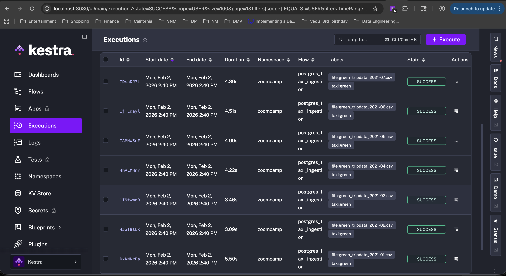

## Module 2 Homework

https://github.com/DataTalksClub/data-engineering-zoomcamp/blob/main/cohorts/2026/02-workflow-orchestration/homework.md

## What needs to be done (High Level)

You already have flows that process **2019–2020 taxi data**.  
Your task is to **extend these flows to 2021 (January–July)** for both **green** and **yellow** taxis.

### Requirements

- Process data for **2021-01 through 2021-07**
- Apply the processing to **both taxi types**:
  - Yellow taxi
  - Green taxi
- **Commit** the updated code to **GitHub**

## Correct Download Pattern (Important)

### Base URL

https://github.com/DataTalksClub/nyc-tlc-data/releases/download/green/


### File Naming Convention

- `green_tripdata_2021-01.csv.gz`
- `yellow_tripdata_2021-01.csv.gz`

### How to Generate the Files

To download all required files, swap:

- **Taxi type**: `green` / `yellow`
- **Month**: `01` → `07`

This covers **January through July 2021** for both taxi types.

## Option 1 (Easiest): Kestra Backfill ✅

If your flow is **scheduled** and already **parameterized by date**, you can use Kestra’s built-in backfill feature.

### Steps

1. Open your flow in the **Kestra UI**
2. Click **Backfill**
3. Set the following values:
   - **Start**: `2021-01-01`
   - **End**: `2021-07-31`
4. Run the backfill **once per service**:
   - `service: green`
   - `service: yellow`

### Steps to run 

#### 1. Execute Docker compose
```bash
docker compose up
```

#### 2. Open Kestra: http://localhost:8080

#### 3. Open pgAdmin: http://localhost:8085 and connect to pgdatabase

- Host: pgdatabase
- DB: ny_taxi
- User: root
- Password: root

#### 4. Backfill HW2 flows for 2021 green and yellow taxi data.

## Steps to Backfill 2021 Data in Kestra

Followed these steps to backfill taxi data for **January–July 2021** using Kestra:

1. **Open Kestra UI**  
   Navigate to **Flows** and select your flow (e.g., `postgres_taxi_ingestion`).

2. **Select Backfill**  
   Click the **backfill executions** button (inside tab triggers).

3. **Set the Backfill Period**  
   - **Start date**: `2020-12-31`  
   - **End date**: `2021-07-31`  
   > Only up to the last month for which data exists on GitHub.

4. **Choose the Taxi Type Input**  
   - Run once for **green** (`taxi: green`)  
   - Run again for **yellow** (`taxi: yellow`)

5. **Start the Backfill**  
   Kestra will automatically create a flow execution for **each month** in the selected range.  
   It dynamically replaces `{{trigger.date}}` in your YAML to fetch the correct CSV file.

6. **Check Executions**  
   - All monthly executions will be visible in the UI.  
   - Optionally, use a **label** like `backfill:true` to identify these runs.


## Screenshots




## Questions

- Question 1. Within the execution for Yellow Taxi data for the year 2020 and month 12: what is the uncompressed file size (i.e. the output file yellow_tripdata_2020-12.csv of the extract task)? (1 point)

    - 128.3 MiB

    - 134.5 MiB

    - 364.7 MiB

    - 692.6 MiB

Steps followed - 

```bash
wget -qO- https://github.com/DataTalksClub/nyc-tlc-data/releases/download/yellow/yellow_tripdata_2020-12.csv.gz | gunzip > yellow_tripdata_2020-12.csv

% ls -lrt yellow_tripdata_2020-12.csv

```

Output
```text
-rw-r--r--  1 niteshmishra  staff  134481400 Feb  2 14:50 yellow_tripdata_2020-12.csv
```

The size column is 134481400 bytes.


Converting bytes → MiB:

134,481,400÷(1024×1024)≈128.3 MiB

Answer - 128.3 MiB

- Question 2. What is the rendered value of the variable file when the inputs taxi is set to green, year is set to 2020, and month is set to 04 during execution? (1 point)

    - {{inputs.taxi}}_tripdata_{{inputs.year}}-{{inputs.month}}.csv

    - green_tripdata_2020-04.csv

    - green_tripdata_04_2020.csv

    - green_tripdata_2020.csv

Steps followed - 

file: "{{inputs.taxi}}_tripdata_{{trigger.date | date('yyyy-MM')}}.csv"

inputs.taxi = green

trigger.date corresponds to 2020-04, so the date filter date('yyyy-MM') renders as 2020-04

Answer - green_tripdata_2020-04.csv

- Question 3. How many rows are there for the Yellow Taxi data for all CSV files in the year 2020? (1 point)


    - 13,537.299

    - 24,648,499

    - 18,324,219

    - 29,430,127


Steps followed - 

Created new flow - taxi_csv_inspect_multiple which does below steps -

This flow is designed to inspect NYC Taxi CSV files (Yellow or Green) for a given year and multiple months without ingesting data into a database.
Its purpose is to extract CSV files, count rows per file, aggregate totals, and clean up temporary files.

```logs

```


- Question 4. How many rows are there for the Green Taxi data for all CSV files in the year 2020? (1 point)


    - 5,327,301

    - 936,199

    - 1,734,051

    - 1,342,034

Steps followed - 

Since we need all CSV files, I need to backfill all months of 2020

- **Start date**: `2019-12-31`  
- **End date**: `2020-07-31`  

Get record counts - (row count of green_copy_in_to_staging_table)

Jan 2020 - 6405008
Feb 2020 - 
March 2020 - 
April 2020 - 
May 2020 - 
June 2020 - 
July 2020 - 
August 2020 - 
September 2020 - 
October 2020 - 
November 2020 - 
December 2020 - 

Question 5. How many rows are there for the Yellow Taxi data for the March 2021 CSV file? (1 point)


    - 1,428,092

    - 706,911

    - 1,925,152

    - 2,561,031

Query via pgadmin - 

SELECT COUNT(*) 
FROM public.yellow_tripdata
WHERE filename = 'yellow_tripdata_2021-03.csv';

Answer - 1,925,152

- Question 6. How would you configure the timezone to New York in a Schedule trigger? (1 point)


Add a timezone property set to EST in the Schedule trigger configuration

Add a timezone property set to America/New_York in the Schedule trigger configuration

Add a timezone property set to UTC-5 in the Schedule trigger configuration

Add a location property set to New_York in the Schedule trigger configuration

