# Module 3 Homework: Data Warehousing & BigQuery

https://github.com/DataTalksClub/data-engineering-zoomcamp/blob/main/cohorts/2026/03-data-warehouse/homework.md

## Objective

Practice working with BigQuery and Google Cloud Storage (GCS) using NYC Yellow Taxi Trip Records (Jan–Jun 2024).

## Data

Parquet files: NYC Yellow Taxi Trip Records (Jan–Jun 2024)

Source: [NYC Taxi Data](https://www.nyc.gov/site/tlc/about/tlc-trip-record-data.page)

## Setup
### Load Data

- Python script: load_yellow_taxi_data.py

- Jupyter Notebook (DLT): DLT_upload_to_GCP.ipynb

- Requirements: GCS Service Account with Admin privileges or authenticated via Google SDK.

- Ensure all 6 files appear in your GCS bucket.

`Use PARQUET option when creating an external table.`

### BigQuery Setup

    1. Create an external table from the Parquet files.

    2. Create a materialized/regular table in BigQuery (do not partition/cluster for this step).


### Steps Followed - 

### Prerequisites

### 1. Create a New GCP Project

#### Step 1: Create a New GCP Project (UI – Recommended)

1. Go to **Google Cloud Console**
2. In the top bar, click the **project dropdown**
3. Click **New Project**
4. Select **Billing Account**
5. Fill in the following details:

   - **Project name**:  
     `de-zoomcamp-2026`

   - **Project ID** (auto-generated, editable):  
     `de-zoomcamp-2026-486900`

   - **Organization**:  
     Auto generated as per existing organization

6. Click **Create**

#### Step 3: Switch to the New Project

### Using the UI

1. In the **top bar**, click the **project dropdown**
2. Select your project:  
   `de-zoomcamp-2026`

### Using the CLI

gcloud config set project de-zoomcamp-2026-<id>

Verify
```bash
gcloud config get-value project
```

#### Step 3: Enable Required APIs (Very Important)

Go to **APIs & Services → Enable APIs** and enable the following:

- ✅ **BigQuery API**
- ✅ **Cloud Storage API**

(Optional but useful later):

- **IAM API**
- **Compute Engine API**

#### Step 5: Create Resources (In This Order)

Once your project is ready, create the following resources in order:

1. **BigQuery Dataset**  
   - Location: `us-central1`

2. **GCS Bucket**  
   - Location: `us-central1`

3. **Upload Parquet Files**  
   - Upload the required files to your GCS bucket

4. **Create Tables in BigQuery**  
   - Start with an **external table** pointing to the Parquet files  
   - Then create a **materialized table** from the external table

### 1. BigQuery Dataset
Option 1: Using the BigQuery UI

1. Go to Google Cloud Console → BigQuery

2. In the left panel under your project (de-zoomcamp-2026-486900), click the down arrow next to the project name

3.  Click “Create Dataset”
4.  Fill in the details:

| Field                        | Value                    |
| ---------------------------- | ------------------------ |
| **Dataset ID**               | `trip_data`              |
| **Data location**            | `us-central1`            |
| **Default table expiration** | leave blank (optional)   |
| **Encryption**               | Google-managed (default) |
| Click **Create Dataset**     | ✅ Done                   |

5. You should now see taxi_data under your project in the left panel.

Option 2: Using CLI

```bash
bq --location=us-central1 mk \
  --dataset de-zoomcamp-2026-486900:taxi_data
```

Check it exists:
```bash
bq show de-zoomcamp-2026-486900:taxi_data
```
You should see:
```yaml
Dataset Id: taxi_data
Location: us-central1
```
✅ Dataset is now ready!

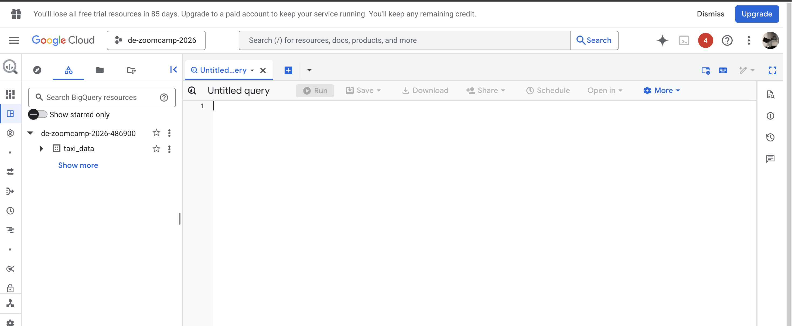

### 2. Create GCS Bucket

Option 1 - Create a GCS Bucket via Google Cloud Console (UI)

Note - make sure that correct project `de-zoomcamp-2026-486900` is selected while creating bucket through UI

1. Go to **Google Cloud Console** → **Cloud Storage** → **Buckets**
2. Click **Create**
3. Fill in the following details:

   - **Bucket name**  
     Must be **globally unique**  
     Example:
     ```
     `de-zoomcamp-hw3-2026-dipika`

   - **Location type**: `Region`

   - **Location**  
     Choose the **same region as BigQuery** (important for performance and cost)  
     Common choice: `us-central1`

   - **Storage class**: `Standard`

   - **Access control**: `Uniform`

   - **Encryption**: Leave as **default**

4. Click **Create**

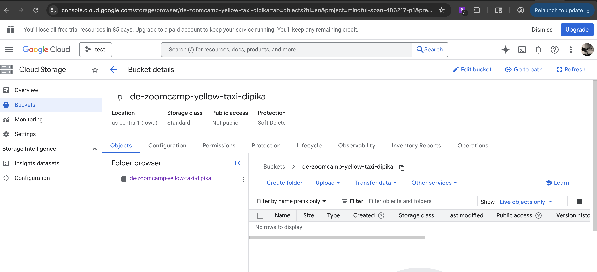

### Option 2: Create GCS Bucket via CLI (Recommended for DEs 😄)

1. Make sure gcloud is authenticated
```bash
gcloud auth login
gcloud config set project YOUR_PROJECT_ID
```

Check:
```bash
gcloud config get-value project
```
Example:
```bash
gsutil mb -p my-gcp-project -c STANDARD -l us-central1 gs://de-zoomcamp-yellow-taxi-dipika
```

3. Verify
```bash
gsutil ls
```

You should see:
```bash
gs://de-zoomcamp-yellow-taxi-dipika/
```

2. Create the bucket
```
gsutil mb \
  -p YOUR_PROJECT_ID \
  -c STANDARD \
  -l us-central1 \
  gs://de-zoomcamp-hw3-2026-dipika
```

### 3. **Upload Parquet Files**  

- Use file load_yellow_taxi_data.py to upload files
- Update bucket name to - de-zoomcamp-hw3-2026-dipika
- Credentials
    - The script has:
        ```python
        CREDENTIALS_FILE = "gcs.json"
        client = storage.Client.from_service_account_json(CREDENTIALS_FILE)
        ```
    - 1. Use a service account JSON key
        - Download a JSON key from IAM → Service Accounts
        - Save as gcs.json in your working folder
    - 2. Or comment these lines if using Cloud Shell / authenticated SDK:
        ```python
        # CREDENTIALS_FILE = "gcs.json"
        # client = storage.Client.from_service_account_json(CREDENTIALS_FILE)
        client = storage.Client(project='de-zoomcamp-2026-486900')
        ```
- Run the script
    Note - make sure that bucket is not manually created. Script will create the bucket.
    ```bash
    python3 load_yellow_taxi_data.py
    ```
    - Create bucket
    - It will download all 6 Parquet files from the NYC taxi dataset
    - Then upload them to your bucket
    - It includes verification to make sure each file exists in GCS

- Verify uploads
    After the script finishes, check:
    ```bash
    gsutil ls gs://de-zoomcamp-hw3-2026-dipika/
    ```
    You should see:
    ```bash
    gs://de-zoomcamp-hw3-2026-dipika/yellow_tripdata_2024-01.parquet
    gs://de-zoomcamp-hw3-2026-dipika/yellow_tripdata_2024-02.parquet
    gs://de-zoomcamp-hw3-2026-dipika/yellow_tripdata_2024-03.parquet
    gs://de-zoomcamp-hw3-2026-dipika/yellow_tripdata_2024-04.parquet
    gs://de-zoomcamp-hw3-2026-dipika/yellow_tripdata_2024-05.parquet
    gs://de-zoomcamp-hw3-2026-dipika/yellow_tripdata_2024-06.parquet
    ```

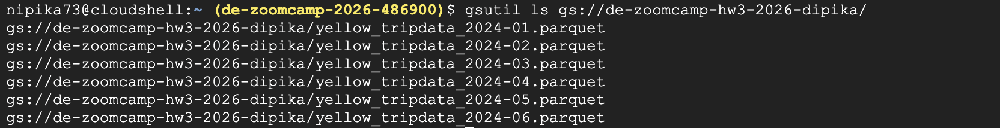

✅ Once all 6 files are there, your bucket is ready for BigQuery.

### 3.1 - Create service account and get JSON key

1. Open **Google Cloud Console** → **IAM & Admin** → **Service Accounts**
2. Click **Create Service Account**
3. Fill in the details
    - Service account name : de-zoomcamp-gcs-sa-dipika
    - Service account ID : (autofilled) de-zoomcamp-gcs-sa-dipika
    - Description : SA for uploading Yellow Taxi Parquet files to GCS
4. Grant this service account permissions

    `Choose Role → Storage → Storage Admin`

    This gives full access to buckets and objects in GCS (needed by your Python script)

    Click Continue → Done
5. Create JSON key
    - Find your service account in the list
    - Click the three dots → Manage Keys → Add Key → Create New Key
        - Note - I am getting error - Service account key creation is disabled
    - Choose JSON → Click Create
    - Save the downloaded file as gcs.json in your working folder
    - Keep this file private — it allows full access to your bucket.

```arduino
gs://your-bucket-name/yellow_taxi_jan_2024.parquet
```

## Steps to complete assignment - 

### Step 1: Create External Table

External tables reference data directly in GCS.

```sql
CREATE OR REPLACE EXTERNAL TABLE `de-zoomcamp-2026-486900.trip_data.yellow_taxi_ext`
OPTIONS (
  format = 'PARQUET',
  uris = [
    'gs://de-zoomcamp-hw3-2026-dipika/yellow_tripdata_2024-*.parquet'
  ]
);
```
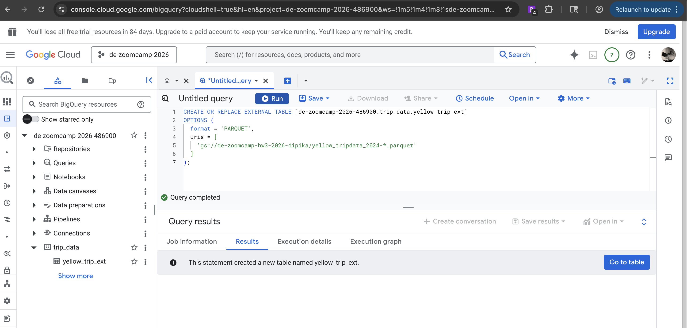

✅ Tip: Use PARQUET format. Wildcard * works if multiple files.

### Step 2: Create Materialized (Regular) Table
```sql
CREATE OR REPLACE TABLE `de-zoomcamp-2026-486900.trip_data.yellow_trip_mat` AS
SELECT * FROM `de-zoomcamp-2026-486900.trip_data.yellow_trip_ext`;
```
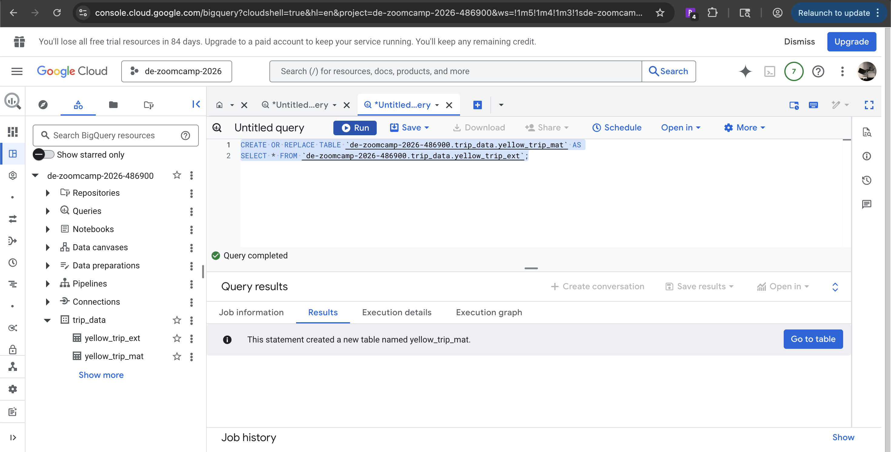

Do not partition/cluster for now. This gives you a full copy in BigQuery.


BigQuery shows estimated bytes scanned → reflects full table size.


### Questions

#### Q1: Counting Records

Question 1. What is count of records for the 2024 Yellow Taxi Data? (1 point)

Options:

- 65,623

- 840,402

- 20,332,093

- 85,431,289

```sql
SELECT COUNT(*) AS total_records
FROM `de-zoomcamp-2026-486900.trip_data.yellow_trip_mat`;
```


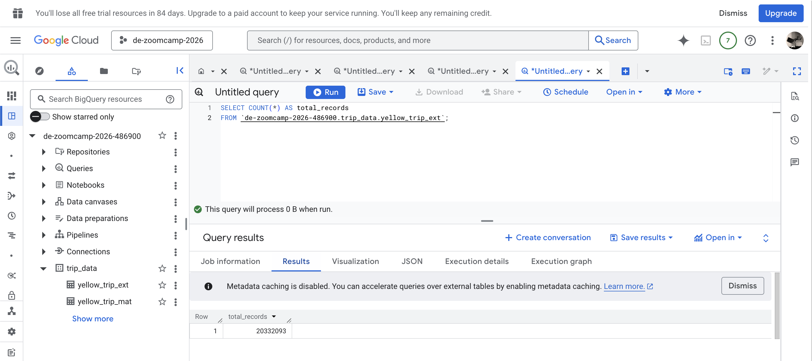

Answer - 20,332,093

#### Q2: Data Read Estimation

Write a query to count the distinct number of PULocationIDs for the entire dataset on both the tables.

What is the estimated amount of data that will be read when this query is executed on the External Table and the Table?


Question 2. What is the estimated amount of data that will be read when this query is executed on the External Table and the Table? (1 point)

Options:

- 18.82 MB (External) / 47.60 MB (Materialized)

- 0 MB / 155.12 MB

- 2.14 GB / 0 MB

- 0 MB / 0 MB

```sql
-- On External Table
SELECT COUNT(DISTINCT PULocationID) AS distinct_pu
FROM `your_project.your_dataset.yellow_taxi_ext`;

-- On Materialized Table
SELECT COUNT(DISTINCT PULocationID) AS distinct_pu
FROM `de-zoomcamp-2026-486900.trip_data.yellow_trip_mat`;
```

Answer - 0 MB / 155.12 MB

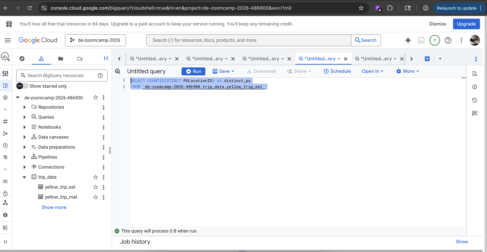

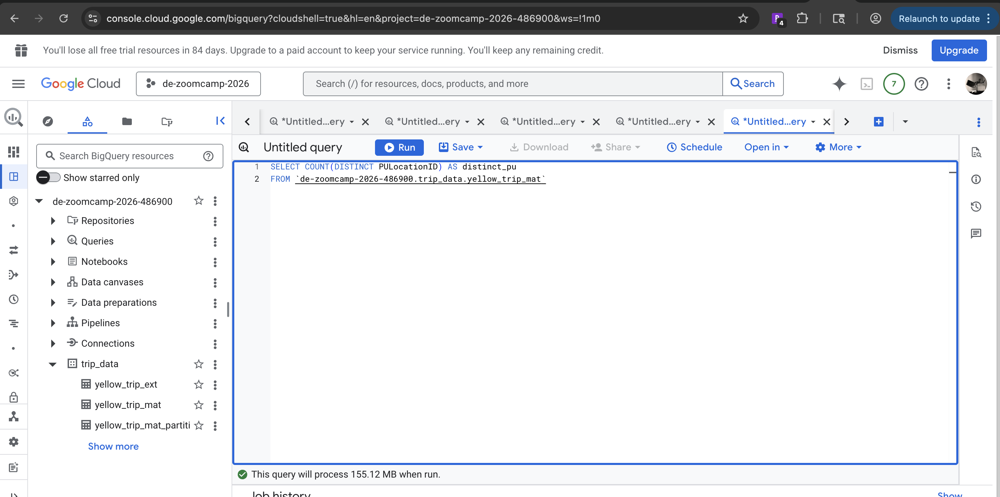

#### Q3: Columnar Storage

Write a query to retrieve the PULocationID from the table (not the external table) in BigQuery. Now write a query to retrieve the PULocationID and DOLocationID on the same table.

Why are the estimated number of Bytes different?

Question 3. Why are the estimated number of Bytes different? (1 point)

```sql
-- One column
SELECT PULocationID
FROM `de-zoomcamp-2026-486900.trip_data.yellow_trip_mat`;

-- Two columns
SELECT PULocationID, DOLocationID
FROM `de-zoomcamp-2026-486900.trip_data.yellow_trip_mat`;
```
Observations: BigQuery is columnar → selecting 2 columns reads more bytes than 1 column.

- BigQuery is a columnar database, and it only scans the specific columns requested in the query. Querying two columns (PULocationID, DOLocationID) requires reading more data than querying one column (PULocationID), leading to a higher estimated number of bytes processed.

- BigQuery duplicates data across multiple storage partitions, so selecting two columns instead of one requires scanning the table twice, doubling the estimated bytes processed.

- BigQuery automatically caches the first queried column, so adding a second column increases processing time but does not affect the estimated bytes scanned.

- When selecting multiple columns, BigQuery performs an implicit join operation between them, increasing the estimated bytes processed

Answer - `BigQuery is a columnar database, and it only scans the specific columns requested in the query. Querying two columns (PULocationID, DOLocationID) requires reading more data than querying one column (PULocationID), leading to a higher estimated number of bytes processed.`


#### Q4: Counting Zero Fare Trips

How many trips have fare_amount = 0?

Options:

- 128,210

- 546,578

- 20,188,016

- 8,333

```sql
SELECT COUNT(*) AS zero_fare_trips
FROM `de-zoomcamp-2026-486900.trip_data.yellow_trip_mat`
WHERE fare_amount = 0;
```

Ans - 8333


#### Q5: Partitioning & Clustering

Question 5. What is the best strategy to make an optimized table in Big Query if your query will always filter based on tpep_dropoff_datetime and order the results by VendorID (Create a new table with this strategy)

Options:

- Partition by tpep_dropoff_datetime & Cluster on VendorID 

- Cluster by tpep_dropoff_datetime & Cluster on VendorID

- Cluster on tpep_dropoff_datetime & Partition by VendorID

- Partition by both tpep_dropoff_datetime & VendorID

Best strategy - Optimize table for queries filtering tpep_dropoff_datetime & ordering by VendorID.

```sql
CREATE OR REPLACE TABLE `de-zoomcamp-2026-486900.trip_data.yellow_trip_mat_partitioned`
PARTITION BY DATE(tpep_dropoff_datetime)
CLUSTER BY VendorID AS
SELECT * FROM `de-zoomcamp-2026-486900.trip_data.yellow_trip_mat`;
```

Ans - Partition by tpep_dropoff_datetime & Cluster on VendorID 

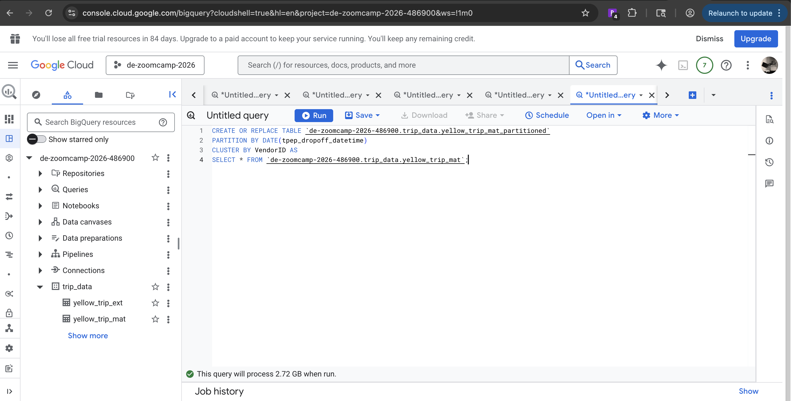

#### Q6: Partition Benefits

Question 6. Write a query to retrieve the distinct VendorIDs between tpep_dropoff_datetime 2024-03-01 and 2024-03-15 (inclusive). Use the materialized table you created earlier in your from clause and note the estimated bytes. Now change the table in the from clause to the partitioned table you created for question 5 and note the estimated bytes processed. What are these values?

Write a query to retrieve the distinct VendorIDs between tpep_dropoff_datetime 2024-03-01 and 2024-03-15 (inclusive)

Use the materialized table you created earlier in your from clause and note the estimated bytes. Now change the table in the from clause to the partitioned table you created for question 5 and note the estimated bytes processed. What are these values?

Choose the answer which most closely matches.

Options:

- 12.47 MB for non-partitioned table and 326.42 MB for the partitioned table

- 310.24 MB for non-partitioned table and 26.84 MB for the partitioned table

- 5.87 MB for non-partitioned table and 0 MB for the partitioned table

- 310.31 MB for non-partitioned table and 285.64 MB for the partitioned table

Query distinct VendorID between March 1–15, 2024:

```sql
-- Non-partitioned table
SELECT DISTINCT VendorID
FROM `de-zoomcamp-2026-486900.trip_data.yellow_trip_mat`
WHERE tpep_dropoff_datetime >= '2024-03-01'
AND tpep_dropoff_datetime < '2024-03-16';

-- Partitioned table
SELECT DISTINCT VendorID
FROM `de-zoomcamp-2026-486900.trip_data.yellow_trip_mat_partitioned`
WHERE tpep_dropoff_datetime >= '2024-03-01'
AND tpep_dropoff_datetime < '2024-03-16';
```
Compare estimated bytes read for both tables → partitioning reduces scanned data.

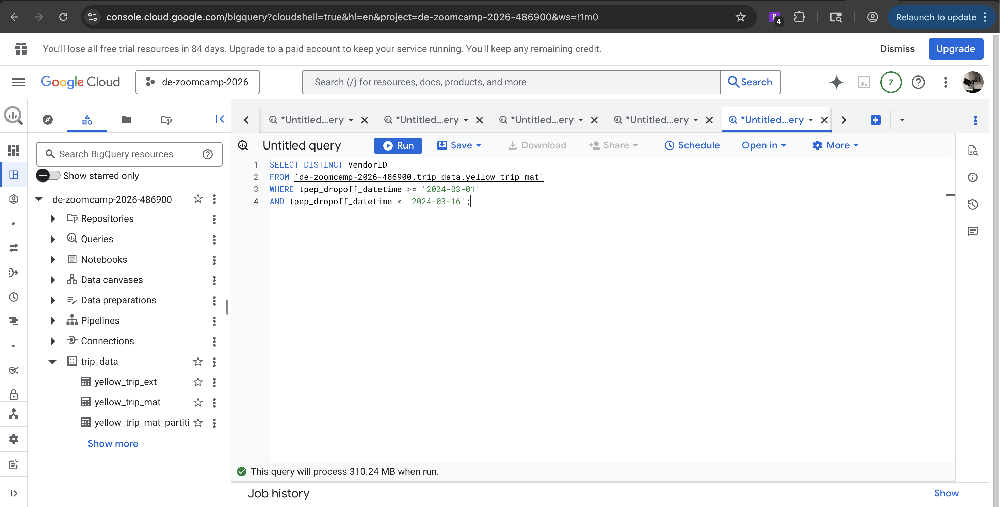

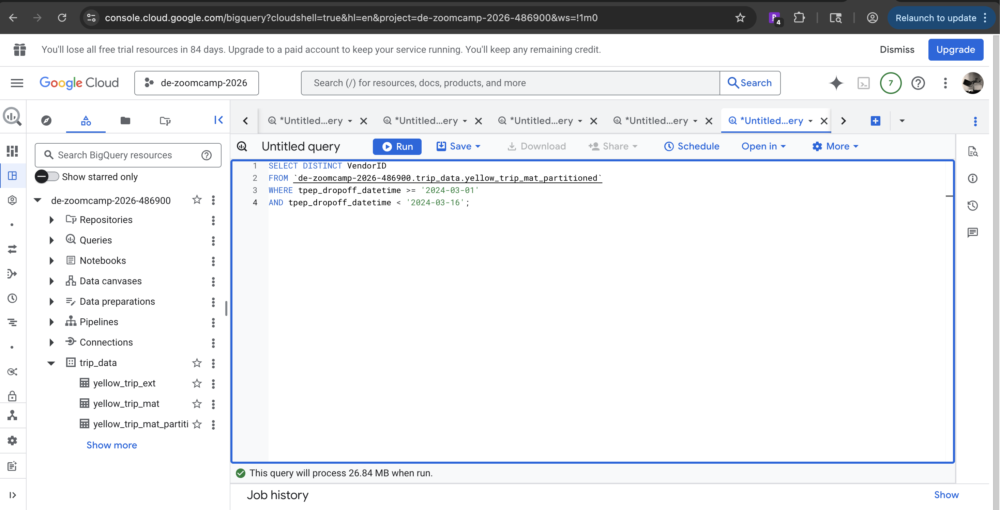

Answer - 310.24 MB / 26.84 MB

310.24 MB for non-partitioned table and 26.84 MB for the partitioned table


#### Q7: External Table Storage

Where is external table data stored?

- Big Query

- Container Registry

- GCP Bucket

- Big Table


Answer - GCS Bucket

#### Q8: Clustering Best Practices

Best practice to always cluster in BigQuery?

- True

- False

Answer - False (cluster only when needed for performance)

#### Q9: Understanding Table Scans

Write SELECT count(*) on the materialized table.

How many bytes estimated? Why?

SELECT COUNT(*) FROM `de-zoomcamp-2026-486900.trip_data.yellow_trip_mat`;

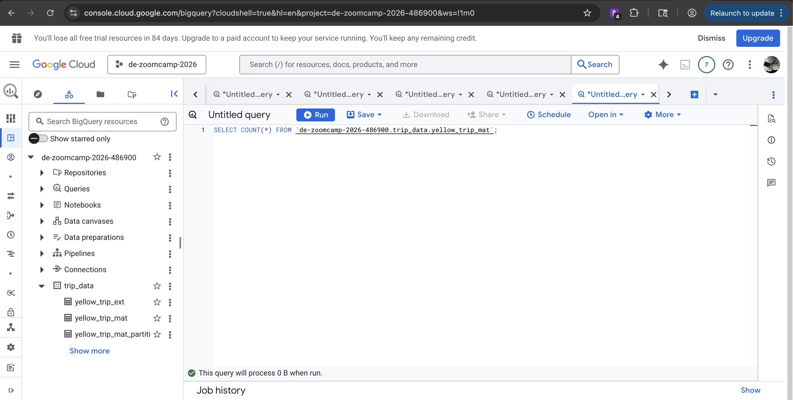

It estimates 0 bytes.

BigQuery is smart 😊

- COUNT(*) does not read columns
    - It only needs metadata
    - No actual data scanning is required
- For materialized (native) tables
    - BigQuery stores row counts in metadata
    - So, no column scan needed

➡️ Result:
Estimated bytes processed = 0 bytes for materialized table.