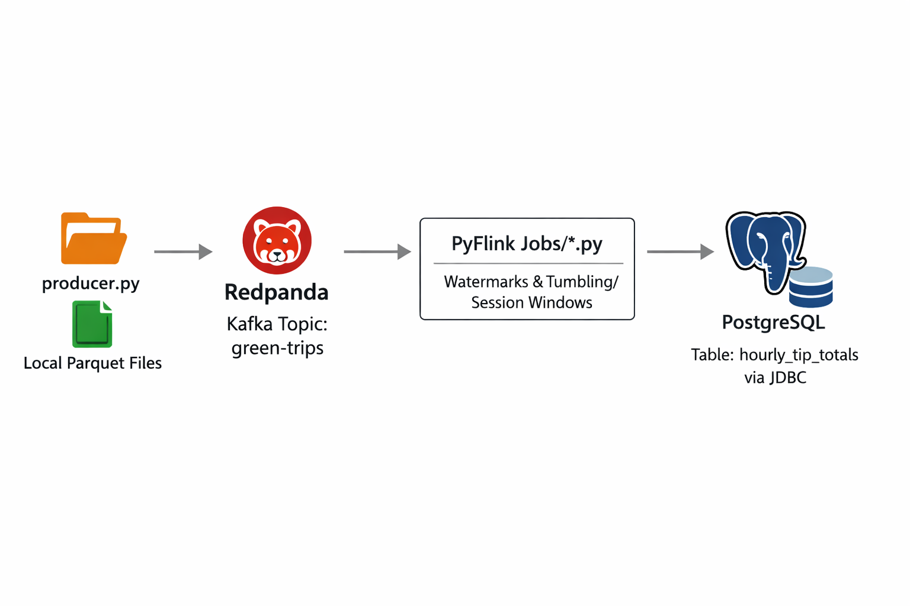
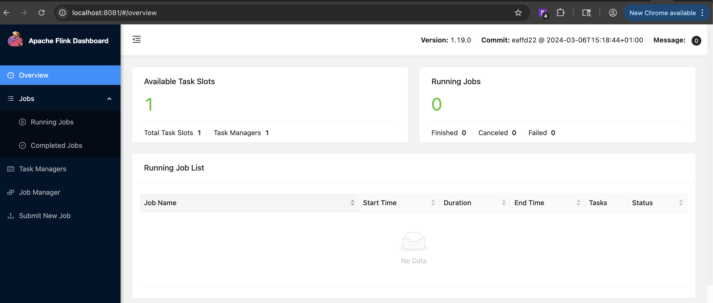
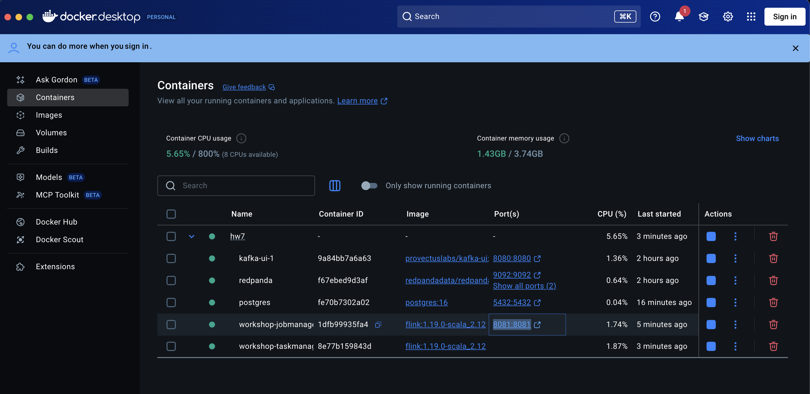
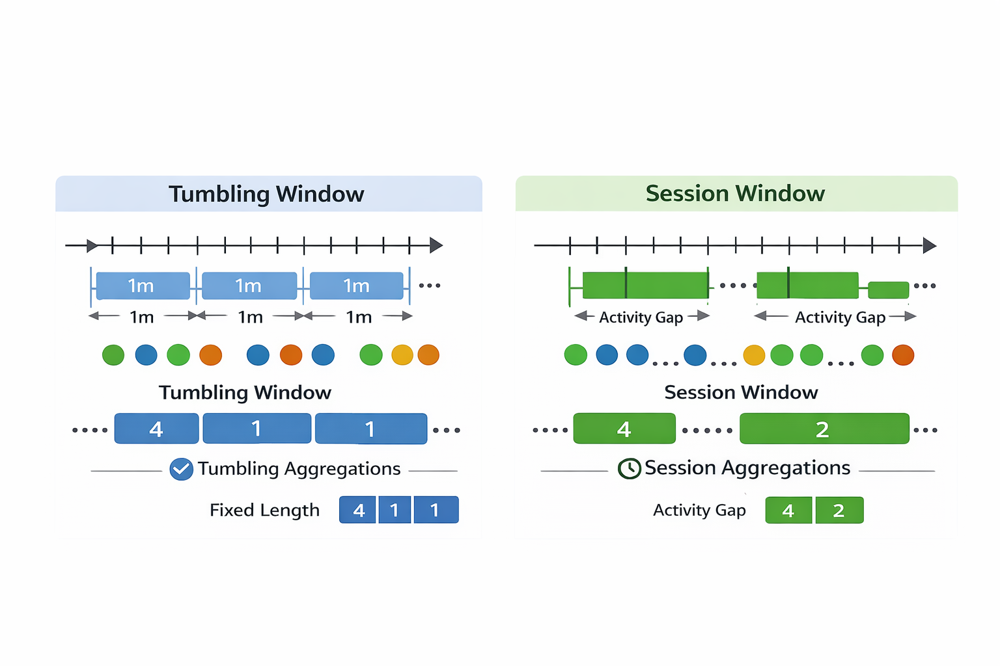

## Homework - Stream Processing

https://github.com/DataTalksClub/data-engineering-zoomcamp/blob/main/cohorts/2026/07-streaming/homework.md

In this homework, we'll practice streaming with Kafka (Redpanda) and PyFlink.

We use Redpanda, a drop-in replacement for Kafka. It implements the same protocol, so any Kafka client library works with it unchanged.

For this homework we will be using Green Taxi Trip data from October 2025:

green_tripdata_2025-10.parquet

🏗️ Architecture Overview
- This project implements a real-time streaming pipeline using PyFlink to analyze NYC Green Taxi trip data.

1. Ingestion: A Python producer reads historical Parquet data and streams it into a Redpanda (Kafka-compatible) topic.

2. Stream Processing: PyFlink jobs consume the stream, applying Event-Time Watermarking and Windowed Aggregations (Tumbling/Session windows) to calculate trip counts and tipping metrics.

3. Storage: The processed results are continuously pushed to a PostgreSQL database using the Flink JDBC connector for final analysis.

## PyFlink streaming pipeline - taxi analysis



## Project Structure (Create your own)

```
hw7/
├── docker-compose.yml          # Infrastructure: Redpanda, Flink, Postgres
├── requirements.txt            # Local Python dependencies (psycopg2, etc.)
├── .gitignore                  # CRITICAL: Ignores .DS_Store, __pycache__, and data/
├── .env                        # (Optional) Store your DB credentials
│
├── data/                       # Local data folder (Ignored by Git)
│   ├── .gitignore              # Ignores the heavy .parquet/.csv files
│   └── green_tripdata.parquet  # Your source file
│
├── jobs/                       # Flink SQL / PyFlink Job scripts
│   ├── q4_tumbling_count.py    # 5-min trip counts
│   ├── q5_session_window.py    # Dynamic session streaks
│   └── q6_tumbling_tips.py     # 1-hour tip sums
│
└── scripts/                    # Utility scripts
|   └── producer.py             # Script that pushes Parquet data to Redpanda
|
└── images                      # Screenshots
```

## Homework Questions

https://github.com/DataTalksClub/data-engineering-zoomcamp/blob/main/cohorts/2026/07-streaming/homework.md#part-2-pyflink-questions-4-6

## Question 1. Redpanda version
Run rpk version inside the Redpanda container:
```bash
docker exec -it workshop-redpanda-1 rpk version
```
What version of Redpanda are you running?

Output - 
```
docker exec -it redpanda rpk version
rpk version: v25.3.9
Git ref:     836b4a36ef6d5121edbb1e68f0f673c2a8a244e2
Build date:  2026 Feb 26 07 47 54 Thu
OS/Arch:     linux/arm64
Go version:  go1.24.3

Redpanda Cluster
  node-0  v25.3.9 - 836b4a36ef6d5121edbb1e68f0f673c2a8a244e2
```

- Answer - `v25.3.9`

## Question 2. Sending data to Redpanda
Create a topic called green-trips:

docker exec -it workshop-redpanda-1 rpk topic create green-trips
Now write a producer to send the green taxi data to this topic.

Read the parquet file and keep only these columns:

lpep_pickup_datetime
lpep_dropoff_datetime
PULocationID
DOLocationID
passenger_count
trip_distance
tip_amount
total_amount
Convert each row to a dictionary and send it to the green-trips topic. You'll need to handle the datetime columns - convert them to strings before serializing to JSON.

Measure the time it takes to send the entire dataset and flush:

from time import time

t0 = time()

send all rows ...

producer.flush()

t1 = time()
print(f'took {(t1 - t0):.2f} seconds')
How long did it take to send the data?

10 seconds
60 seconds
120 seconds
300 seconds

Output - 
```
took 2.44 seconds
```
`Answer - 10 seconds`

## Question 3. Consumer - trip distance
Write a Kafka consumer that reads all messages from the green-trips topic (set auto_offset_reset='earliest').

Count how many trips have a trip_distance greater than 5.0 kilometers.

How many trips have trip_distance > 5?

6506
7506
8506
9506

Output - 

```bash
 hw7 % python consumer.py
Consumer started... counting trips where distance > 5.0

Final Count: 8506
```

Answer - `8506`

### Part 2: PyFlink (Questions 4-6)

Steps followed - 

- Add postgres, flink jobmanager and taskmanager in docker-compose.yml
- Run postgres 
```bash
docker compose up postgres
```

- Connect postgres terminal
```bash
docker exec -it postgres psql -U postgres -d taxi_db
```

- Start Jobmanager first
```bash
docker compose up jobmanager
```

- Then start taskmanager
```bash
docker compose up taskmanager
```





- Preparing the PostgreSQL Sink
Before the Flink job can write anything, the database table must exist. Based on Question 4 (which usually asks about popular locations), you should create a table in your Postgres container:

- create the table where the final answers will land.

```sql
CREATE TABLE processed_trip_stats (
    PULocationID INT,
    trip_count BIGINT,
    window_start TIMESTAMP,
    window_end TIMESTAMP
);"
```

- Create - green_trips_job.py

This script defines the 8-column source but only sinks the aggregated results.

## Question 4. Tumbling window - pickup location
Create a Flink job that reads from green-trips and uses a 5-minute tumbling window to count trips per PULocationID.

Write the results to a PostgreSQL table with columns: window_start, PULocationID, num_trips.

After the job processes all data, query the results:
```sql
SELECT PULocationID, num_trips
FROM <your_table>
ORDER BY num_trips DESC
LIMIT 3;
```
Which PULocationID had the most trips in a single 5-minute window?

42
74
75
166

Steps followed as follows - 

Create table in postgreSQL table - 
```sql
CREATE TABLE IF NOT EXISTS trip_counts_window (
    window_start TIMESTAMP(3),
    PULocationID INT,
    num_trips BIGINT
);
```

### Envirnment Setup 

Below three lines are the foundation of any PyFlink Table API application. They define how the engine should run, where the data lives, and how fast it should process.

```python
settings = EnvironmentSettings.new_instance().in_streaming_mode().build()
t_env = StreamTableEnvironment.create(environment_settings=settings)
# Important for Watermarks to progress on a 1-partition topic
t_env.get_config().get_configuration().set_string("parallelism.default", "1")
```

`EnvironmentSettings.new_instance().in_streaming_mode().build()`

- This line configures the Execution Mode.
    - What it does: It tells Flink that you are not processing a static file (Batch Mode), but a never-ending stream of data (Streaming Mode).

    - Why it matters: In streaming mode, Flink enables features like Watermarks and Windowing, which allow it to handle data that arrives continuously and potentially out of order.

`t_env = StreamTableEnvironment.create(environment_settings=settings)`

- This creates the Table Environment (t_env), which is the primary "gateway" for writing your logic.
    - What it does: It is the context where you define your sources (Redpanda), your sinks (Postgres), and your SQL queries.
    - Analogy: If Flink is the factory, the t_env is the Control Room. Everything you do—defining tables or running INSERT INTO—happens through this object.

`t_env.get_config().get_configuration().set_string("parallelism.default", "1")`

- This is the most critical line for specific homework assignment.
    - The Problem: Flink advances time (Watermarks) based on the "slowest" sub-task. If you have a parallelism of 2, but your Redpanda topic only has 1 partition, one Flink worker will get all the data and the other worker will get nothing.
    - The Consequence: The "idle" worker stays at "Time Zero." Flink sees that one worker is stuck at Time Zero and refuses to advance the global clock for the whole job.
    - The Fix: By setting parallelism to 1, you ensure there is only one worker. Since that one worker is receiving all the data, the Watermark advances correctly, and your 5-minute windows will actually "close" and send data to Postgres.

### Submit the Job:

```bash
docker exec -it workshop-jobmanager-1 flink run -py /opt/src/job/q4_tumbling_window.py
```

- The path /opt/src/job/q4_tumbling_window_job.py is an Internal Path—it exists only inside the Docker container, not directly on Mac or PC's hard drive.

- To make this work, we have to "bridge" Git repo folder on laptop to a folder inside the Flink container using a Volume.

- How the "Bridge" works
When we run `docker-compose up`, Docker looks at your docker-compose.yml file. We should see a volumes section under the jobmanager service that looks something like this:

```yaml
services:
  jobmanager:
    # ... other settings ...
    volumes:
      - .:/opt/src  # This is the "Bridge"
```

- . (Left side): This is your Host Path (your Git repo on your laptop).

- /opt/src (Right side): This is the Container Path.

- Because of this line, every file in your Git repo is "mirrored" inside the container at /opt/src. If your file is inside a folder named job in your repo, it will appear at /opt/src/job/q4_tumbling_window_job.py inside Flink.

- How to check your path
    - Before you run the flink run command, you can "peek" inside the container to see exactly where your file is
    ```
    docker exec -it jobmanager ls -R /opt/src
    ```
    - If you see your file listed there, your flink run command will work. If you see "No such file or directory," your Volume mapping in docker-compose.yml is likely missing or pointing to the wrong place.


### Monitor:
Check the Flink UI at http://localhost:8081. Once the "Records Sent" to the sink stops increasing, the processing is done.


### Run the Final Query at postgreSQL
```sql
select count(*) from trip_counts_window;
 count
-------
 53438
(1 row)

SELECT PULocationID, num_trips
FROM trip_counts_window
ORDER BY num_trips DESC
LIMIT 3;"
 pulocationid | num_trips
--------------+-----------
           74 |        15
           74 |        15
           74 |        14
(3 rows)

```

`Answer - 74`

### Troubleshoot 

`Problem`: Volume path for Jobmanager and Taskmanager were wrong.

`Solution`: Update docker-compose.yml with correct path. Stop container and restart.

```bash
docker-compose stop jobmanager taskmanager
docker-compose rm -f jobmanager taskmanager
docker-compose up -d jobmanager taskmanager
```

Logs
```bash
docker-compose stop jobmanager taskmanager
[+] Stopping 2/2
 ✔ Container workshop-taskmanager-1  Stopped                                                                                                                                                               2.4s
 ✔ Container workshop-jobmanager-1   Stopped
```

```bash
Going to remove workshop-taskmanager-1, workshop-jobmanager-1
[+] Removing 2/2
 ✔ Container workshop-jobmanager-1   Removed                                                                                                                                                               0.1s
 ✔ Container workshop-taskmanager-1  Removed
```

`Problem` - Container is up but still not showing local files at container level

```bash
Mac hw7 % docker exec -it workshop-jobmanager-1 ls -R /opt/src
/opt/src:
job

/opt/src/job:
```

`Solution`:
If the directory /opt/src/job exists but is empty, it means Docker has successfully created the "mount point," but the link to your Mac's folder is broken. This is a classic "Empty Volume" issue on macOS. Here is how we troubleshoot it in order of likelihood:

1. The "Path Sensitivity" Check
In your docker-compose.yml, you used:

```yaml
volumes:
  - ./job:/opt/src/job
```
2. Make sure that all files present at ./job in local

`Problem`: Job failed with a `python3: not found error.`

`Solution`:
Since we are using the official Flink image `flink:1.19.0-scala_2.12`. That image is built for Java/Scala, not Python. If we try to run the job now, it will almost certainly fail with a python3: not found error.

- The Python Preparation
    - Since your container is already running and the file is visible, we can "inject" the necessary Python tools directly into the running container without restarting everything again.

    - Run these three commands in our terminal (as root user):
        ```bash
        # 1. Update the package list inside the Jobmanager
        docker exec -u 0 -it workshop-jobmanager-1 apt-get update

        # 2. Install Python 3
        docker exec -u 0 -it workshop-jobmanager-1 apt-get install -y python3 python3-pip

        # 3. Install the PyFlink library (version 1.19.0 to match your image)
        docker exec -u 0 -it workshop-jobmanager-1 pip3 install apache-flink==1.19.0
        ```

    OR

    - Create a "custom" version of Flink that already has Python built-in.

    - Create a file named Dockerfile (no extension) in hw7 folder:

        ```Dockerfile
        FROM flink:1.19.0-scala_2.12

        # Install Python 3 and pip
        USER root
        RUN apt-get update -y && \
            apt-get install -y python3 python3-pip python3-dev && \
            rm -rf /var/lib/apt/lists/*

        # Install PyFlink
        RUN pip3 install apache-flink==1.19.0
        ```

    - Update docker-compose.yml to use this file instead of the standard image:

        ```yaml
        jobmanager:
        build: .  # Tells Docker to look for the 'Dockerfile' in the current folder
        container_name: workshop-jobmanager-1
        # ... rest of your config ...

        taskmanager:
        build: .  # Uses the same custom image for the worker
        container_name: workshop-taskmanager-1
        # ... rest of your config ...
        ```

        Note : use keyword `build` instead of `image`

Rebuild and Start:
```bash
docker-compose stop jobmanager taskmanager
docker-compose rm -f jobmanager taskmanager
docker-compose up -d jobmanager taskmanager
```

Query the metadata of apache-flink directly from the Python environment

```bash
hw7 % docker exec -it workshop-jobmanager-1 pip3 show apache-flink
```

Output 
```bash
Name: apache-flink
Version: 1.19.0
Summary: Apache Flink Python API
Home-page: https://flink.apache.org
Author: Apache Software Foundation
Author-email: dev@flink.apache.org
License: https://www.apache.org/licenses/LICENSE-2.0
Location: /usr/local/lib/python3.10/dist-packages
Requires: apache-beam, apache-flink-libraries, avro-python3, cloudpickle, fastavro, httplib2, numpy, pandas, pemja, protobuf, py4j, pyarrow, python-dateutil, pytz, requests, ruamel.yaml
Required-by:
```

Quick Verification of the Python-Java Bridge

Since we  are working on hw7 (likely the homework involving Kafka and streaming), we'll want to ensure the Python process can actually talk to the Flink JVM. This is the "smoke test" for any PyFlink job:

```bash
docker exec -it workshop-jobmanager-1 python3 -c "from pyflink.table import EnvironmentSettings, TableEnvironment; t_env = TableEnvironment.create(EnvironmentSettings.in_streaming_mode()); print('JVM Gateway is UP!')"
```

Output
```bash
JVM Gateway is UP!
```

Now we can submit job for Question 4 - q4_tumbling_window.py

`Problem`: Error while executing job
org.apache.flink.client.program.ProgramAbortException: java.io.IOException: `Cannot run program "python": error=2, No such file or directory`

Solution - 

- This error is a bit of a trick! The "No such file or directory" isn't actually complaining about your .py script—it's complaining that it can't find the Python executable itself.

- Even though we installed Python in the Dockerfile, Flink's internal PythonDriver is specifically looking for a command named python, but in modern Debian-based images (like the one Flink uses), the command is usually named python3.

- The Fix: Set the Python Executable
    - You need to tell Flink exactly which command to use for Python. You can do this by adding an environment variable to your docker-compose.yaml or by passing a configuration flag in your command.

    - Add the -pyexec flag to your run command so Flink knows to use python3:
    ```Bash
    docker exec -it workshop-jobmanager-1 flink run \
        -pyexec python3 \
        -py /opt/src/job/q4_tumbling_window.py
    ```
    - OR
    - The Permanent Fix - Update your docker-compose.yaml so you don't have to type that flag every time. Add these two environment variables to both the jobmanager and taskmanager services:
    ```yaml
    services:
    jobmanager:
        # ... other config ...
        environment:
        - PYTHON_EXECUTABLE=python3
        - PYFLINK_PYTHON=python3
    
    taskmanager:
        # ... other config ...
        environment:
        - PYTHON_EXECUTABLE=python3
        - PYFLINK_PYTHON=python3
    ```
    - Create a link between the two names:
    ```bash
    docker exec -it -u root workshop-jobmanager-1 ln -s /usr/bin/python3 /usr/bin/python
    ```

`Problem` - Error after running job - `Could not find any factory for identifier 'kafka' that implements... in the classpath.`

- This means your Python code is asking Flink to talk to Kafka, but Flink says, "I don't know what 'kafka' is." You need to provide the Kafka SQL Connector JAR file so Flink knows how to handle that connector.

`Solution` - The Fix: Add the Kafka Connector JAR

```bash
hw7 % docker exec -it workshop-jobmanager-1 ls -R /opt/flink/lib/

/opt/flink/lib/:
flink-cep-1.19.0.jar		  flink-csv-1.19.0.jar	 flink-json-1.19.0.jar	      flink-table-api-java-uber-1.19.0.jar   flink-table-runtime-1.19.0.jar  log4j-api-2.17.1.jar   log4j-slf4j-impl-2.17.1.jar
flink-connector-files-1.19.0.jar  flink-dist-1.19.0.jar  flink-scala_2.12-1.19.0.jar  flink-table-planner-loader-1.19.0.jar  log4j-1.2-api-2.17.1.jar	     log4j-core-2.17.1.jar
```

- Missing JAR - flink-sql-connector-kafka-3.1.0-1.18.jar
    - download it into the container first
    ```bash
    # Download the jar into the container's lib folder
    docker exec -it -u root workshop-jobmanager-1 wget -P /opt/flink/lib https://repo.maven.apache.org/maven2/org/apache/flink/flink-sql-connector-kafka/3.1.0-1.18/flink-sql-connector-kafka-3.1.0-1.18.jar
    ```

    ```bash
    docker exec -it workshop-jobmanager-1 ls -R /opt/flink/lib/

    /opt/flink/lib/:
    ... flink-sql-connector-kafka-3.1.0-1.18.jar  ...
    ```

- Update jar details in job script - q4_tumbling_window.py

`Problem` - The Missing JDBC JAR

- Your script now knows how to talk to Kafka, but it also needs to know how to talk to PostgreSQL via the JDBC connector. If you run this now, you will likely get another ValidationException for 'connector' = 'jdbc'.

- To fix this once and for all, you should include the JDBC connector and the Postgres driver. You can comma-separate them in your Python script:

- Inside python job script - q4_tumbling_window.py
    - Download jars
    ```bash
    # JDBC Connector (compatible with Flink 1.19)
    docker exec -it -u root workshop-jobmanager-1 wget -P /opt/flink/lib/ https://repo.maven.apache.org/maven2/org/apache/flink/flink-connector-jdbc/3.1.2-1.18/flink-connector-jdbc-3.1.2-1.18.jar

    # PostgreSQL Driver
    docker exec -it -u root workshop-jobmanager-1 wget -P /opt/flink/lib/ https://jdbc.postgresql.org/download/postgresql-42.7.2.jar
    ```
    - Include in job script 
    ```python
    # Updated Jar Config with JDBC and Postgres Driver
        t_env.get_config().set(
            "pipeline.jars", 
            "file:///opt/flink/lib/flink-sql-connector-kafka-3.1.0-1.18.jar;"
            "file:///opt/flink/lib/flink-connector-jdbc-3.1.2-1.18.jar;"
            "file:///opt/flink/lib/postgresql-42.7.2.jar"
        )
    ```

    - output after download - 
    ```bash
    docker exec -it workshop-jobmanager-1 ls -R /opt/flink/lib/

    /opt/flink/lib/:
    ...
    postgresql-42.7.2.jar
    flink-sql-connector-kafka-3.1.0-1.18.jar
    flink-connector-jdbc-3.1.2-1.18.jar
    ...
    ```

    - Kafka Connector: flink-sql-connector-kafka-3.1.0-1.18.jar
    - JDBC Connector: flink-connector-jdbc-3.1.2-1.18.jar
    - Postgres Driver: postgresql-42.7.2.jar

`Problem` - Job failed
Error - 
```
Caused by: ... TimeoutException: Timed out waiting for a node assignment. Call: describeTopics
Caused by: java.lang.RuntimeException: Failed to get metadata for topics [green-trips].
```

- Flink is trying to start the job, but when it reaches out to redpanda:9092 to look for the green-trips topic, it gets no response. It waits, times out, and crashes the whole job before it even attempts to write to Postgres.

- Why is this happening? (3 Most Likely Reasons)
    - `Redpanda is not running.` Fix: Check your containers: docker ps. If the redpanda container isn't "Up", start it: docker-compose up -d redpanda.
        - Verify Redpanda: Run `docker exec -it redpanda rpk cluster info`. If this fails, Redpanda is the problem.
        ```bash
        docker exec -it redpanda rpk cluster info
        CLUSTER
        =======
        redpanda.a2b18e8a-497c-4932-a079-817dc97e963b

        BROKERS
        =======
        ID    HOST       PORT
        0*    localhost  9092

        TOPICS
        ======
        NAME                PARTITIONS  REPLICAS
        __consumer_offsets  3           1
        green-trips         1           1
        ```

    - `The Topic green-trips doesn't exist yet.` In HW7, Flink usually expects the topic to already be there. If your producer hasn't run yet, or if you haven't manually created the topic, Flink might time out trying to describe it. `docker exec -it redpanda-1 rpk topic create green-trips`
        - Verify the Topic: Run docker exec -it redpanda-1 rpk topic list. If green-trips isn't there, create it.
        ```bash
        Mac hw7 % docker exec -it redpanda rpk topic list
        NAME         PARTITIONS  REPLICAS
        green-trips  1           1
        ```
    - `Network Isolation (The "Docker Bridge" issue)` Flink is looking for redpanda:9092. If Redpanda and Flink are not on the same Docker network, they can't see each other.
        - In `docker exec -it redpanda rpk cluster info` is this:
        `HOST: localhost | PORT: 9092`

        - Inside the Docker network, "localhost" means the container itself. When Flink (in the jobmanager container) tries to connect to redpanda:9092, Redpanda might be telling Flink: "Hi! I'm at localhost:9092". Flink then looks at its own localhost, finds nothing, and times out.

        - Here is how to verify and fix the networking:
            - `Identify the Network` - First, let's see which network your containers are actually using. Run this:
            ```bash
            docker network ls

            hw7 % docker network ls
            NETWORK ID     NAME          DRIVER    SCOPE
            e1fdf8b0d2c2   bridge        bridge    local
            6247e4db28af   host          host      local
            0cdbb0f903d2   hw7_default   bridge    local
            c98d2e932e44   none          null      local
            ```
            You should see one called something like hw7_default or data-engineering-zoomcamp_default.

            - `Inspect the Bridge` Once you find the network name (let's assume it's hw7_default), run this:
            ```bash
            docker network inspect hw7_default

                        [
                {
                    "Name": "hw7_default",
                    "Id": "0cdbb0f903d2dc92fa0f2e9c0202c8da8eab39f2a66b48b2864d2910ac220666",
                    "Created": "2026-03-13T22:00:13.788446796Z",
                    "Scope": "local",
                    "Driver": "bridge",
                    "EnableIPv4": true,
                    "EnableIPv6": false,
                    "IPAM": {
                        "Driver": "default",
                        "Options": null,
                        "Config": [
                            {
                                "Subnet": "172.18.0.0/16",
                                "Gateway": "172.18.0.1"
                            }
                        ]
                    },
                    "Internal": false,
                    "Attachable": false,
                    "Ingress": false,
                    "ConfigFrom": {
                        "Network": ""
                    },
                    "ConfigOnly": false,
                    "Containers": {
                        "334c982a53026c06c3d0d59e2c329bef77af3ddf091800fa22af08c8ee5b3b7c": {
                            "Name": "workshop-jobmanager-1",
                            "EndpointID": "8161e36a665dbbcb468a36731853b4f09957a9f7c6700d22067d7a83cbbdfb47",
                            "MacAddress": "b2:98:45:91:24:7e",
                            "IPv4Address": "172.18.0.6/16",
                            "IPv6Address": ""
                        },
                        "41a9d334a7317218f6ddbf62c66e0af64cb53fd6d13500d803e50466e380f84f": {
                            "Name": "workshop-taskmanager-1",
                            "EndpointID": "469b932c7a4dac9976fffefffdace8f19cd7efd4b6c6405c3e931a69c7ea2e8f",
                            "MacAddress": "ea:1c:82:c5:32:21",
                            "IPv4Address": "172.18.0.5/16",
                            "IPv6Address": ""
                        },
                        "9a84bb7a6a630909973afbea47ba7e80d127b0b3f3c44d6cabf563c08133904a": {
                            "Name": "hw7-kafka-ui-1",
                            "EndpointID": "14cf1a9234a499bf22bb6ef513cffce78e1437fb1ef2db006ae5ce83ade64406",
                            "MacAddress": "56:10:3f:03:97:42",
                            "IPv4Address": "172.18.0.3/16",
                            "IPv6Address": ""
                        },
                        "f67ebed9d3af68521de47d0caae0c6d731ee7d579c654be72fb316f789ffb19e": {
                            "Name": "redpanda",
                            "EndpointID": "95713819e50edaed0496fa85296ec15211b2ea02473114079fdf8d9f686f6e8f",
                            "MacAddress": "06:7d:71:e8:35:3b",
                            "IPv4Address": "172.18.0.2/16",
                            "IPv6Address": ""
                        },
                        "fe70b7302a023e4ae52c1602fffc94277a93d1f18d7c66fa2e7e330c4543e806": {
                            "Name": "postgres",
                            "EndpointID": "56d4691106d7f50f91af8eed08fa3273171dc9d2fd65c4c2cc8597cb00fd4eba",
                            "MacAddress": "06:9c:9b:f3:87:b1",
                            "IPv4Address": "172.18.0.4/16",
                            "IPv6Address": ""
                        }
                    },
                    "Options": {
                        "com.docker.network.enable_ipv4": "true",
                        "com.docker.network.enable_ipv6": "false"
                    },
                    "Labels": {
                        "com.docker.compose.config-hash": "2ceb1c15fcd9ebd1ce882bbde5c338a86e7e9f6c2288f5516f386c05d8862e87",
                        "com.docker.compose.network": "default",
                        "com.docker.compose.project": "hw7",
                        "com.docker.compose.version": "2.38.2"
                    }
                }
            ]
            ```

        - Since the road exists but Flink is still getting a TimeoutException while trying to "describe topics," the problem is almost certainly how Redpanda is introducing itself. In Kafka/Redpanda terminology, this is the Advertised Listener issue.

        - The `Identity Crisis` Explained
            - When Flink connects to redpanda:9092, Redpanda answers. But Redpanda doesn't just say "Hello," it sends a list of addresses (metadata) and says, "To talk to me about data, use this address."
            - If your Redpanda is configured to advertise localhost:9092:
            - Flink reaches out to redpanda:9092.
            - Redpanda says: "Got it! For the green-trips metadata, contact me at localhost:9092."
            - Flink (inside its own container) tries to find a Kafka broker at its own localhost:9092.
            - There is nothing there. Flink times out.

        - How to Fix It
            - You need to change your docker-compose.yaml so that Redpanda tells internal Docker clients to find it at redpanda:9092.

        - Check your redpanda service definition. It should look like this:
        ```yaml
        redpanda:
            image: docker.redpanda.com/redpandadata/redpanda:v23.3.10 # or your version
            container_name: redpanda
            command:
                - redpanda start
                - --kafka-addr internal://0.0.0.0:9092,external://0.0.0.0:19092
                # THIS LINE IS THE FIX:
                - --advertise-kafka-addr internal://redpanda:9092,external://localhost:19092
            networks:
                - default
        ```

        - Why two addresses?
            - internal://redpanda:9092: This is for Flink and other containers to use.
            - external://localhost:19092: This is for you (your Mac/Python producer) to use from outside Docker.

        - Execute `docker-compose down && docker-compose up -d`

        - Verify
        ```bash
        docker exec -it redpanda rpk cluster info
        CLUSTER
        =======
        redpanda.a691a0d1-5a16-4942-b674-3557ea01fcc8

        BROKERS
        =======
        ID    HOST      PORT
        0*    redpanda  9092
        ```
            - Redpanda is now telling everyone its name is `redpanda` and not `localhost`
            - By showing redpanda in the HOST column, the broker is now correctly "advertising" its internal Docker identity. Now, when Flink connects to redpanda:9092, it will be told: "The data is right here on host 'redpanda'," and Flink will actually know where to look.

`Problem` - Every time we have to create postgreSQL table manually. 

`Solution` - Include it in job script - q4_tumbling_window.py

```python
def create_postgres_table():
    conn = psycopg2.connect(
        host="postgres",
        database="taxi_db",
        user="postgres",
        password="password"
    )
    cur = conn.cursor()
    # Create the table if it doesn't exist
    cur.execute("""
        CREATE TABLE IF NOT EXISTS trip_counts_window (
            window_start TIMESTAMP,
            PULocationID INT,
            num_trips BIGINT
        );
    """)
    conn.commit()
    cur.close()
    conn.close()
```

-Handle dependencies in Dockerfile

```
# 4. Install Python dependencies for Flink and Postgres connectivity
RUN pip3 install --no-cache-dir \
    apache-flink==1.19.0 \
    psycopg2-binary
```

- Build image
```bash
docker-compose build
```

- Execute `docker-compose up -d` so that new image can be picked.
```bash
 hw7 % docker-compose up -d
[+] Running 5/5
 ✔ Container redpanda             Running                                                                                                                                                               0.0s
 ✔ Container hw7-kafka-ui-1          Running                                                                                                                                                               0.0s
 ✔ Container postgres                Running                                                                                                                                                               0.0s
 ✔ Container workshop-jobmanager-1   Started                                                                                                                                                               4.5s
 ✔ Container workshop-taskmanager-1  Started
 ```

 Note - It started workshop-jobmanager-1, workshop-taskmanager-1. Rest remained unchanged.

- Verify using - `docker exec -it workshop-jobmanager-1 python3 -c "import psycopg2; print('Success!')"`

`Problem` - After building new image, jobmanager container restarted and it removed required JARs

`Solution` - Include them in Docker file. So that it can be downloaded when container is up and no need to manually install it.

```
# 5. Download Flink Connectors (Automated)
# We use the 3.3.0-1.19 versions which are specifically built for Flink 1.19
RUN wget -P /opt/flink/lib/ https://repo.maven.apache.org/maven2/org/apache/flink/flink-sql-connector-kafka/3.3.0-1.19/flink-sql-connector-kafka-3.3.0-1.19.jar && \
    wget -P /opt/flink/lib/ https://repo.maven.apache.org/maven2/org/apache/flink/flink-connector-jdbc/3.2.0-1.19/flink-connector-jdbc-3.2.0-1.19.jar && \
    wget -P /opt/flink/lib/ https://jdbc.postgresql.org/download/postgresql-42.7.5.jar
```
- Rebuild: docker-compose build
- Restart: docker-compose up -d
- Confirm: Run docker exec -it workshop-jobmanager-1 ls /opt/flink/lib/

`Problem` - Job failed after Jobmanager container restart
```bash
docker exec -it workshop-jobmanager-1 flink run -py /opt/src/job/q4_tumbling_window.py

org.apache.flink.client.program.ProgramAbortException: java.io.IOException: Cannot run program "python": error=2, No such file or directory
```

- Automate simlink in Dockerfile
```
# AUTOMATION: Create the symlink so 'python' points to 'python3'
RUN ln -s /usr/bin/python3 /usr/bin/python
```
- Rebuild: docker-compose build
- Restart: docker-compose up -d
- Confirm: Run docker exec -it workshop-jobmanager-1 ls /opt/flink/lib/

- Verify
```bash
Mac hw7 % docker exec -it workshop-jobmanager-1 python --version
Python 3.10.12
```

`Problem` - Worker/Taskmanager of Flink is failing to register 

- localhost:8081 -> You should see 1 Available Task Slot. 
    - This confirms the TaskManager registered correctly with the JobManager using your updated environment variables.
- But currently it is showing 0 Available Task Slot
    - It usually means the TaskManager failed to register with the JobManager or crashed shortly after starting.
- Why this happens
    - When you see 0 slots, the JobManager is basically sitting in a room alone waiting for its workers to check in. If the TaskManager has the wrong address for the JobManager (due to a typo or network issue), it will keep trying to connect in the background but never show up in the UI.

`Solution`
Use - FLINK_PROPERTIES in docker-compose.yaml

```yaml
FLINK_PROPERTIES=
        jobmanager.rpc.address: jobmanager
        taskmanager.numberOfTaskSlots: 1
```

- The Conflict: Env Vars vs. Config File
    - Flink has two ways of getting its settings when it starts inside a container:
        - Environment Variables: (e.g., jobmanager.rpc.address=jobmanager). The entrypoint script tries to convert these into configuration settings.
        - FLINK_PROPERTIES: This is a special variable the entrypoint script is hard-coded to look for. It takes whatever is inside it and appends it directly to the flink-conf.yaml.
        - The Problem: Sometimes the entrypoint script fails to translate the "dot-notation" environment variables (like jobmanager.rpc.address) correctly, but it always respects FLINK_PROPERTIES.

Note: Do not put any comment in FLINK_PROPERTIES. It will be treated as part of property and container might fail.


`Problem` - Job script remain in hang state due to missing topic

`Solution` - Maintain Execution order - 
- Run the Producer First: This creates the topic and starts pushing data.
    - Tip: If the producer is working, docker exec -it redpanda rpk topic list should finally show the topic name.
- Run the Flink Job Second: Now that the topic exists, Flink can "bind" to the partitions instantly and move past Step 5.

## Tumbling window VS Session window

### 1. Tumbling Windows (The "Clock" Approach)
- Tumbling windows are fixed-size, contiguous, and non-overlapping time intervals.
- Logic: They "tumble" forward by their own length. When one window ends, the next one immediately begins.
- Key Characteristic: Every event belongs to exactly one window.
- Example: A 5-minute tumbling window will group data from 10:00–10:05, then 10:05–10:10, and so on.
- Best For: Reporting steady metrics, like "Total sales per hour" or "Average CPU usage every 5 minutes.

### 2. Session Windows (The "Activity" Approach)
- Session windows do not have a fixed size. Instead, they are defined by gaps of inactivity.
- Logic: A window stays open as long as events keep arriving within a certain threshold (the "timeout"). If no data arrives for a specified period (e.g., 30 minutes), the window closes.
- Key Characteristic: They are highly dynamic. One user might have a session lasting 2 minutes, while another's lasts 2 hours.
- Example: A user logs into a website and clicks around. As long as they click something every 5 minutes, they stay in the same "session." If they stop for 31 minutes, the window is finalized.
- Best For: User behavior analysis, like "How long does a typical user spend on the app before leaving?"




## Question 5. Session window - longest streak
Create another Flink job that uses a session window with a 5-minute gap on PULocationID, using lpep_pickup_datetime as the event time with a 5-second watermark tolerance.

A session window groups events that arrive within 5 minutes of each other. When there's a gap of more than 5 minutes, the window closes.

Write the results to a PostgreSQL table and find the PULocationID with the longest session (most trips in a single session).

How many trips were in the longest session?

- 12
- 31
- 51
- 81

- Steps followed as follows - 

1. Create Postgres Table

```sql
CREATE TABLE IF NOT EXISTS trip_counts_session (
                    window_start TIMESTAMP(3),
                    window_end TIMESTAMP(3),
                    PULocationID INT,
                    num_trips BIGINT
                );
```

2. Flink SQL Logic

- In Flink SQL (Legacy/Group Window syntax), a Session window is defined using SESSION(time_attr, gap_interval).
- Create souce DDL: : Kafka/Redpanda

```python
t_env.execute_sql("""
        CREATE TABLE green_trips (
            PULocationID INT,
            lpep_pickup_datetime STRING,
            -- Convert string to Flink Timestamp
            event_timestamp AS TO_TIMESTAMP(lpep_pickup_datetime, 'yyyy-MM-dd HH:mm:ss'),
            -- Define Watermark
            WATERMARK FOR event_timestamp AS event_timestamp - INTERVAL '5' SECOND
        ) WITH (
            'connector' = 'kafka',
            'topic' = 'green-trips',
            'properties.bootstrap.servers' = 'redpanda:9092',
            'properties.group.id' = 'q5-session-group',
            'scan.startup.mode' = 'earliest-offset',
            'format' = 'json',
            'json.ignore-parse-errors' = 'true'  -- Ignore malformed JSON records instead of failing the job
        )
```
- Create Sink DDL and Insert logic in the Python script:

```python
# 3. Sink DDL: PostgreSQL
    t_env.execute_sql("""
        CREATE TABLE session_sink (
            window_start TIMESTAMP(3),
            window_end TIMESTAMP(3),
            PULocationID INT,
            num_trips BIGINT
        ) WITH (
            'connector' = 'jdbc',
            'url' = 'jdbc:postgresql://postgres:5432/taxi_db',
            'table-name' = 'trip_counts_session',
            'username' = 'postgres',
            'password' = 'password',
            'driver' = 'org.postgresql.Driver'
        )
    """)

    # 4. Session Windowing Query and Job Submission with Job ID retrieval.
    table_result = t_env.execute_sql("""
        INSERT INTO session_sink
        SELECT 
            SESSION_START(event_timestamp, INTERVAL '5' MINUTE) AS window_start,
            SESSION_END(event_timestamp, INTERVAL '5' MINUTE) AS window_end,
            PULocationID, 
            COUNT(*) AS num_trips
        FROM green_trips
        GROUP BY 
            PULocationID, 
            SESSION(event_timestamp, INTERVAL '5' MINUTE)
    """)
```

- Ideally topics should be there in Kafka stream. But let's verify once

    -   Check if the Topic Exists
        ```bash
        docker exec -it redpanda rpk topic list

        NAME         PARTITIONS  REPLICAS
        green-trips  1           1
        ```
        - look for green-trips in the list, the topic is alive.
        - the PARTITIONS column. If it says 1, the structure is intact.

    - Verify if the Data is Still Inside (The "High Watermark")
        - A topic can exist but be empty. To see if your 50,000+ taxi records are still there, check the
        ```bash
        docker exec -it redpanda rpk topic describe green-trips

        SUMMARY
        =======
        NAME        green-trips
        PARTITIONS  1
        REPLICAS    1

        CONFIGS
        =======
        KEY                                   VALUE          SOURCE
        cleanup.policy                        delete         DEFAULT_CONFIG
        compression.type                      producer       DEFAULT_CONFIG
        delete.retention.ms                   -1             DEFAULT_CONFIG
        flush.bytes                           262144         DEFAULT_CONFIG
        flush.ms                              100            DEFAULT_CONFIG
        initial.retention.local.target.bytes  -1             DEFAULT_CONFIG
        initial.retention.local.target.ms     -1             DEFAULT_CONFIG
        max.compaction.lag.ms                 9223372036854  DEFAULT_CONFIG
        max.message.bytes                     1048576        DEFAULT_CONFIG
        message.timestamp.after.max.ms        3600000        DEFAULT_CONFIG
        message.timestamp.before.max.ms       9223372036854  DEFAULT_CONFIG
        message.timestamp.type                CreateTime     DEFAULT_CONFIG
        min.cleanable.dirty.ratio             0.2            DEFAULT_CONFIG
        min.compaction.lag.ms                 0              DEFAULT_CONFIG
        redpanda.iceberg.mode                 disabled       DEFAULT_CONFIG
        redpanda.leaders.preference           none           DEFAULT_CONFIG
        redpanda.remote.allowgaps             false          DEFAULT_CONFIG
        redpanda.remote.delete                true           DEFAULT_CONFIG
        redpanda.remote.read                  false          DEFAULT_CONFIG
        redpanda.remote.write                 false          DEFAULT_CONFIG
        retention.bytes                       -1             DEFAULT_CONFIG
        retention.local.target.bytes          -1             DEFAULT_CONFIG
        retention.local.target.ms             86400000       DEFAULT_CONFIG
        retention.ms                          604800000      DEFAULT_CONFIG
        segment.bytes                         134217728      DEFAULT_CONFIG
        segment.ms                            1209600000     DEFAULT_CONFIG
        write.caching                         true           DEFAULT_CONFIG
        
        ```

        - Look at the HIGH-WATERMARK. This number represents the total number of messages ever written to that partition.
        - If the High-Watermark is a large number (e.g., 53438), your data is still sitting there waiting to be read.
        - `retention.ms = 604,800,000`: That is exactly `7 days` in milliseconds. Since you loaded the data yesterday, you have about 6 more days before Redpanda even thinks about deleting it.
        - `retention.bytes = -1`: The -1 means "infinite." Redpanda will not delete data based on how much disk space it takes up; it will only use the 7-day timer.
        - HIGH-WATERMARK data is now showing
            - To verify that run and check offset of very last topic in stream -
            ```
            docker exec -it redpanda rpk topic consume green-trips --offset -1 --num 1
            hw7 % docker exec -it redpanda rpk topic consume green-trips --offset -1 --num 1
            {
            "topic": "green-trips",
            "value": "{\"lpep_pickup_datetime\": \"2025-10-31 23:23:00\", \"lpep_dropoff_datetime\": \"2025-10-31 23:37:00\", \"PULocationID\": 195, \"DOLocationID\": 33, \"passenger_count\": NaN, \"trip_distance\": 3.0, \"tip_amount\": 0.0, \"total_amount\": 19.6}",
            "timestamp": 1773734826172,
            "partition": 0,
            "offset": 49415
            }
            ```


    - "Peek" at the Data (The Ultimate Test)
        - If you want to actually see the JSON records to be 100% sure they haven't been corrupted or cleared, you can "consume" a few messages directly in your terminal:
        ```bash
        docker exec -it redpanda rpk topic consume green-trips --num 5

        {
        "topic": "green-trips",
        "value": "{\"lpep_pickup_datetime\": \"2025-10-01 00:21:47\", \"lpep_dropoff_datetime\": \"2025-10-01 00:24:37\", \"PULocationID\": 247, \"DOLocationID\": 69, \"passenger_count\": 1.0, \"trip_distance\": 0.7, \"tip_amount\": 1.7, \"total_amount\": 10.0}",
        "timestamp": 1773734825077,
        "partition": 0,
        "offset": 0
        }
        {
        "topic": "green-trips",
        "value": "{\"lpep_pickup_datetime\": \"2025-10-01 00:14:03\", \"lpep_dropoff_datetime\": \"2025-10-01 00:24:14\", \"PULocationID\": 66, \"DOLocationID\": 25, \"passenger_count\": 1.0, \"trip_distance\": 1.61, \"tip_amount\": 2.78, \"total_amount\": 16.68}",
        "timestamp": 1773734825077,
        "partition": 0,
        "offset": 1
        }
        ...
        ```
        - If you see JSON blocks appearing with lpep_pickup_datetime and PULocationID, then your stream is healthy and Flink has everything it needs to replay the job.

- Run job 
```bash
docker exec -it workshop-jobmanager-1 flink run -py /opt/src/job/q5_session_window.py
```

- logs
```bash
hw7 % docker exec -it workshop-jobmanager-1 flink run -py /opt/src/job/q5_session_window.py
2026-03-17 23:24:26,885 - INFO - Ensuring Postgres table 'session_window_counts' exists...
2026-03-17 23:24:26,885 - INFO - Attempting to connect to Postgres (attempt 1/10)...
2026-03-17 23:24:27,053 - INFO - Connected to Postgres, creating table if it doesn't exist...
2026-03-17 23:24:27,226 - INFO - Successfully verified/created Postgres table - session_window_counts.
2026-03-17 23:24:27,226 - INFO - Starting Flink job to process session windows...
2026-03-17 23:24:32,037 - INFO - Adding required JARs for Kafka and JDBC connectors...
2026-03-17 23:24:32,209 - INFO - Creating source table for Kafka topic 'green-trips'...
2026-03-17 23:24:32,585 - INFO - Creating session_sink table in Postgres if it doesn't exist...
2026-03-17 23:24:32,595 - INFO - Inserting into session_sink using SESSION windows...
Job has been submitted with JobID 0adda807dfa2081d18ced5de4c02d863
2026-03-17 23:24:35,996 - INFO - ✅ Job submitted successfully! ID: 0adda807dfa2081d18ced5de4c02d863
2026-03-17 23:24:35,997 - INFO - ✅ Job submitted to cluster! Check http://localhost:8081
```

- Once the job finishes processing the data, run query in PostgreSQL terminal:

```sql
SELECT count(*) FROM trip_counts_session;
 count
-------
 23909
(1 row)

SELECT
    PULocationID,
    num_trips,
    window_start,
    window_end
FROM trip_counts_session
ORDER BY num_trips DESC
LIMIT 1;
 pulocationid | num_trips |    window_start     |     window_end
--------------+-----------+---------------------+---------------------
           74 |        81 | 2025-10-08 06:46:14 | 2025-10-08 08:27:40
(1 row)
```

`Answer - 81`

## Question 6. Tumbling window - largest tip
Create a Flink job that uses a 1-hour tumbling window to compute the total tip_amount per hour (across all locations).

Which hour had the highest total tip amount?

2025-10-01 18:00:00
2025-10-16 18:00:00
2025-10-22 08:00:00
2025-10-30 16:00:00

- we are switching back to a Tumbling Window, but with two major changes:
    - The Interval: We are moving from 5 minutes to 1 hour (1' HOUR).
    - The Aggregation: We aren't counting trips anymore; we are calculating the SUM(tip_amount).

- Create postegres table
```sql
CREATE TABLE IF NOT EXISTS hourly_tip_totals (
    window_start TIMESTAMP(3),
    window_end TIMESTAMP(3),
    total_tip_amount DOUBLE PRECISION
);
```
- Flink SQL Logic
    - Since we want the total tips across all locations, we do not include PULocationID in the GROUP BY clause. We only group by the window itself.
    - Source DDL: Kafka/Redpanda
    ```python
    t_env.execute_sql("""
        CREATE TABLE green_trips (
            PULocationID INT,
            lpep_pickup_datetime STRING,
            -- Convert string to Flink Timestamp
            event_timestamp AS TO_TIMESTAMP(lpep_pickup_datetime, 'yyyy-MM-dd HH:mm:ss'),
            -- Define Watermark
            WATERMARK FOR event_timestamp AS event_timestamp - INTERVAL '5' SECOND
        ) WITH (
            'connector' = 'kafka',
            'topic' = 'green-trips',
            'properties.bootstrap.servers' = 'redpanda:9092',
            'properties.group.id' = 'q4-tumbling-group_2',
            'scan.startup.mode' = 'earliest-offset',
            'format' = 'json',
            'json.ignore-parse-errors' = 'true'  -- Ignore malformed JSON records instead of failing the job
        )
    """)
    ```
    - Sink DDL and Insert logic

    ```python
    # Sink DDL for Hourly Tips
    t_env.execute_sql("""
        CREATE TABLE tip_sink (
            window_start TIMESTAMP(3),
            window_end TIMESTAMP(3),
            total_tip_amount DOUBLE PRECISION
        ) WITH (
            'connector' = 'jdbc',
            'url' = 'jdbc:postgresql://postgres:5432/taxi_db',
            'table-name' = 'hourly_tip_totals',
            'username' = 'postgres',
            'password' = 'password',
            'driver' = 'org.postgresql.Driver'
        )
    """)

    # Insert logic for 1-hour tumbling window
    t_env.execute_sql("""
        INSERT INTO tip_sink
        SELECT 
            TUMBLE_START(event_timestamp, INTERVAL '1' HOUR) AS window_start,
            TUMBLE_END(event_timestamp, INTERVAL '1' HOUR) AS window_end,
            SUM(tip_amount) AS total_tip_amount
        FROM green_trips
        GROUP BY 
            TUMBLE(event_timestamp, INTERVAL '1' HOUR)
    """)
    ```

- Find the Answer
    - Once your job processes the ~50k records (which it will do very quickly since you have the earliest-offset and unique group.id set up), run this query in PostgreSQL:

    ```sql
    SELECT window_start, total_tip_amount
    FROM hourly_tip_totals
    ORDER BY total_tip_amount DESC
    LIMIT 1;
    ```

- Run job
```bash
docker exec -it workshop-jobmanager-1 flink run -py /opt/src/job/q6_tumbling_window.py
```

- logs
```bash
hw7 % docker exec -it workshop-jobmanager-1 ls /opt/src/job
q4_tumbling_window_count_trips.py  q5_session_window_count_trips.py  q6_tumbling_window_sum_tip.py
niteshmishra@Mac hw7 % docker exec -it workshop-jobmanager-1 flink run -py /opt/src/job/q6_tumbling_window_sum_tip.py
2026-03-17 23:56:20,179 - INFO - Ensuring Postgres table 'hourly_tip_totals' exists...
2026-03-17 23:56:20,180 - INFO - Attempting to connect to Postgres (attempt 1/10)...
2026-03-17 23:56:20,351 - INFO - Connected to Postgres, creating table if it doesn't exist...
2026-03-17 23:56:20,495 - INFO - Successfully verified/created Postgres table - hourly_tip_totals.
2026-03-17 23:56:20,495 - INFO - Starting Flink job to process tumbling windows...
2026-03-17 23:56:24,199 - INFO - Adding required JARs for Kafka and JDBC connectors...
2026-03-17 23:56:24,386 - INFO - Creating source table for Kafka topic 'green-trips'...
2026-03-17 23:56:24,760 - INFO - Creating sink table in Postgres if it doesn't exist...
2026-03-17 23:56:24,770 - INFO - Submitting Flink job to process tumbling windows and write to Postgres...
Job has been submitted with JobID 4edb6886f8811dea1618ce291660a899
2026-03-17 23:56:27,654 - INFO - ✅ Job submitted successfully! ID: 4edb6886f8811dea1618ce291660a899
2026-03-17 23:56:27,655 - INFO - ✅ Job submitted to cluster! Check http://localhost:8081
```

- Get final answer by running query in postgreSQL
```sql
taxi_db=# SELECT COUNT(*) FROM hourly_tip_totals;
 count
-------
   745
(1 row)

taxi_db=# SELECT
    window_start,
    total_tip_amount
FROM hourly_tip_totals
ORDER BY total_tip_amount DESC
LIMIT 1;
    window_start     | total_tip_amount
---------------------+-------------------
 2025-10-16 18:00:00 | 510.8599999999999
(1 row)
```

`Answer - 2025-10-16 18:00:00`