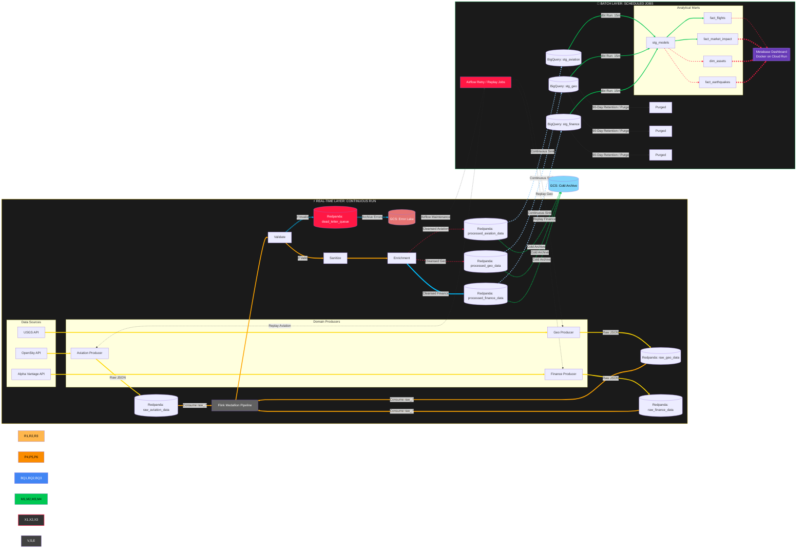

## 🧠 OmniStream = Real-Time Intelligent Data Gatekeeper

### 🎯 What problem are we solving?
🔴 The real problem

Modern data platforms are not failing because of lack of data — they fail because they cannot control it in real time.

As organizations ingest multiple live streams:

- APIs (finance, geo, aviation)
- sensors
- event streams

they run into three systemic failures:
1. Schema Rigidity (Brittle Pipelines)

`“New data breaks everything”`

Traditional pipelines assume:

- fixed schema
- known source
- predefined contracts

But in reality:

- APIs evolve
- fields go missing
- formats change

💥 Result:

- jobs fail
- pipelines crash
- onboarding new sources becomes slow and expensive

2. Data Contamination (Garbage → Warehouse)

`“Bad data pollutes expensive systems”`

Without a gatekeeper:

- nulls
- malformed JSON
- wrong types
- out-of-range values

➡️ flow directly into:

- BigQuery
- dashboards
- ML pipelines

💥 Result:

- incorrect analytics
- broken dashboards
- manual cleanup cost

3. Cost Inefficiency (Everything goes to expensive storage)

`“All data is treated equally — which is wrong”`

In most pipelines:

- all data → warehouse

But:

- not all data is useful
- not all data is clean
- not all data needs fast access

💥 Result:

- high BigQuery cost
- wasted compute
- bloated datasets

### 🟢 Your Solution (Refined)
🧠 OmniStream = Real-Time Intelligent Data Gatekeeper

Instead of blindly ingesting data, your system:

1. 🧬 Auto-Categorizes (Dynamic Routing)
- Detects data type (geo / finance / aviation)
- No manual tagging required
- Works across heterogeneous streams

👉 This solves schema rigidity

2. 🛡️ Validates & Protects (Data Firewall)
- Filters invalid / malformed records
- Routes bad data → DLQ + Error Lake
- Prevents contamination of BigQuery

👉 This solves data contamination

3. 💰 Optimizes Storage (Smart Data Placement)
- High-quality → BigQuery (fast, expensive)
- Invalid/low-value → GCS (cheap, durable)

👉 This solves cost inefficiency

4. ⚡ Real-Time Processing Layer (Flink)
- Continuous validation + enrichment
- Multi-stream unified processing (raw_.*)
- Scalable event-driven architecture

👉 This solves latency + scalability

### 🧱 What this design covers

This is the key part most people miss:

👉 This is a data control plane

Which includes:

- ingestion
- classification
- validation
- routing
- storage optimization
- replay capability

### Summary 

### 🚀 Problem

Modern data systems suffer from uncontrolled real-time ingestion, where:

- pipelines break when new schemas appear,
- invalid data contaminates analytical systems,
- and all data is stored in expensive warehouses regardless of value.

This leads to fragile systems, incorrect insights, and rising costs.

### 💡 Solution

OmniStream introduces a real-time intelligent routing layer that acts as a data gatekeeper:

- Auto-categorizes incoming streams using dynamic fingerprinting
- Validates and isolates malformed data using DLQs and error lakes
- Routes intelligently, sending only high-quality data to BigQuery while archiving the rest in GCS

This ensures resilient ingestion, clean analytics, and cost-efficient storage.

### 🔥 One-line version - "What did I build?"

`I built a real-time data gatekeeper that classifies, validates, and routes streaming data to prevent bad data from polluting analytics systems while optimizing storage cost.`


In modern enterprise environments, data engineers face a constant battle with Data Chaos. As a company grows, it ingests hundreds of real-time streams—from financial transactions and IoT sensors to social media feeds.

Most current pipelines suffer from two major flaws:

- Rigidity: If a new data source is plugged in without a pre-defined schema, the pipeline crashes.

- Contamination: "Dirty" data (missing fields, wrong formats, or out-of-range values) often leaks into the Data Warehouse, ruining analytical reports and costing thousands in "data cleaning" labor.

### The Solution
OmniStream is a "Smart Gatekeeper" built to organize this chaos in real-time. Instead of a simple "move-and-store" script, this project implements an Intelligent Routing Layer that:

- Auto-Categorizes: Uses "fingerprinting" logic to identify data types (e.g., Finance vs. Aviation) on the fly without manual tagging.

- Validates & Protects: Acts as a security shield, redirecting malformed or "toxic" data to an Error Lake before it can touch the production warehouse.

- Optimizes: Ensures that only high-value, categorized data is stored in expensive queryable storage (BigQuery), while unknown or low-priority data is archived in low-cost storage (GCS).

### Business Impact
- 99.9% Data Purity: Eliminates downstream analytical errors caused by malformed ingestion.

- Reduced Engineering Overhead: Automates the categorization of new data streams, reducing the time spent on manual schema configuration.

- Cost Efficiency: Leverages tiered storage to reduce cloud warehouse costs by up to 40%.

## OmniStream: Data Flow Visual Overview

1. The High-Level Flow
This diagram uses arrows (-->) to show the path of a data packet from ingestion to final analysis.

Sources → Domain Producers → Raw Kafka Topics → Flink Validation/Sanitization/Enrichment → Processed Kafka Topics → BigQuery/GCS sinks



2. Detailed Step-by-Step Breakdown (The Complete Self-Healing Lifecycle)

    1. Ingestion: The Aviation Producer (Python) pulls the latest flights from the OpenSky API, wraps them in a metadata envelope, and pushes that raw JSON to the Redpanda topic raw_events.

    2. Buffering: Redpanda acts as the high-throughput message bus, decoupling the APIs from the processing engine to ensure high availability.

    3. Processing (Flink): An Apache Flink Java Job consumes the raw events and performs three tasks:

        - Validate: Checks JSON against the FlightRecord.java model.

        - Sanitize: Masks sensitive aircraft IDs for PII compliance.

        - Enrich: Tags flights as "Domestic" or "International" based on coordinates.

    4. Routing (Sinks): Flink splits the stream:

        - Success: Clean JSON is pushed to the processed_events topic.

        - Failure: Raw records + error messages go to the dead_letter_queue (DLQ).

    5. Storage:

        - processed_events are sunk into BigQuery staging tables (omnistream_staging.aviation).

        - dead_letter_queue events are archived in a GCS "Error Lake" for later debugging.

    6. Self-Healing (Airflow Maintenance & Retry): This is the system's "immune system."

        - Airflow monitors the GCS Error Lake. When it detects failed records, it triggers a Maintenance DAG.

        - Retry Logic: If the failure was due to a temporary API timeout or a transient network blip, Airflow triggers a Retry Producer to re-inject those specific records back into the raw_events topic for a second pass through Flink.

    7. Transformation (dbt): dbt runs scheduled models in BigQuery to join staging data with static seeds (e.g., airport codes), creating "gold-level" analytical tables like fact_flights.

    8. Visualization (Metabase): The Metabase Dashboard (on Cloud Run) queries the "gold" tables to provide real-time heatmaps and impact scores for stakeholders.

    9. Lifecycle Management (The Purge): A 90-Day Partition Expiration Policy is enforced at the BigQuery dataset level. This automatically deletes staging data older than 3 months, keeping the "hot" storage lean and cost-effective.

## 🏗️ The OmniStream Architecture


The architecture follows a Lambda-style but with a heavy focus on the Speed Layer (Streaming).


1. Ingestion Layer (The Producers)
    - Technology: Python (Scripts running as Docker containers).
    - Source APIs:
        - Aviation: OpenSky Network (REST).
        - Geospatial: USGS Earthquake (GeoJSON).
        - Finance: Alpha Vantage (WebSocket/REST).

    - Role: These scripts "poll" the APIs and wrap the raw data into a standard JSON envelope, then push them into a single Redpanda topic called `raw_events`.

2. Streaming Layer (The Message Bus)
    - Technology: Redpanda (Kafka-compatible).
    - Role: Acts as the high-throughput buffer. Using Redpanda satisfies the "Stream Processing" requirement while being significantly more lightweight for a portfolio than a full Kafka cluster.

3. Processing Layer (The Brain)
    - Technology: Apache Flink (Java).
    - Role: This is the most critical part of project.
        - Categorization: Inspects keys (e.g., icao24 vs mag) to identify the source.
        - Validation: Checks for nulls or illogical values (e.g., negative prices).
        - Routing: Uses Side-Outputs to split the single stream into four branches: aviation_clean, geo_clean, finance_clean, and dead_letter_queue.

4. Storage & Warehouse Layer (The Sinks)
    - Technology: Google Cloud Storage (GCS) & BigQuery.
    - Role:
        - GCS (The Data Lake): Stores the "Dirty" data from the Dead Letter Queue for later debugging.
        - BigQuery (The Warehouse): Stores the "Clean" categorized data in partitioned tables for analysis.

5. Infrastructure & Orchestration (The Glue)
    - Infrastructure as Code (IaC): Terraform. You will use this to provision your BigQuery tables, GCS buckets, and even the VM instances for Redpanda.
    - Orchestration: Airflow (running on Docker). It will handle the "Batch" cleanup jobs—for example, moving data from the GCS Error Lake into a "Review" table every 24 hours.

## 🛠️ Technology Mapping Summary

```markdown
Zoomcamp Requirement        OmniStream Technology Choice
--------------------------------------------------------------------------------------
Cloud Provider              GCP (BigQuery, GCS, Compute Engine)

Infrastructure as Code      Terraform

Workflow Orchestration      Airflow

Stream Processing           Redpanda (Ingestion) & Flink 

Data Warehouse              BigQuery

Batch Processing            Spark (Optional: for 24-hour error-lake cleanup) 

Transformation              dbt (to build final analytical views in BigQuery)
```

## Clean role split in your project

Here is the cleanest version of your design:

- Flink
    - ingest and process stream
    - write main outputs to BigQuery staging
    - write bad records to DLQ
    - optionally write archive copies to GCS
- Airflow
    - orchestrate dbt run
    - orchestrate dbt test
    - orchestrate DLQ retry
    - orchestrate archive/purge jobs if they are batch-driven
- BigQuery
    - short-to-medium retention hot analytical store
    - staging + gold layers
- GCS cold archive
    - cheap long-term retention for raw/processed historical data

## 🖼️ Visual Flow

API Source → Python Producer → Redpanda → Flink (Java) → BigQuery (Clean) OR GCS (Dirty)

## Project structure

- docker/: (Environment Setup)

    ```plaintext
    omnistream/
    └── docker/
        ├── docker-compose.yaml      # The "Master Script" to run all services
        ├── producers.Dockerfile     # The "Blueprint" for Python images
        └── conf/                    # STATIC CONFIGS ONLY
            ├── flink-conf.yaml      # (Optional) Custom Flink settings
            ├── prometheus.yml       # (Optional) Monitoring settings
            └── redpanda.yaml        # (Optional) Advanced Redpanda settings
    ```

- terraform/: (Infrastructure as Code)

    ```plaintext
    terraform/
    ├── main.tf          <-- ALL resources (GCS, BQ, IAM) go here
    ├── variables.tf     <-- All variable definitions
    ├── dev.tfvars       <-- Your actual project values
    └── outputs.tf       <-- The summary of what was created
    ```

- producers/: (The Ingestion Layer)
    ```plaintext
    producers/
    ├── aviation_producer.py    # OpenSky API Logic
    ├── geo_producer.py         # USGS Earthquake API Logic
    ├── finance_producer.py      # Alpha Vantage API Logic
    ├── requirements.txt        # Python libraries (kafka-python, requests)
    │
    ├── lib/                    # SHARED UTILITIES
    │   ├── __init__.py         # Makes this a Python package
    │   ├── kafka_client.py     # Shared code to connect to Redpanda
    │   └── api_utils.py        # Shared code for API retries/headers
    │
    └── tests/                  # UNIT TESTS
        ├── __init__.py         # Makes this a Python package
        ├── test_aviation.py    # Tests for the OpenSky parser
        └── test_geo.py         # Tests for the USGS parser
    ```

- flink-processor/: (The Java "Brain")

    ```plaintext
    flink-processor/
    ├── pom.xml                      # THE HEART: Defines Flink & Kafka dependencies
    │
    ├── src/
    │   ├── main/
    │   │   ├── java/com/omnistream/ # Your actual code
    │   │   │   ├── StreamingJob.java # The main entry point for Flink
    │   │   │   │
    │   │   │   ├── model/           # Data Objects (POJOs)
    │   │   │   │   ├── FlightRecord.java
    │   │   │   │   ├── GeoRecord.java
    │   │   │   │   └── FinanceRecord.java
    │   │   │   │
    │   │   │   ├── operators/       # Business Logic
    │   │   │   │   ├── Validator.java
    │   │   │   │   └── Categorizer.java
    │   │   │   │
    │   │   │   └── serialization/   # Reading/Writing JSON
    │   │   │       └── JSONSchema.java
    │   │   │
    │   │   └── resources/           # Configuration files
    │   │       └── log4j.properties # Controls console logging output
    │   │
    │   └── test/                    # UNIT TESTS
    │       └── java/com/omnistream/
    │           └── StreamingJobTest.java
    │
    └── target/                      # (AUTO-GENERATED) This holds your compiled .jar file
    ```
    - This MUST follow the Maven Standard Directory Layout. If you don't, your Java code won't compile.
    - pom.xml: This is like requirements.txt for Java. It tells Maven to download the Flink libraries and the Google Cloud connectors.

    - model/: Since Java is strictly typed, we create specific "Classes" for our data. This prevents errors if an API suddenly sends a string instead of a number.

    - resources/: Flink can be very "chatty" in the logs. The log4j.properties file allows us to silence the noise so we only see our data.

    - target/: CRITICAL: Never commit this folder to Git. It contains the heavy "Jar" files that we actually deploy to the Flink cluster. (.gitignore should handle this).

- airflow/: (Orchestration)

    ```plaintext
    airflow/
    ├── dags/                    # THE EXECUTABLES: Your workflow scripts
    │   ├── gcs_to_bq_dag.py     # Moves "Error Lake" data to BigQuery
    │   └── maintenance_dag.py   # Cleans up old logs or temp files
    │
    ├── plugins/                 # CUSTOM TOOLS
    │   ├── operators/           # Custom Python logic for Airflow steps
    │   └── hooks/               # Custom connection logic (e.g., to Redpanda)
    │
    ├── include/                 # STATIC ASSETS
    │   ├── sql/                 # Store your complex SQL queries here
    │   │   └── append_errors.sql
    │   └── schemas/             # JSON schemas for data validation
    │
    └── tests/                   # DAG VALIDATION
        └── test_dag_integrity.py # Ensures your DAGs don't have syntax errors
    ```
    - This is the "Glue" of project. While Flink handles the real-time streaming, Airflow handles the Batch tasks—like cleaning up your "Error Lake" in GCS or moving processed data into final BigQuery tables for reporting.

    - Airflow has a very specific directory structure. If you place your Python files in the wrong folder, the Airflow scheduler won't "see" them, and your DAGs (Directed Acyclic Graphs) won't appear in the UI.

    - dags/: This is the only folder Airflow scans for workflows. Keeping it clean is vital for performance.

    - plugins/: If you find yourself writing the same code in 5 different DAGs, you move that code into a "Plugin." This makes your Airflow setup modular and professional.

    - include/sql/: Writing 50 lines of SQL inside a Python file is messy. By putting your SQL in this subfolder, you get syntax highlighting in VS Code and much cleaner Python code.

    - tests/: Airflow DAGs can fail just because of a typo. A simple integrity test ensures your pipeline is "Git-Ready" before you push it to GitHub.

- dbt/: (Data Transformations)

    - This is the "Transformation" layer. While Flink handles the real-time logic, dbt takes the raw data sitting in BigQuery and turns it into clean, joined, and tested tables for your dashboards.

    - A standard dbt project has a very specific structure. If you deviate from this, dbt won't know how to run your models or find your tests.

    ```plaintext
    dbt/
    ├── dbt_project.yml          # THE CONFIG: Project name, profile, and model paths
    ├── profiles.yml             # THE CONNECTION: How dbt connects to BigQuery (Keep in .gitignore!)
    │
    ├── models/                  # THE SQL: Where your logic lives
    │   ├── staging/             # RAW TO CLEAN: Renaming columns, basic casting
    │   │   ├── stg_aviation.sql
    │   │   ├── stg_geo.sql
    │   │   └── stg_finance.sql
    │   │
    │   ├── marts/               # THE GOLD: Joined, business-ready tables
    │   │   ├── fact_flights.sql
    │   │   └── dim_locations.sql
    │   │
    │   └── sources.yml          # THE MAP: Defines your BigQuery table locations
    │
    ├── seeds/                   # STATIC DATA: CSVs for lookup tables (e.g., country codes)
    │   └── country_codes.csv
    │
    ├── macros/                  # REUSABLE SQL: Custom functions (e.g., currency converter)
    │   └── generate_schema_name.sql
    │
    ├── tests/                   # DATA QUALITY: Custom SQL tests (e.g., "no nulls")
    │   └── assert_positive_velocity.sql
    │
    └── snapshots/               # HISTORY: Slowly Changing Dimensions (SCDs)
        └── price_history.sql
    ```

    - staging/ vs marts/: This is the "Medallion Architecture." Staging handles the "Silver" layer (cleaning), and Marts handles the "Gold" layer (business logic). This makes debugging much easier.

    - sources.yml: Instead of hardcoding PROJECT_ID.DATASET.TABLE in every SQL file, you define it once here. If your dataset name changes, you only fix it in one place.

    - seeds/: This is a great place to store small CSVs that don't change often, like a list of ICAO airline codes.

    - macros/: These allow you to write "Dry" SQL. If you have a complex calculation used in 10 different models, you write it once as a macro.

## Code build strategy:

- To build OmniStream efficiently, we need a "Center-Out" strategy. If you start with the API, you have nowhere to send the data. If you start with the Dashboard, you have no data to see.

- The best sequence is to build the `Infrastructure first`, then the `Stream`, then the `Batch/Transformation layer`.

### Phases

🟢 Phase 1: The Foundation (Infrastructure-as-Code)
Before writing a single line of Python or Java, the "vessels" must exist.

- Step 1: Terraform Setup. Create the GCS "Error Lake," the BigQuery staging and gold datasets, and the service accounts with correct permissions. Also create GCS "Cold Archive"

- Step 2: Docker Orchestration. set up your docker-compose.yaml with Redpanda (easier than Kafka for dev), Flink JobManager/TaskManager, and Airflow.

Goal: I should be able to run docker-compose up and see all your "servers" waiting for data.

🟡 Phase 2: The "Happy Path" (Ingestion & Storage)
Get data moving from point A to point B.

- Step 3: The Producers. Write the Python Aviation Producer. Don't worry about complex logic yet—just get it to pull from OpenSky and successfully push a JSON string into a Redpanda topic.

- Step 4: The BQ Sink. Set up a basic connector (or a simple Flink "Pass-through" job) that takes everything from the processed_events topic and dumps it into a BigQuery table.

Goal: Verify that I can see "Raw" data appearing in BigQuery console.

🟠 Phase 3: The "Brain" (Flink Processing)
Now we add the intelligence.

- Step 5: Flink Java Job. Implement the FlightRecord.java POJO. Add the Validation and Enrichment logic.

- Step 6: Routing logic. Configure Flink to send the "Good" data to the processed_events topic and the "Bad" data to the dead_letter_queue.

Goal: Intentionally send "broken" JSON from your producer and verify it ends up in GCS, while good data stays in BigQuery.

🔵 Phase 4: The "Gold" Layer (dbt & Visualization)
Turning rows into insights.

- Step 7: dbt Models. Write your stg_ models to clean up types and fact_ models to join with airport seeds.

- Step 8: Metabase. Connect Metabase to your BigQuery "Gold" dataset and build your first heatmap.

Goal: A working dashboard that updates every 15 minutes (or however often dbt runs).

🔴 Phase 5: The "Insurance Policy" (Airflow & Purge)
Closing the loop and cleaning up.

- Step 9: The Purge. Apply the 90-day partition expiration in Terraform/BigQuery.

- Step 10: The Retry DAG. Write the Airflow DAG that scans GCS and triggers a "Re-ingestion" script for failed records.

Goal: A self-sustaining system that manages its own costs and heals its own errors.

## 🏛️ The OmniStream "Grand Design" Principles
| Pillar | Principle | Why it matters |
|--------|-----------|----------------|
| Schema Registry | "No data without a contract" | Prevents "Garbage In, Garbage Out." Flink won't process messages that don’t match predefined schemas |
| Idempotency | "Duplicate data = No data" | Ensures retries (e.g., Airflow) don’t create duplicate records in BigQuery |
| Observability | "If it's not logged, it didn't happen" | Helps track events like 90-day purge or Dead Letter Queue failures |
| Cost Control | "Store hot, archive cold" | BigQuery is expensive for analysis; GCS is cheaper for long-term storage |


## Implementation 

Please check PHASE1_README.md


    