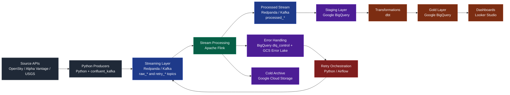
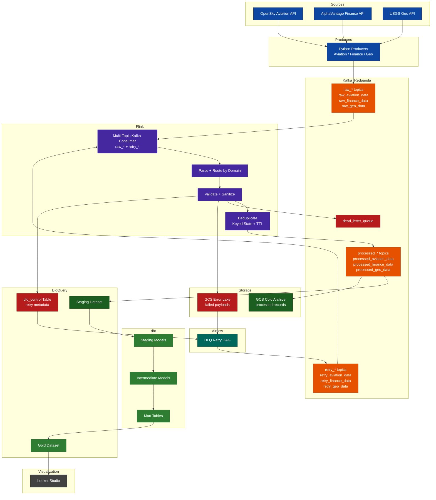

# 🚀 OmniStream — Production-Grade Streaming Data Platform


⚡ Built as part of Data Engineering Zoomcamp — showcasing a production-grade streaming architecture with real-world design patterns.

OmniStream is a production-grade, real-time data platform designed to act as a **data quality control plane** for streaming systems.

It ingests multi-source data, enforces validation and deduplication in real time, and ensures only high-quality, analytics-ready data reaches BigQuery.

It acts as a real-time data gatekeeper, ensuring only high-quality data reaches systems like BigQuery while optimizing storage cost.

## ❗ Problem

Modern data pipelines struggle due to real-time, multi-source ingestion:

- Schema Rigidity

    → Pipelines assume fixed schemas, but real-world data evolves

- Data Contamination

    → Lack of early validation allows bad data into warehouses

- Cost Inefficiency

    → All data is stored in expensive systems regardless of quality

👉 Without a control layer, bad data propagates downstream, increasing cost, reducing trust, and complicating recovery.

## 💡 Solution

OmniStream introduces a streaming control layer built on Kafka + Flink:

- 🔗 Multi-Source Ingestion (Structured Topics)
    - Dedicated producers per domain (aviation, finance, geo)
    - Data flows into Kafka topics (raw_*, retry_*)
- ⚡ Unified Stream Processing (Flink)
    - Single job consumes multiple topics
    - Performs validation, deduplication, and routing in real time
- 🔁 Retry Mechanism (Recovery Layer)
    - Failed records stored in GCS Error Lake + DLQ metadata (BigQuery)
    - Airflow reprocesses and pushes data back to retry_* topics
    - Ensures reliable replay without data loss
- 🛡️ Data Validation Layer
    - Invalid records → DLQ + Error Lake
    - Prevents contamination of analytics systems
- 💰 Smart Storage Routing
    - Clean data → BigQuery
    - Invalid / low-value → GCS (cold storage)
- ♻️ Extensible Design
    - Modular producers and schema handling make it easy to onboard new data sources
    - Adding a new API typically requires minimal changes (new producer + topic)
    - Existing Flink job automatically processes new streams via multi-topic consumption

👉 Enables rapid scaling across new domains without redesigning the pipeline

## 🧱 What It Does

OmniStream functions as a data control plane for streaming systems:
```
Ingestion → Validation → Deduplication → Routing → Error Handling → Retry → Analytics
```

## 🧠 Why OmniStream Stands Out

- Handles heterogeneous real-time data (aviation, finance, geo) in a unified pipeline  
- Implements a **true streaming control layer** (not just ingestion)  
- Combines **Kafka + Flink + dbt + Airflow** into a cohesive architecture  
- Provides **replayable pipelines with zero data loss guarantees**  
- Demonstrates production-grade patterns: DLQ, idempotency, partitioning, clustering

## 🔥 One-Line Pitch

Real-time streaming control plane that guarantees clean, deduplicated, and replayable data pipelines at scale.

## 📈 Impact

- ✅ Reliable, replayable data pipelines (no data loss)
- 🛡️ Clean and trustworthy analytics
- ⚙️ Reduced manual intervention
- 💰 Optimized storage and compute costs
- 🚀 Scalable multi-topic streaming architecture

## 🏗️ Architecture

### High-Level Flow

```
APIs → Producers → Kafka (Redpanda) → Flink Processing
    → Valid Data → BigQuery (Staging → Gold)
    → Errors → DLQ + GCS Error Lake
    → dbt → Analytics Layer → Dashboard
```

### High-Level  



The pipeline ingests streaming data from multiple external APIs, including OpenSky, Alpha Vantage, and USGS, using Python-based producers. These producers publish raw events into Redpanda/Kafka topics, which serve as the central streaming backbone of the platform.

Apache Flink consumes data from the streaming layer and performs real-time processing, including validation, transformation, and routing. Successfully processed records are written to processed_* topics and loaded into BigQuery staging tables for downstream analytics. dbt is used to transform staged data into curated gold-layer tables, which power dashboards in Looker Studio.

To support reliability and data lifecycle management, the architecture includes both error handling and archival mechanisms. Failed records are captured via BigQuery control metadata and stored as payloads in a GCS-based error lake. A retry orchestration layer, implemented using Python and Airflow, reprocesses recoverable failures by republishing them into Kafka retry topics.

In parallel, all successfully processed records are written to a GCS-based cold archive, enabling long-term storage, reproducibility, and backfill capabilities.

This design follows a streaming-first medallion architecture, separating ingestion, processing, storage, transformation, analytics, and recovery into clearly defined layers.

### 🟢 2. Detailed Architecture (Technical)



📊 Detailed Architecture

The Omnistream pipeline is a real-time, event-driven data platform that ingests, processes, and serves data across multiple domains (aviation, finance, and geospatial). The architecture is designed to ensure scalability, fault tolerance, and clear separation of concerns across ingestion, processing, storage, and orchestration layers.

🔹 Data Ingestion

Data is collected from external APIs including OpenSky (aviation), AlphaVantage (finance), and USGS (geospatial). Python-based producers continuously fetch data and publish it to Kafka/Redpanda topics grouped as raw_* (e.g., raw_aviation_data, raw_finance_data, raw_geo_data). These topics act as the entry point into the streaming pipeline.

🔹 Stream Processing (Apache Flink)

A single Apache Flink job consumes data from both raw_* and retry_* topics using a pattern-based multi-topic Kafka consumer. Inside Flink, records go through a sequence of transformations:

- Parse & Route: Incoming JSON events are parsed and routed to domain-specific streams.
- Validate & Sanitize: Records are checked for schema correctness and cleaned.
- Deduplication: Keyed state with TTL is used to eliminate duplicate records and ensure idempotent processing.

🔹 Success Path

Once records pass validation and deduplication, they are published to processed_* Kafka topics. These topics serve as the central contract layer, decoupling stream processing from downstream systems.

From processed_* topics, data is delivered to:

- BigQuery Staging Dataset for structured analytical processing
- GCS Cold Archive for durable storage of processed records

🔹 Failure Handling (DLQ Design)

If a record fails validation, it is immediately branched into three destinations:

- `Kafka Dead Letter Queue` (dead_letter_queue) for real-time failure monitoring
- `GCS Error Lake` for storing full failed payloads (source of truth)
- `BigQuery dlq_control table` for tracking retry metadata such as error reason, status, and timestamps

This design separates failure storage, monitoring, and retry control responsibilities.

🔹 Retry Mechanism (Airflow-Orchestrated)

Retries are orchestrated using an Airflow DAG rather than consuming directly from Kafka DLQ.

- The DAG reads retry candidate's metadata from the dlq_control table in BigQuery
- Retrieves corresponding failed payloads from GCS Error Lake
- Republishes records into domain-specific retry_* topics

These retry topics are then re-consumed by Flink and processed through the same pipeline, ensuring consistency and reusability of logic.

🔹 Transformation Layer (dbt)

Data written to BigQuery staging tables is transformed using dbt into curated analytical models:

- Staging models
- Intermediate (unified) models
- Mart tables (Gold layer)

🔹 Serving Layer

The final curated datasets in the BigQuery Gold layer are used for analytics and visualization, typically through Looker Studio dashboards.

🔹 Key Design Principles

- Event-Driven Architecture: processed_* topics act as the contract between streaming and downstream systems
- Decoupled Layers: Each component (Kafka, Flink, GCS, BigQuery, Airflow, dbt) has a well-defined responsibility
- Robust Retry Strategy: Combines GCS (payload) and BigQuery (metadata) instead of relying on Kafka DLQ
- Idempotent Processing: Deduplication ensures no duplicate records are written to analytical storage
- Scalability & Fault Tolerance: Kafka buffering + Flink stateful processing provide resilience

🔥 Summary

This architecture enables reliable, scalable, and maintainable real-time data processing by combining streaming, batch transformations, and orchestration into a cohesive pipeline, with strong guarantees around data quality, recovery, and analytical readiness.

## 🔗 Data Lineage (dbt)

OmniStream uses a layered dbt architecture:

sources → staging → intermediate → marts

- `stg_*` models standardize raw domain data (aviation, finance, geo)  
- `int_events_unified` creates a unified event model across domains  
- `mart_*` models provide analytics-ready aggregations  

👉 This design ensures:
- clear separation of concerns  
- reusable transformations  
- easy onboarding of new data sources  

### Example Lineage


### 🏬 BigQuery Optimization

To support efficient analytical queries, OmniStream applies warehouse-level optimizations in BigQuery:

- `int_events_unified`  
  - partitioned by `event_date`
  - clustered by `source_type`, `event_type`

- `mart_event_volume_by_hour`  
  - partitioned by `event_date`

- `mart_event_volume_by_source`  
  - clustered by `source_type`

These optimizations improve query performance and reduce cost for common access patterns such as:
- time-based trend analysis
- source-level aggregations
- cross-domain event exploration

👉 Multi-domain data (aviation, finance, geo) is unified into a single model and transformed into analytics-ready marts

## ⚙️ Tech Stack

| Layer            | Technology                           |
| ---------------- | ------------------------------------ |
| Streaming        | Redpanda (Kafka-compatible)          |
| Processing       | Apache Flink                         |
| Orchestration    | Apache Airflow                       |
| Data Warehouse   | BigQuery                             |
| Data Lake        | GCS (Cold Archive + Error Lake)      |
| Transformations  | dbt                                  |
| Infrastructure   | Terraform                            |
| Containerization | Docker + Docker Compose (local orchestration) |
| Visualization    | Looker Studio                        |


## 🔄 Pipeline Flow

1. Producers (Python) fetch data from:
    - Aviation (OpenSky)
    - Finance (AlphaVantage / demo mode)
    - Geo (USGS earthquakes)

    The pipeline operates in a fully event-driven manner

2. Data is published to Kafka topics:
    ```
    raw_* topics
    ```
3. Flink Streaming Job:
    - Parses multi-type JSON
    - Routes data by type
    - Validates schema
    - Deduplicates records
    - Writes:
        - Processed data → Kafka + BigQuery
        - Errors → DLQ + GCS
        - Error metadata → BigQuery dlq_control table
4. BigQuery Layers:
    - omnistream_staging → raw processed data
    - omnistream_gold → dbt-transformed models
5. dbt:
    - Builds staging views
    - Creates unified event model
    - Generates marts for analytics
6. Dashboard (Looker Studio):
    - Built on gold layer

## ⭐ Key Features

- Real-time streaming platform (Kafka + Flink)
- Multi-source ingestion via domain-specific producers
- Unified multi-topic stream processing
- Idempotent processing with deduplication
- Dead Letter Queue (DLQ) with replayable retry mechanism
- Medallion architecture (raw → staging → gold)
- Cold archive + error lake in GCS
- Fully reproducible environment (Docker + Makefile)
- Infrastructure as Code (Terraform)

## 🔁 Idempotency & Deduplication

To ensure no duplicate records reach BigQuery, OmniStream uses idempotent record keys.

### Record Key Strategy

| Data Type | Key                  |
| --------- | -------------------- |
| Finance   | `symbol + timestamp` |
| Geo       | `id + timestamp`     |
| Aviation  | `icao24 + timestamp` |

### Implementation
- Flink uses `KeyedProcessFunction`
- Maintains keyed state with TTL-based deduplication
- Emits only unseen records within the configured deduplication window

### 👉 Guarantees:

- No duplicate inserts in BigQuery
- Safe reprocessing
- Consistent analytics

👉 This ensures exactly-once–like behavior at the application layer.

## 🚨 Error Handling (DLQ + Retry)

OmniStream separates bad data from good data early.

### Flow
- Invalid records → dead_letter_queue (Kafka)
- Stored in:
    - GCS Error Lake (full payload)
    - BigQuery (dlq_control) (metadata only)
- Retry Mechanism
    - Airflow DAG: omnistream_dlq_retry
    - Picks retryable records
    - Pushes to retry_* topics
    - Flink reprocesses them

👉 Prevents data loss while keeping pipeline clean
👉 This avoids tight coupling with Kafka DLQ and enables flexible, controlled replay.

## 🪙 Data Model (Medallion Architecture)

| Layer   | Description                     |
| ------- | ------------------------------- |
| Raw     | Kafka topics (`raw_*`)          |
| Staging | BigQuery (`omnistream_staging`) |
| Gold    | dbt models (`omnistream_gold`)  |

## 📊 Dashboards (Looker Studio)

The dashboard demonstrates how OmniStream handles fundamentally different streaming behaviors within a unified architecture.

Data is visualized using Looker Studio built on the gold layer.

### 🥧 Event Distribution by Source (Pie Chart)
A pie chart shows the distribution of events across different data sources (aviation, finance, geo), highlighting the multi-source nature of the pipeline and relative contribution of each stream.


### 📈 Streaming Behavior by Source (Time Series)
A time series dashboard highlights how different data sources exhibit distinct streaming behaviors. Aviation data shows bursty, high-volume ingestion, finance reflects API-driven batch patterns, while geo data arrives gradually as a continuous stream. This demonstrates the platform’s ability to handle heterogeneous real-time data patterns within a unified pipeline.characteristics within a unified pipeline.


🔗 (Optional) Live Dashboard:
https://lookerstudio.google.com/s/lAdyPoHoQf0

#### Summary

| Source   | Behavior                  |
| -------- | ------------------------- |
| Aviation | High-volume burst stream  |
| Finance  | Low-frequency batch-like  |
| Geo      | Continuous natural stream |

## 🚀 How to Run

### Prerequisites
- Docker
- Terraform
- Google Cloud SDK
- BigQuery CLI (bq)

### 🔐 Authenticate GCP

```bash
gcloud auth application-default login
gcloud config set project de-zoomcamp-2026-486900
```

### ▶️ Run Full Pipeline

```bash
make demo
```

This will:

- Build Flink job
- Apply Terraform infra
- Start Docker services
- Submit Flink job
- Run producers
- Load data into BigQuery
- Execute dbt models + tests

### 🧪 Validate Data

```bash
bq ls de-zoomcamp-2026-486900:omnistream_staging
bq ls de-zoomcamp-2026-486900:omnistream_gold
```

### 🧹 Cleanup Everything

```bash
make destroy
```

This will:

-  Cancel Flink jobs
-  Delete Kafka topics
-  Stop Docker containers
-  Destroy Terraform resources
-  Remove BigQuery datasets (via Terraform)

## ♻️ Reproducibility

The entire pipeline is fully reproducible:

```bash
make destroy
make demo
```

👉 Multiple runs produce consistent, duplicate-free results

## 🧠 Project Highlights

OmniStream is not just a pipeline — it is a data quality gatekeeper.

- It solves real-world problems:
    - Prevents bad data from entering analytics
    - Handles schema evolution gracefully
    - Reduces warehouse costs
    - Enables reliable retry workflows
- Advanced Capabilities:
    - Idempotent streaming
    - DLQ + retry orchestration
    - Multi-source unified processing
    - End-to-end automation

## 📌 Future Improvements
- Schema registry integration
- Real-time alerting on DLQ spikes
- Streaming-first dashboard refresh

## 🙌 Acknowledgements
- DataTalksClub — Data Engineering Zoomcamp
- OpenSky API
- USGS Earthquake API
- AlphaVantage API

## 🎉 Final Note

OmniStream demonstrates a fully integrated, production-ready streaming data platform with strong guarantees around data quality, reliability, and scalability.

It showcases how modern data engineering systems can combine streaming, storage, transformation, and orchestration into a cohesive and resilient architecture.

It bridges the gap between raw ingestion and trusted analytics.

- ✔ Real-time ingestion
- ✔ Data validation & deduplication
- ✔ Error handling & retry
- ✔ Analytics-ready transformations
- ✔ Dashboard visualization

## 🧪 Reviewer Guide (Quick Evaluation Mapping)
This section maps project implementation directly to evaluation criteria for quick and precise assessment.

### 📌 Problem Description
- Clearly defined challenge: real-time data quality, schema evolution, and cost inefficiency
- OmniStream acts as a data gatekeeper to validate, deduplicate, and route streaming data before it reaches analytics systems

### ☁️ Cloud + IaC
- Built on GCP (BigQuery + GCS)
- Infrastructure fully managed using Terraform
- Supports reproducible cloud setup via IaC

File: terraform/main.tf

**Sample code:**
```hcl
resource "google_bigquery_dataset" "gold" {
  dataset_id = "omnistream_gold"
  location   = var.region
}
```

### 🌊 Streaming Pipeline
- Uses Redpanda (Kafka) for streaming ingestion
- Domain-specific producers (aviation, finance, geo)
- Apache Flink for unified multi-topic stream processing
- Includes DLQ + retry pipeline (Airflow + GCS + Kafka retry topics)

File: flink-processor/src/main/java/com/omnistream/StreamingJob.java

**Sample code:**

```java
KafkaSource<String> source = KafkaSource.<String>builder()
    .setBootstrapServers("redpanda:9092")
    .setTopicPattern(Pattern.compile("(raw|retry)_.*"))
    .setStartingOffsets(OffsetsInitializer.earliest())
    .build();
```
👉 Consumes both raw_* and retry_* topics in a single job

🔁 Retry Mechanism
Failed records stored in GCS (Error Lake)
Metadata tracked in BigQuery (DLQ control table)
Reprocessed via Airflow → Kafka retry_* topics

File: airflow/dags/retry_pipeline.py

```python
producer.produce(
    topic="retry_finance_data",
    value=json.dumps(record)
)
```
👉 Enables reliable replay without data loss

### 🏬 Data Warehouse
- Data is stored in **BigQuery** across staging and gold layers
- dbt models follow a layered design: **staging → intermediate → marts**
- Analytical tables are optimized using **partitioning and clustering** for efficient time-based and source-based queries

**Files:**
- `dbt/models/intermediate/int_events_unified.sql`
- `dbt/models/marts/mart_event_volume_by_hour.sql`
- `dbt/models/marts/mart_event_volume_by_source.sql`

**Sample code:**
```sql
{{ config(
    materialized='table',
    partition_by={
      "field": "event_date",
      "data_type": "date",
      "granularity": "day"
    },
    cluster_by=["source_type", "event_type"]
) }}
```

#### 🧩 Unified Event Model
The pipeline consolidates streaming data from aviation, finance, and geo sources into a unified BigQuery table.

This model standardizes schema across domains and enables downstream analytics.


#### 📊 Aggregated Analytics Layer

Aggregated models built using dbt enable time-based analytics and power dashboard visualizations.

These models provide event volume insights across sources and time windows.


#### 🧱 Schema Design

The unified schema is designed to handle multi-domain streaming data while maintaining consistency and extensibility.


✔️ End-to-end pipeline verified: Streaming → Processing → Storage → Analytics → Visualization


### 🔄 Transformations

- Uses dbt with a layered architecture:
    - staging → source-specific standardization (stg_*)
    - intermediate → unified event model (int_events_unified)
    - marts → analytics-ready aggregations (mart_*)
- Modular, version-controlled SQL models using ref() for dependency management
- Supports multi-domain data (aviation, finance, geo) through a unified transformation layer

Warehouse Optimization:

- int_events_unified
    - partitioned by event_date
    - clustered by source_type, event_type
- mart_event_volume_by_hour
    - partitioned by event_date
- mart_event_volume_by_source
    - clustered by source_type

Files:

- dbt/models/staging/stg_aviation.sql
- dbt/models/staging/stg_finance.sql
- dbt/models/staging/stg_geo.sql
- dbt/models/intermediate/int_events_unified.sql
- dbt/models/marts/mart_event_volume_by_hour.sql
- dbt/models/marts/mart_event_volume_by_source.sql

Sample code:
```sql
{{ config(
    materialized='table',
    partition_by={
      "field": "event_date",
      "data_type": "date",
      "granularity": "day"
    },
    cluster_by=["source_type", "event_type"]
) }}
```

👉 Enables scalable, reusable transformations with optimized query performance in BigQuery

### ### 🧪 Data Quality Validation

Deduplication correctness verified using:

```sql
SELECT COUNT(*), event_id
FROM int_events_unified
GROUP BY event_id
HAVING COUNT(*) > 1
```
Result: 0 rows → strong guarantee of idempotent processing

### 📊 Dashboard
- Built using Looker Studio
- Includes multiple visualizations for processed data insights

### 🔁 Reproducibility
- Fully containerized using Docker + Docker Compose
- End-to-end pipeline can be run with a single command:
```bash
make demo
```
- Includes setup instructions for both local + cloud execution

### ⭐ Summary
- ✅ Production-grade streaming architecture
- ✅ End-to-end pipeline (ingestion → processing → warehouse → dashboard)
- ✅ Fault-tolerant with retry + replay
- ✅ Fully reproducible with IaC and containers